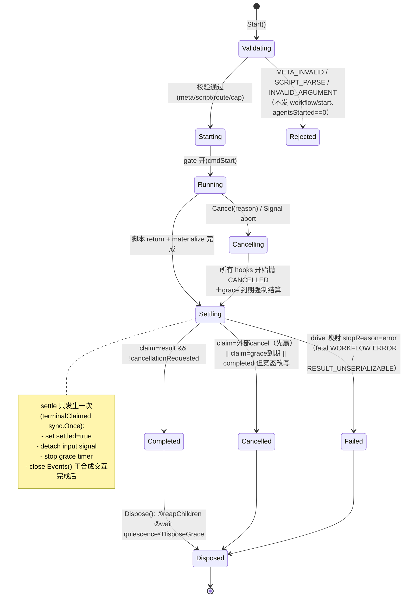

# Agent Note: Dynamic Workflow (PTC) — 模型可编程的多子代理编排引擎

Status: proposed

Scope（拟新增/改动）: `pkg/workflow`（新）、`pkg/tools/builtin/workflow.go`（新）、`pkg/ui/runtime.go`（接线）、`pkg/engine/query.go`（新增 StreamEvent 类型）、`pkg/protocol/types.go`（新事件，M2）、`pkg/config/settings.go`（workflows 配置段）

调研对象（2026-08-27 全源码精读）:

- [deepseek-ai/deepseek-harness `packages/workflow`](https://github.com/deepseek-ai/deepseek-harness/tree/master/packages/workflow)（4 子包：`workflow` seam、`workflow-worker-thread` 引擎、`tool-workflow`、`tool-ralph`；对标 Claude Code dynamic workflows）
- [laude-institute/headlong `bin/`](https://github.com/laude-institute/headlong/tree/main/bin)（16 个纯 bash 脚本构成的 agent microharness："Of bash, by bash, for bash"）
- dop251/goja（master 源码核实宿主绑定机制）

全文级调研档案（含协议表、时序、值边界行为表、goja 通信机制全景图）见 [docs/workflow-ptc-research.md](../../../../docs/workflow-ptc-research.md)；本 note 只保留决策相关蒸馏。

## Problem

当前 agent loop 是"一轮一个 tool_use"：编排 N 个子任务需要 N 次 LLM 往返，每个中间结果都落进父会话上下文。以"调研 3 个方案各跑 1 个 Explore 子代理再汇总"为例：

- **传统模式**：父模型发 3 次 Agent tool_use（或 1 次 + 等待循环），每次往返携带全部已有中间结果 → 父上下文膨胀 ≈ Σ(子任务输出)，延迟 = N × (父往返 + 子运行)，且父模型在等待期间全程占费。
- **PTC 模式**：父模型一次 tool_use 提交一段脚本，脚本内 `parallel([() => agent("调研A"), () => agent("调研B"), () => agent("调研C")])` + 汇总逻辑。tool_use 次数 O(1)；父上下文只接收最终 JSON 返回值；中间结果停留在各自独立子上下文里。

deepseek-harness 已落地该能力并明确对标 Claude Code dynamic workflows（其 Agent Note 原文："Claude Code ships this capability as dynamic workflows"；`WorkflowMeta` 注释："The field vocabulary matches the Claude Code dynamic-workflows meta block"）。openharness-go 若要在 agentic 编排上保持同代竞争力，需要一个同等物。同时本仓库已审计的三笔债务会被 PTC 直接放大，必须在设计里显式处置：

- **P0-1 权限断线**：沙箱内连续调工具使每一次误放行的风险 ×N；
- **P0-5b usage 缺 input_tokens**：多子代理成本核算失真；
- **bounded output 公约**：子代理输出回流需要显式尺寸上限与溢出通道。

## Research findings

### DeepSeek Harness 的机制本质（四句话）

1. **谁写代码**：LLM 写。模型在一次普通 tool_use 中提交 `script`（纯 JS 体，top-level await，`return <json>` 结尾）+ `meta`（独立 JSON 参数：name/description/phases）。循环、分支、fan-out 全部由代码承载。
2. **在哪执行**：每 run 一个 Node worker thread，脚本跑在 worker 内的 `node:vm` context。README 官方定性：**"node:vm inside a worker is an API-shaping mechanism, not a security boundary"**——信任前提与 bash 工具同级。实际 containment 收益来自 worker 孵化时的 `env: {}`（凭据不跨线程）+ structured clone 序列化边界。
3. **工具桥接**：脚本内的 `agent()` 不是本地函数调用，而是跨线程 RPC——宿主收到 `child-start` 后经 SubagentRuntime 启动真正的子代理 agent loop，脚本只拿到最终结果投影（无 schema→文本；有 schema→已验证 JSON 对象）。
4. **调度纪律**：并发闸门（FIFO 信号量）、总 agent 数 cap、单次 parallel 条目 cap、首同步切片 vm timeout、grace timer + `worker.terminate()` 兜底、结算 first-wins（外部 cancel > 迟到 result）、值边界 materialize（离开脚本的值深拷贝为 plain JSON，拒绝 function/symbol/Date/cycle，路径限定报错）。

关键工程事实（重实现时直接照抄的部分）：

| 维度 | deepseek-harness 的事实 |
|---|---|
| 结算契约 | `Run.result` **永不 reject**；终止原因三值封闭集 `completed/cancelled/error`；部分输出从不冒充成功 |
| 取消语义 | 边界是"下一个 hook 入口"不只是 `agent()`；cancel 后 hooks 一律抛 CANCELLED；宿主抑制 cancel 后的叙事消息但保留配对的 agent-end |
| 错误分层 | 同步抛（SCRIPT_PARSE/META_INVALID，start 前置校验）≠ 脚本化失败（stopReason=error）≠ 组合器纪律：**hook 误用（未知 option/schema 越界/cap 触发/provider 故障）是 fatal、杀整脚本**，普通子代理失败是 item→null——"typo'd option 不得溶成看起来像子代理失败的 null" |
| 协议 | worker→host 8 tag / host→worker 7 tag 封闭枚举，switch+assertNever（加消息类型=编译错误）；callId 三 Promise pending 记录；ghost callId 必须容忍 |
| 死亡屏障 | 首个 error/messageerror/exit 设 `workerDeathObserved=true`，其后排队消息一律丢弃；`liveAgents` ledger 强制每个 agent-start 配对 agent-end（缺端合成 cancelled） |
| 持久化 | **log-only，resume 是 documented non-goal**："No journaling or resume… a process restart cannot continue a run"。持久记录有两处：完整 script/meta 留在 assistant tool_call 里；run 事件投影到父 Session（首次 append 失败即禁用该 run 后续记录，绝不改变工具结果） |

### Headlong 的可移植洞察

headlong 用 ~10K 行 bash 实现 harness，其成立的赌注是：**行动者（LLM）的母语恰好就是这套介质（进程/管道/文件系统）**。对本项目真正值得偷的机制：

- **组合表达式即 OS 进程**：分支=`&`/`wait`、子代理=递归调用自身、长任务=tmux。orchestration framework 就是 process model，不需要任何自建编排原语（philosophy: "the model is not a dispatcher ordering from a menu; it's an operator sitting at a terminal"）。
- **完成信号走文件不走 stdout**（`FINAL=` 写入 sentinel 文件）：最终答案与其他输出严格分离，stdout 可继续当管道用。
- **blob 溢出三件套**：大字段截断版内联 + `blobs/<step_id>.stdout` 引用 + 原始字节数。这与本仓库 bounded output 公约天然对齐——**bash 版给了我们一个已被生产验证的引用式溢出格式**。
- **watchdog/beacon 协议**：嵌套运行每 5s touch 一个 beacon 文件刷新父 watchdog 的 stale 计时器，解决"等子思考时被静默误杀"；kill 原因写 marker 文件让反馈能对模型说清死因。
- **mkdir 当锁、epoch 定宽文件名当 FIFO 队列、退出即布防（EXIT trap 武装 `.wake_at`）**：同步原语全部退化到文件系统姿势。
- **反面教材同样是宝**：SIGPIPE under pipefail 在 macOS 杀掉整个流式运行、bash 3.2 `read -t` 返回码歧义、"契约散落在 env 名/字段名/路径约定里所以 fail silently"（AGENTS.md 自供状态）。**隐式协议不可测试**是他们自己列的头号债务——这正好反过来支持我们把协议做成封闭枚举。

### 为什么不整体照抄 headlong 路线

headlong 的信任模型是"全有或全无"（本地 docker 或裸机）。openharness-go 有 permission 架构（即便今天处于 P0-1 未接线状态），把"从任意 bash 派生 LLM 运行"作为一等入口等于绕过未来所有权限修复；且 bash-native 路线的正确性预算几乎全花在信号/并发收拾上（上文反面教材）。结论：**吸收机制，不采用介质**。

## Proposal

### 选型决策：执行 substrate

| 方案 | 表达力 | 隔离 | CGO_ENABLED=0 | 新依赖 | 判定 |
|---|---|---|---|---|---|
| **dop251/goja（纯 Go JS 解释器）** | ES2023+Promise，模型写惯 JS；deepseek 兼容面最大 | 解释器级：无宿主全局泄漏，仅注入函数可达 IO；`vm.Interrupt` 可杀同步自旋 | ✅ | goja（~2MB 纯 Go） | **选它** |
| go-starlark | 有语句但无异步/一等 Promise，fan-out 别扭 | 好 | ✅ | 小 | 输给表达力（Starlark 为确定性 config 设计，分钟级阻塞调用反模式） |
| V8 via v8go | 最大 | 最强 | ❌ cgo | 重 | 输给构建约束（硬性） |
| 声明式 DAG（JSON steps + 模板插值） | 无 while/fan-out 循环 | 平凡可校验、天生可 checkpoint | ✅ | 无 | 作为 fallback 记录在 Alternatives（若将来要 resume 再回头评估） |
| bash-native（headlong 式：Bash 工具 + `oh` CLI 派生嵌套 RunQuery） | 无限 | 全有或全无 | ✅ | 无 | 见上文"为什么不整体照抄"；权限接线后可作为轻量补充重新评估 |

### 与 deepseek 架构的概念映射

| deepseek-harness | 本方案 | 变化点及理由 |
|---|---|---|
| worker thread | **owning goroutine**（VM 归属goroutine，外部只通过 channel/RPC 交互） | 无独立内存空间收益；goroutine 冷启动零成本 |
| node:vm context | **goja Runtime 实例**（空全局 + 注入 6 个冻结成员） | 纯解释器天然无 Node intrinsics，比 vm 更接近"API-shaping only"的理想 |
| vm timeout（罩首个同步切片） | `Runtime.Interrupt(err)` 由 watchdog goroutine 触发，**罩住任意同步段** | goja 的 Interrupt 可随时打断执行中的 VM；比 V8 只能超时首片更强 |
| MessagePort 协议 | **typed Go channels + 封闭 tag 枚举**（结构相同，exhaustive switch） | 单进程后协议仍是内部 API 边界，保留封闭性为了 assertNever 式编译检查 |
| structured clone / materializeFromRealm | **materialize.go：严格 JSON walk 深拷贝**（同一拒绝表） | `__proto__` 防护不再需要（JSON encode 即安全），其余行为逐条保留 |
| worker.terminate() 终结兜底 | 不存在 kill 能力 → **beacon 心跳 + 硬上限兜底**：不肯死的脚本由 watchdog Interrupt + grace 到期强制 settle(cancelled)；若连 hook 都不再进入（死循环无 await 且已 Interrupt 失败的场景不存在——Interrupt 对纯 CPU 循环必然生效） | 这是与 deepseek 最大的能力差：我们失去"无条件 terminate"，但 goja Interpreter 上 Interrupt 覆盖所有执行路径，实际覆盖面 ≥ worker 方案 |
| env:{} 凭据隔离 | n/a（同进程）；改为**子代理 QueryContext 不继承任何凭据对象，仅持 client 接口** | 凭据本来就不进 ToolExecutionContext |
| SubagentRuntime 经 provider 抽象 | **复刻 pkg/tasks.SubAgentExecutor 路径**：child = 一次嵌套 `engine.RunQuery` | tasks 已示范该装配；child 并行绕过 QueryEngine 单飞队列与今天的 Agent 工具同构（接受先例） |

### 领域模型与数据结构

新包布局（import 方向遵守现有约束 `workflow → engine + tools (+services)`，恰如 `tasks → engine + tools`；BaseTool 包装放 builtin，如 `agent.go → tasks`）：

```
pkg/workflow/
├── workflow.go      # Engine/Run/Meta/Result/ErrorCodes —— seam 公共接口
├── host.go          # HostRun：事件账本、children map、terminal claim、grace
├── exec.go          # Execution：goja drive、hook 注入、job pump、watchdog
├── bridge.go        # ChildRpcBridge：callId ↔ pending 协程桥（channels）
├── limits.go        # Limits 解析 + FIFO 并发闸门 + 计数 cap
├── materialize.go   # 值边界：严格 JSON 化 + 路径限定错误
├── blobstore.go     # 大字段溢出（.openharness/workflows/<run>/blobs/）
├── errors.go        # WorkflowError{Code, fatal} —— fatal 不可伪造
└── *_test.go
```

公共接口（最终签名以实现为准，语义承诺如下）：

```go
type RunID string // 引擎 mint，UUID

type Phase struct {
    Title   string `json:"title"`
    Detail  string `json:"detail,omitempty"`
    Model   *ModelRoute `json:"model,omitempty"` // 仅进度标注
}

type Meta struct { // 纯数据，永不 eval；known-field 白名单 + violation 全列出
    Name        string  `json:"name"`        // kebab-case；持久化 key
    Description string  `json:"description"`
    WhenToUse   string  `json:"whenToUse,omitempty"`
    Phases      []Phase `json:"phases,omitempty"`
}

type ModelRoute struct { Provider, Model string } // 每 agent() 可覆盖路由

type StartRequest struct {
    Script         string            // 纯 JS 体；禁止 export 语句；return <json>
    Meta           Meta
    Args           json.RawMessage   // 以 args 全局暴露；顶层裸数组须包字段
    MaxTotalAgents int               // ≤ ceiling；只能降不能升
    Parent         *engine.QueryContext // 所有 child 由此派生（复制而非共享指针，见下）
    Signal         context.Context   // abort 即取消整个 run
}

type StopReason string // completed | cancelled | error（封闭集）

type Result struct {
    Value         any        // materialize 后的宿主侧 JSON 数据
    StopReason    StopReason
    Error         string     // 仅非 completed 时存在
    AgentsStarted int        // 优雅结算=脚本侧计数；终止路径=宿主观测计数
}

type AgentEvent struct { // 观察者叙事，载荷均为快照（不含可变别名）
    Kind    string // phase | log | agent_start | agent_end
    Seq     int    // agent_* 时为正整数且唯一
    Label   string
    Phase   string
    Outcome string // agent_end: completed | failed | cancelled
    Message string // log 文本 / 错误渲染
    Blobs   []BlobRef
}
type BlobRef struct{ Path string; Bytes int64 }

type Run interface {
    ID() RunID
    Events() <-chan AgentEvent          // 关闭即叙事流结束；Result 先于 Events 关闭
    Result() <-chan Result              // 恰好投递一次，永不因 panic/close 泄漏双投
    Cancel(reason string)               // 幂等，第一个 reason 赢
    Dispose(ctx context.Context)        // Cancel + 有界等待 children quiescence
}

type Engine interface {
    Start(ctx context.Context, req StartRequest) (Run, error) // 同步校验失败在此抛
    Events(emitter func(AgentEvent))   // 或 observer 注册，二选一定稿
}
```

错误分类（11 个封闭 code，与 deepseek 对齐）：

```go
type ErrorCode string

const (
    ErrScriptParse ErrCode = "SCRIPT_PARSE"       // start 前同步预编译
    ErrMetaInvalid         = "META_INVALID"
    ErrInvalidArgument     = "INVALID_ARGUMENT"
    ErrUnsupportedOption   = "UNSUPPORTED_OPTION" // effort/isolation 等点名 deferred
    ErrUnsupportedSchema   = "UNSUPPORTED_SCHEMA" // schema 白名单外的关键字
    ErrAgentCap            = "AGENT_CAP"
    ErrItemCap             = "ITEM_CAP"
    ErrAgentStart          = "AGENT_START"
    ErrAgentResult         = "AGENT_RESULT"       // 基础设施故障 ≠ 子代理自身失败
    ErrResultUnserializable = "RESULT_UNSERIALIZABLE"
    ErrCancelled           = "CANCELLED"
)

type WorkflowError struct{ Code ErrorCode; fatal bool; msg string }
// fatal 只能由包内构造（小写字段），errors.As 断言我们的具体类型——
// 脚本侧伪造 {code:"...", fatal:true} 的 plain object 不能骗过组合器，
// 这对应 deepseek "instanceof 是宿主 realm 的类，fatality 不可伪造" 的保证。
// 所有错误文案以动词开头告诉模型下一步（仓库 actionable errors 公约），
// 例：AGENT_CAP → "this run reached its total agent cap (N) — lower the fan-out or restart with a higher max_total_agents"
```

Limits 默认值（settings 可降不可超过 ceiling）：

```go
type Limits struct {
    MaxConcurrentAgents int // ceiling 32；默认 min(16, max(1, GOMAXPROCS-2))
    MaxTotalAgents      int // ceiling 256；默认 32（request 可降）
    MaxItemsPerCall     int // ceiling 1024；默认 256
    SyncTimeout         time.Duration // 默认 500ms；watchdog Interrupt 同步切片
    DisposeGrace        time.Duration // 默认 2s；到期强制 settle(cancelled)
    MaxPromptChars      int           // 单次 agent() prompt 上限，默认 100_000
    MaxResultChars      int           // 聚合返回截断阈值，默认 25_000（bounded output 公约）
    BlobOverflowBytes   int           // 超过则落 blobs/ 并留引用，默认 4_096
}
```

settings.go 新增（JSON 向后兼容，缺失走 DefaultSettings）：

```go
type WorkflowsSettings struct {
    Enabled          bool   `json:"enabled"`   // 显式开关；default false 直到 M2 观察性补齐
    MaxConcurrentAgents int `json:"max_concurrent_agents,omitempty"`
    MaxTotalAgents   int    `json:"max_total_agents,omitempty"`
    DisposeGraceMs   int    `json:"dispose_grace_ms,omitempty"`
}
```

### hook 面（模型可见 API，工具 description 内嵌全文规范）

```js
await agent(prompt, opts?)   // opts: {label?, phase?, schema?, model?}
                             //   schema → resolve 已验证 JSON 对象；否则 resolve 最终文本拼接
                             //   子代理普通失败 → resolve null（模型用 .filter(Boolean) 过滤）
                             //   未认识 option → UNSUPPORTED_OPTION，fatal 杀整脚本
await parallel(thunks)       // thunks: (() => any)[]；barrier；thunk throw → 该项 null；
                             // 组合器内部见 fatal 错误必须 re-throw 杀整脚本（不得吞成 null）
await pipeline(items, ...stages) // 每 item 独立穿 stages；stage throw → 该 item null 并跳过剩余 stages
phase(title); log(message)   // 观察者叙事 → AgentEvent 流（TUI/protocol 展示）
args                         // 启动参数（只读冻结对象）
```

schema 支持子集（与 deepseek 相同的白名单）：仅 `type/properties/required/additionalProperties/items/enum/const/oneOf`，越界抛 `UNSUPPORTED_SCHEMA`。理由：宿主要拿 schema 做 child 结构化输出约束与结果验证，白名单外的 JSON Schema 特性没有一致的轻量校验器。

model 参数是 deepseek `provider/model` 二元的合并（本仓 provider 由 api 层按 settings 探测，非 per-call 选择；per-call 只暴露 `model` 字符串，adapter 已支持 per-request model）。依赖 §8.2 的 modelRoles/retry settings 才能做 provider 级路由——M1 仅透传 model 名，provider 恒继承父。

### 组件架构图

```mermaid
flowchart TB
    subgraph parent["父 agent loop（pkg/engine.RunQuery）"]
        TU[assistant tool_use:<br/>name=workflow] --> EX[executeToolCall<br/>query.go:349]
        EX --> WT["builtin.WorkflowTool<br/>(BaseTool 包装，executeToolCall 的分发目标)"]
    end
    WT -->|"engine.Start(req)<br/>同步校验: meta/script/route/cap"| ENG[WorkflowEngine]
    ENG --> HR[HostRun<br/>events 账本 · children map · terminal claim · grace]
    HR <|--listen--| OBS[Observer:<br/>StreamEvent / journal recorder]
    HR --> CH[typed chan: cmdCh / evtCh<br/>封闭 tag 枚举]
    subgraph wfg["Execution goroutine（VM owner）"]
        CH --> BR[ChildRpcBridge<br/>callId ↔ pending promise]
        BR --> EXE[goja drive:<br/>job pump + Interrupt watchdog]
        EXE --> HOOKS["注入: agent/parallel/pipeline/phase/log/args"]
    end
    HOOKS -->|"agent(prompt,opts) → Promise"| CH
    BR -->|"child-start callId"| HR
    HR --> SE["SpawnChild:<br/>构造 sandboxed QueryContext<br/>+ engine.RunQuery(嵌套)"]
    SE --> CHILD["子 agent loop<br/>(复用 tools.Registry 白名单过滤,<br/>PermissionChecker 继承父)"]
    CHILD -->|"result 投影(child-settled/failed)"| HR
    HR --> BLOB[blobstore: 大字段落盘<br/>.openharness/workflows/&lt;run&gt;/blobs/]
    OBS --> JRN[(session Store:<br/>KindWorkflowRun entries)]
```

import 方向（`go list` 实测现状推演）：

```
tools(basis, 无内部依赖) ← engine ← workflow ← tools/builtin ← ui(BuildRuntime)
tasks ────────────────────^ （workflow 与 tasks 平级，同吃 engine+tools）
禁止：engine → workflow（会成环且违背引擎无关原则）
```

BuildRuntime 插槽（runtime.go，参照 SubAgentExecutor 的 :171-190 区段）：

```go
wfEngine := workflow.NewEngine(workflow.EngineConfig{
    Cwd: cwd, Registry: toolReg, Client: adapter,
    BaseQuery: func(ctx context.Context, qc *engine.QueryContext, msgs *[]types.ConversationMessage) <-chan engine.StreamEventWithUsage {
        return engine.RunQuery(ctx, qc, msgs)
    },
    Permissions: permChecker, // 继承；P0-1 接线前为 AllowAll，但这不是新债
}, settings.Workflows /* Enabled gate */)
if settings.Workflows.Enabled {
    if err := toolReg.Register(builtin.NewWorkflowTool(wfEngine)); err != nil { … }
}
```

wiring 测试（AGENTS.md 防拆线要求，mirror `runtime_test.go:22` 范式）：关掉 Enabled → `toolReg.Get("workflow") == nil`；打开 → 非 nil 且 fake engine 的 Start 被真实 executeToolCall 链路触达。**移除任一接线代码必须导致测试失败。**

### 执行流程时序图

```mermaid
sequenceDiagram
    participant M as 父模型
    participant Q as RunQuery loop
    participant T as WorkflowTool
    participant E as Engine.Start
    participant H as HostRun(goroutine-safe)
    participant X as Execution(goroutine, goja owner)
    participant S as Child(RunQuery)

    M->>Q: tool_use workflow{script,meta,args}
    Q->>T: Execute(input, execCtx)
    T->>E: Start(ctx, req)
    E->>E: validateMeta(纯数据) + host 预 parse script<br/>（wrapper `(async()=>{\n…\n})()`，取同步 SCRIPT_PARSE）
    E->>H: new HostRun(id, meta, limits, resolvedCaps)
    E->>X: spawn goroutine(script/body/args/limits/cmdCh)
    E-->>T: Run{id,…}（此刻起事件已发布）
    X->>X: ctx 与 goja 就绪：<br/>空全局+args 注入, hooks 冻结注册<br/>watchdog arm(SyncTimeout)
    H->>X: cmdStart（gate 打开）
    X->>X: body 第一次求值：语法错→evtFatal；<br/>然后 job pump 循环
    loop 每个 agent() 调用
        X->>X: throwIfCancelled → 校验 args(路径限定错误)<br/>→ caps 计数 → FIFO slot(acquire)
        X->>H: cmdChildStart{callId, request(prompt,schema,model)}
        H->>S: SpawnChild: derive QueryContext(perm 继承,<br/>registry 白名单) → engine.RunQuery
        S-->>H: StreamEvent 消费至完成 → 结果投影(output/structured/stop)
        H->>X: evtChildSettled/Failed{callId, 投影(blob 溢出则 BlobRef)}
        X->>X: promise resolve → pump 继续<br/>agent-start/end 成对发布
    end
    X->>H: evtResult{value(materialize), stopReason, agentsStarted}
    H->>H: terminalClaim(first-wins):<br/>result vs 外部Cancel vs DisposeGrace 竞争
    H-->>T: Result(Value, StopReason)
    T->>T: try/finally Dispose(ctx)：<br/>非 completed → isError 文案;<br/>completed → {run_id, agents_started, result}
    T->>Q: tool_result 回填
    Q->>M: assistant 渲染汇总
```

取消插播（任意时刻用户 Ctrl-C / ctx abort）：

```
Signal done ──► H.Cancel(reason)：幂等；广播 cmdCancel 至 X；
                X.cancelled=true → 所有 slot waiter reject(CANCELLED)；
                下一个 hook 入口一律 throwIfCancelled 抛出（边界是 hook 不是 agent()）；
                H 武装 DisposeGrace 定时器（unref 等价: time.AfterFunc）：
                  到期仍无 result → terminalClaim(cancelled) 强制结算 +
                  合成缺失 agent-end(outcome=cancelled)（liveAgents ledger 保证配对）
                迟到 result 到达 → terminalClaimed 已设 → 整份丢弃零副作用
                cancel 后 X 发出的 phase/log 在 H 侧丢弃；agent-end 保留（配对可见性）
```

### 状态机

**Run**（终态三值封闭；claim 点唯一裁决）：



**Child**（每个 callId）：

```
Requested → Admitted(repostered childId) → Streaming → Settled{completed|failed}
                ↘ Rejected(start error → fatal AGENT_RESULT? 否:
                   AGENT_RESULT 仅用于 result-reject 基础设施故障；
                   start-fail 抛 AGENT_START(fatal)；子代理普通失败=resolve null)
Disposed: memoized（幂等 ack；多路径合并 disposeCalls==1）
泄漏守恒不变量：requested == admitted+rejected == disposed（ledger 定期断言，测试可用）
```

### 关键实现片段（sketch，定稿以测试驱动为准）

**drive 主循环 + job pump + watchdog**（exec.go）：

```go
func (x *Execution) drive() (any, StopReason, error) {
	x.armSyncWatchdog()                 // time.AfterFunc(SyncTimeout, x.vm.Interrupt)
	defer x.disarmWatchdog()

	pv, err := x.evalBody()             // (async()=>{…})() 编译后的 Script.RunValue
	if err != nil {                     // 含 watchdog Interrupt 注入的错误
		return nil, reasonFromInterrupt(x.vm, err) // interrupted→cancelled/error 分流
	}
	p, ok := pv.Export().(*goja.Promise)
	if !ok {
		return nil, StopError, errf(ErrScriptParse, "script body must return a value from an async wrapper")
	}
	for p.State() == goja.PromiseStatePending {
		select {
		case ev := <-x.evtCh: // child-settled/failed 等：在 VM 空闲窗口 resolve 对应 Promise
			x.applyEvent(ev)
		case <-x.ctx.Done():
			x.setCancelled()            // 已取消则脚本体一行不再前进（hook 入口接力抛）
			return nil, StopCancelled, nil
		case <-watchdogFired:
			return nil, StopError, errf(ErrScriptParse, "synchronous slice exceeded timeout")
		}
		x.disarmAndRearm()              // 每次进场重置 watchdog（钩子间即“有进展”证据）
		if st := x.drainJobs(); st != nil {
			return nil, StopError, renderThrown(st) // never-rejects：total 渲染器
		}
	}
	// drainJobs：goja master 无导出的单步 job 排空 API，jobQueue 只在
	// leave()（顶层函数返回时）冲刷 —— 重新进入一次 runtime 即可：
	//   x.vm.RunString("0")
	// 被唤醒的 JS 续体就在这次进入里执行（发起新的 agent()/组合器/最终 return）。
	// 细节与源码行号见 docs/workflow-ptc-research.md Part 3。
	switch p.State() {
	case goja.PromiseStateFulfilled:
		return x.materialize(p.Result().Export())
	case goja.PromiseStateRejected:
		return nil, StopError, renderThrown(p.Result().Export())
	}
	unreachable()
}
```

**hook 注入：阻塞调用永不出现在 VM goroutine**（exec.go 核心规则）：

```go
func (x *Execution) injectHooks() {
	fns := map[string]func(call goja.FunctionCall) goja.Value{
		"agent": x.hookAgent,         // 校验完立刻返回 Promise，跨 goroutine resolve
		"parallel": x.composeParallel, // barrier 组合器，基于全部子 Promise
		"pipeline": x.composePipeline,
		"phase": x.hookPhase, "log": x.hookLog,
	}
	for name, fn := range fns {
		x.vm.Set(name, fn)
	}
	x.vm.Set("args", x.frozenArgs())
	// 冻结防篡改：Object.freeze 六个成员（普通 invoke 足够，无需 trap）
	_, _ = x.vm.RunString(`for (const k of ["agent","parallel","pipeline","phase","log","args"])
		Object.defineProperty(globalThis, k, {configurable:false, writable:false})`)
}

func (x *Execution) hookAgent(c goja.FunctionCall) goja.Value {
	throwIfCancelled(x)                       // 边界=下一个 hook
	prompt := assertNonEmptyString(x.vm, c.Arguments, 0) // 路径限定 INVALID_ARGUMENT
	opts, model := readAgentOptions(x, c.Arguments)      // 白名单外→UNSUPPORTED_OPTION(fatal)
	schema := assertAllowedSchema(opts)                   // 越界→UNSUPPORTED_SCHEMA(fatal)
	if err := x.gates.agentAdmit(); err != nil {          // TOTAL cap → AGENT_CAP(fatal)
		panicFatal(x.vm, err)
	}
	callID := x.bridge.next()                             // FIFO 满时挂 waiter；
	go x.host.StartChild(callID, childRequest{            //   cancel 会唤醒 waiter 整批 reject
		Prompt: prompt, Schema: schema, Model: model,
		Label: opts.Label, Phase: opts.Phase,
	})
	seq := x.recordIntent(opts)                           // 含排队中者，AgentsStarted 脚本侧计数口径
	return x.vm.NewPromise()                              // resolve 在 evtChildSettled 回调中发生
}
```

**Host 侧 child RPC**（bridge.go + host.go，封闭枚举代替魔数 tag）：

```go
type cmdKind int // exhaustive switch on receive sides; adding a constant breaks both switches at compile time
const (
	cmdStart cmdKind = iota
	cmdCancel                      // 载荷 reason
	cmdChildStart                  // 载荷 callID + childRequest
	cmdChildDispose                // 载荷 callID
)
type evtKind int
const (
	evtReady evtKind = iota
	evtPhase; evtLog; evtAgentStart; evtAgentEnd
	evtChildStarted   // reply: callID+childID（对未知 callID 必须容忍）
	evtChildStartErr  // reply
	evtChildSettled   // reply: 投影（output 文本 / structured / stop）
	evtChildFailed    // reply: 基础设施故障渲染文本
	evtChildDisposed  // reply
	evtResult         // run 唯一终端结果
)
// pending 表：callID → {started chan, settled chan, disposed chan}
//   ghost callId（teardown race）: send 到 deleted entry → 丢弃并计数，不断言崩溃
```

**materialize 值边界**（materialize.go，行为表照抄 deepseek §realm）：

```go
// Accept: bool/string/int-float finite/null/plain object/proto-chain<=1/dense array/string keys
// Reject with path-qualified error: bigint,function,symbol,nested undefined,
// NaN±Inf,cycle,稀疏数组,带非索引属性的数组,Date/map/class 实例(exotic proto),throwing getter
// 出口安全：json.Marshal 得到的就是宿主侧独立副本（__proto__ 污染在 JSON 层不复存在）
func Materialize(v any, path string) (json.RawMessage, error) { … }
```

**blob 溢出**（blobstore.go，headlong traj 三件套的同构）：

```go
// 载荷超 BlobOverflowBytes：截断版内联 + BlobRef{Path: .openharness/workflows/<run>/blobs/<seq>-<kind>.json, Bytes: raw}
// 最终工具结果的聚合 Value 仍受 MaxResultChars 截断，附一行“读取指引”（actionable errors 公约）：
// e.g. “…truncated (31,204 bytes). Full value saved to .openharness/workflows/<id>/blobs/007-result.json — Read it if you need the rest.”
```

**tool 结果信封**（builtin/workflow.go）：

```
成功: {"run_id":"…","agents_started":7,"result":<materialized>}   // ≠ IsError
失败: isError=true，文案固定族（stable errors）:
  "workflow script does not parse: <err>"
  "invalid meta: <violations>"
  "<code>: <msg>"  ← 对应 AGENT_CAP 等，统一含下一步动作
IsReadOnly(input) 恒 false（间接写世界）；InputSchema 与 description 内嵌 hook 规范全文
```

### 安全边界声明（信任前提与 containment 实况）

- **goja VM 不是安全边界**，与 deepseek 的 node:vm 定性完全一致；信任前提=写脚本的模型可信到与使用 Bash 工具同级（本仓现状本来就允许 Bash 全权执行）。逃逸面仅限我们注入的 6 个成员 + args；纯解释器意味着无宿主 globalThis、无 net/fs intrinsic 可言——containment 实况**优于** worker-thread/node:vm。
- 我们实际获得的 containment：(a) 无凭据对象进入脚本可见环境（子代理仅持 StreamingLLMClient 接口）；(b) 同步自旋必死于 watchdog Interrupt；(c) 值边界保证回传数据是纯 JSON 副本；(d) 三层 cap 约束失控扇出（最贵轴线）。
- 明确的残留风险：**脚本可以造巨大字符串/数组耗内存**（goja 无 heap cap）。M1 缓解=MaxPromptChars/MaxItemsPerCall/value-depth cap（materialize 加 depth 512 上限）；彻底解决走 M3 子进程 dialect（见 Alternatives）。
- **权限链**：SpawnChild 从 Parent.QueryContext 复制 PermissionChecker 与 AskPermission 回调（不写死 AllowAll——这是与 tasks/executor.go:105 现状的显式分歧，不新欠 P0-1）；每 child 的 tool 调用走同一条 `HookExecutor.PreToolUse → registry.Get → PermissionChecker.Check → Execute → PostToolUse` 链。hooks 目前未接线（P0-3），不影响本设计的前向兼容。
- **单飞关系**：child 直调 `engine.RunQuery` 绕过 QueryEngine 提交队列——与今天的 Agent 工具（tasks）并行先例一致；steering/follow-up 是交互会话概念，对非交互 child 天然不适用。父 query 被 Ctrl-C → Signal 撤销 → 全体 child 共享一个 cancel 衍生 context（对齐 deepseek 单一 AbortController）。

### 可观测性与持久化

- **M1**：observer emitter → 新增 engine.StreamEvent 类型 `EventWorkflowEvent{Payload AgentEvent}`（query.go StreamEvent 族扩展），TUI 的 applyStreamEvent 加最小 case：进度行复用 openTools 行风格，`phase(t)` 渲染为段落标题。父 transcript 里保存的只有最终 tool_result（中间结果不进父上下文——这正是 PTC 的经济学）。
- **M2（journal 投影）**：session Store 新 EntryKind：`KindWorkflowRun`（EntryKind 字符串枚举开放，ActiveMessages 只认 KindMessage，新增零影响）；recorder 把 AgentEvent 转 Meta 载荷 append。**前缀容错语义照抄**：首次 append 失败即禁用该 run 的后续记录 + 一条 warn，绝不改变工具结果；日志尾部缺 terminal suffix 是合法中断证据而非腐坏。Resume/run 检查点明确为 non-goal（deepseek parity；引入它将连带禁用时间/随机读取的 determinism 负担）。
- **M2（protocol）**：`BEWorkflowProgress{run_id,name,event}`（protocol 包刻意 dependency-free，加类型无环风险）。前置条件：RunJSONLinesMode 当前无 CLI 入口，需先开 flag，否则该通道是死线。
- **blob 目录**纳入 `.gitignore` 约定与 session 清理策略讨论（不在本 note 展开）。

### 测试计划（每条都对齐仓库既有范式）

| 类别 | 测试 | 失败条件 |
|---|---|---|
| wiring | `TestBuildRuntimeWiresWorkflowTool`（ui/runtime_test.go 内） | 删除 BuildRuntime 注册/Enabled 分支任一代码 |
| 确定性 | `TestAgentOptionsWhitelistStableErrors`、schema 白名单枚举遍历 | 错误文案/code 改动 |
| 状态机 | 表驱动 TestRunTerminalClaim：`(result, cancel, disposeGrace)` 三源排列覆盖 first-wins 全矩阵；重复 result 零副作用 | 任一竞态顺序错乱 |
| 取消 | mid-run Cancel → hooks 抛 CANCELLED、slot waiter 整批 reject、合成配对 agent-end、迟到 child-settled 被容忍（ghost callId） | 泄漏 / double-settle |
| 值边界 | property 测试（rapid）：伪造 exotic 值族全部 reject 且带 path；JS 层 forged fatal object 不能骗过 `isFatalWorkflowError` | fatality 可伪造 |
| 泵正确性 | `-race`：N 个并发 agent() 混合 settle 顺序随机化（channel 干扰器）；fake clock 下 grace 到期强制结算 | data race / 卡死 / 双投递 |
| 经济学回归 | 断言父 messages 仅 +1 tool_use/tool_result 对，无论 agents_started 多少 | 中间结果泄漏进父上下文 |
| bounded output | >MaxResultChars 的聚合作 blob 化 + 截断提示 | 超限直通 |

### 分期落地

- **M1 内核**（PR 1）：`pkg/workflow` 五件（host/exec/bridge/limits/materialize/errors）+ builtin.WorkflowTool + settings.Enabled（default false）+ BuildRuntime wiring/wiring test + 状态机与取消矩阵测试。验收：REPL 手工跑通 3-agent parallel demo（ANTHROPIC_API_KEY in place），`go test ./... && go vet ./...` 绿。
- **M2 观察性**（PR 2）：StreamEvent 类型 + TUI 行渲染 + journal 投影（KindWorkflowRun）+ blobstore + protocol 事件（含 RunJSONLinesMode CLI 入口补课）+ docs/ 新主题笔记。此时才把 Enabled default 翻 true（先决条件=TUI 可视 + journal 落地，防止"黑盒烧钱"体验）。
- **M3 可选硬化与消费者模板**：子进程 dialect（进程 isolation，协议沿用 cmdKind/evtKind 表序列化为 line-delimited JSON——headlong 教训封装成封闭协议反而更容易外置）；ralph 式固定脚本工具（fresh-agent 循环、结构化 handoff、三段式校验）；§8.2 modelRoles 落地后接 per-child provider 路由；heap bound 议题评估（goja 替代品或强制 depth/size 总预算）。

## Alternatives considered

- **为什么不用 Starlark？** 其设计目标是确定性 config 求值：无不透明第三方副作用、有限迭代、无一等 async。分钟级阻塞 `agent()` 与 fan-out/pipeline 语义都要靠扭曲建模。输给表达力与生态贴近度（模型写 JS 远好于写 Starlark）。
- **为什么不上声明式 JSON DAG？** 无法表达 unbounded iteration（例如 ralph 式直到 complete 的循环）与动态 fan-out（下游数量取决于上游输出）。换来的是平凡可 resume/checkpoint——如果未来真要做 resume，DAG 方案应重新开庭；本阶段选择 deepseek 的"不做 resume"立场换取表达力，并把该取舍记录于此。
- **为什么不是 bash-native（整体采纳 headlong）？** 信任模型冲突（全有或全无 vs 我们的分 mode permission 架构）、fail-silent 隐式契约（他们自己的头号自认债务）、以及把 harness 正确性预算押在 bash 信号处理上（SIGPIPE/pipefail、read -t 歧义、zombie 收割都是他们的实战事故）。保留作为 M3 后可选轻量补充：权限接线完备后，给 Bash 工具暴露一条 `oh workflow spawn` 门面命令是可以便宜叠加的糖，但不作为编排内核。
- **为什么不是 v8go/VMTized 真 V8？** 违反 CGO_ENABLED=0 构建（P0 实施过程中已是既定约束），部署矩阵（交叉编译、容器镜像体积）也恶化。goja 的解释器性能对本工作负载（阻塞在 LLM 网络调用上的脚本）完全不敏感——热路径在网络，不在 VM。
- **Subprocess-as-worker 从一开始就上？** deepseek 用 worker thread 的三大理由中两条（进程内 vm 首片阻塞、无法击杀死后循环）在我们这里已被 goja owning-goroutine + Interrupt 消解；第三条（terminate 终结）转译为 grace + Interrupt 的强结算。M1 保持单进程更小核对清单（Go 进程内可断言一切），外部化留给 M3 按需触发。

## Acceptance criteria

1. REPL 内，父模型能用一次 `workflow` tool_use 完成 ≥3 个并行子代理的 fan-out + 汇编，父 transcript 仅增加一对 tool_use/tool_result（经济性回归测试守护）。
2. 全部 11 个 error code 各有一条稳定文案测试锚定；fatal 错误永远杀整脚本且组合器不会把它们溶成 null。
3. Cancel 矩阵（结果先到/取消先到/grace 到期三类 claim，× 到达顺序）全部满足 first-wins 且无 goroutine/child 泄漏（`-race` + goleak 风格断言）。
4. 任何路径上，`Result()` 恰好投递一次、Events() 最终关闭、每个 agent-start 恰好配对一个 agent-end（合成兜底）。
5. Wiring test：从 BuildRuntime 移除注册行必须红。
6. Enabled=false 时零注册零开销；开启需要显式 settings 决策（M1 期 review 可控）。

## Risks

- **job pump 机制已对照 goja master 源码钉死**：`Runtime.NewPromise()` 返回 `(*Promise, resolve, reject)`，但 resolve/reject 与 Promise 实例均非 goroutine-safe（builtin_promise.go 注释原文警告"must not be called in parallel with VM running"）——resolve 只能在属主协程的驱动间隙调用；jobQueue 无导出的单步排空 API，唯一冲刷点是顶层函数返回时的 `leave()`，用平凡语句重新进入 runtime（`RunString("0")`）即可驱动 JS 续体。机制全景见 [docs/workflow-ptc-research.md](../../../../docs/workflow-ptc-research.md) Part 3。残余风险收缩为：若将来升级 goja 版本行为变化，此逻辑集中在 exec.go 单文件 + 专项 race 测试兜住。
- **无 heap 上限**：恶意/意外的大对象脚本可耗内存。M1 仅 caps+depth 兜底；升级为已知缺口记录在 risks，跟踪至 M3。
- **成本放大**：一个脚本理论上可打满 MaxTotalAgents×全上下文 tokens。除 caps 外，把 usage 缺口（P0-5b：input_tokens 恒 0）修复合并进 M1 前置项或至少同步交付，否则 workflows 的成本观测是半盲的。
- **prompt cache 抖动**：注册新工具改变 tools 数组字节一次——随后即稳定（ListTools 已排序）；skill/description 是静态文本，不构成持续抖动源。
- **依赖引入 goja**：mitigated by "纯 Go、MIT、广泛使用" ；构建产物 +~2MB。

## Supersession check

2026-08-27 对 `proposed/`+`implemented/` 全树审计：无既有 note 拥有"PTC/dynamic workflow/编排引擎"决策。相邻部分关联两份均保留活跃并交叉链接：

- [pi/omp implementation design](2026-08-22-pi-omp-implementation-design.md)：其 §8.2（modelRoles/retry settings）是本方案 per-child provider 路由的前置；本方案的 child=RunQuery 路径与其 §1 文件编辑/§8.1 排序正交。不构成 supersede。
- [pi/omp adoption research](2026-08-22-pi-omp-adoption-research.md)：#9 Extension API 若未来落地，本方案的工具注册/observer 可迁移为其事件总线的一个插件形态（届时做迁移而不是并存）；#6 结构化输出正是 `agent(…,{schema})` 的宿主侧需求来源。不构成 supersede。
