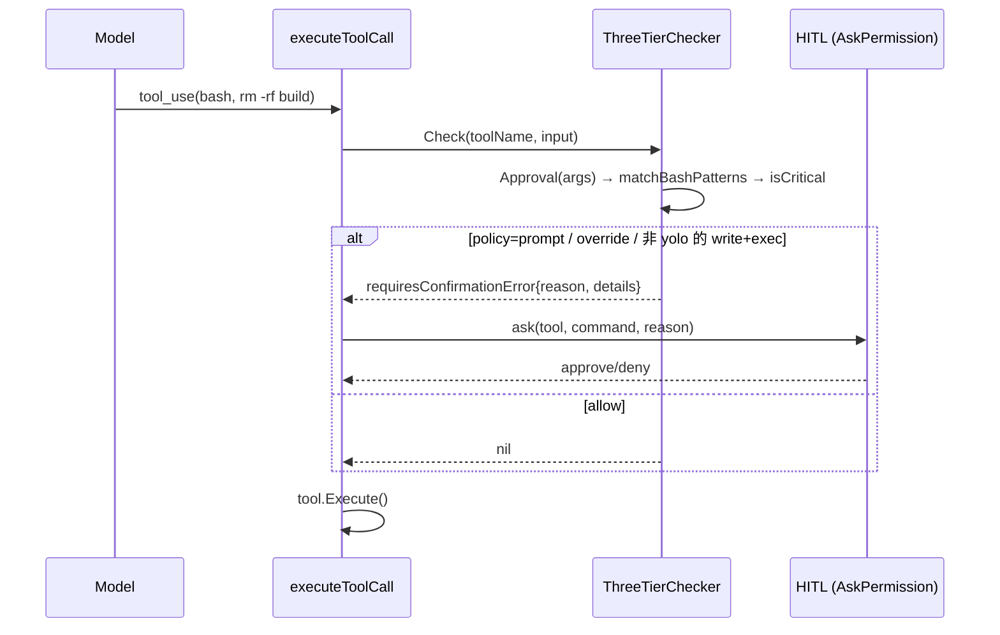
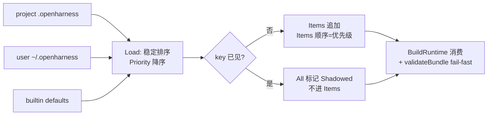
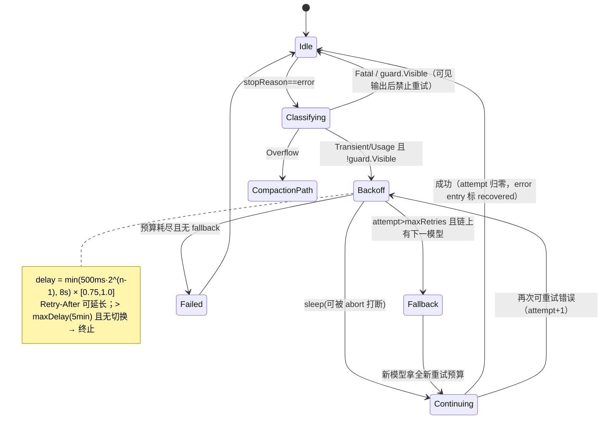
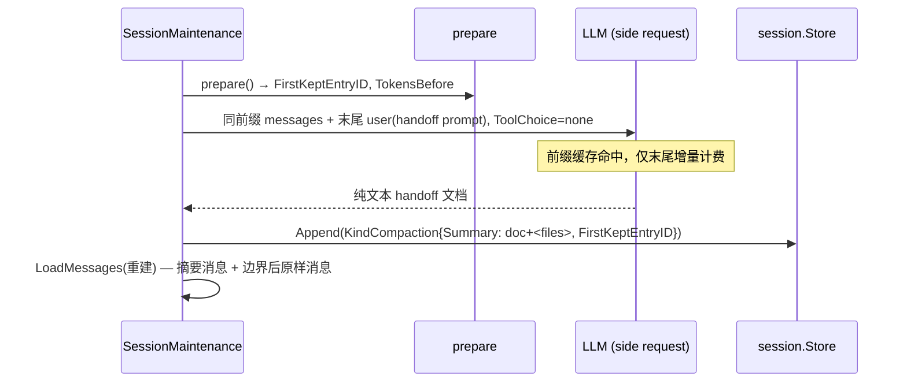
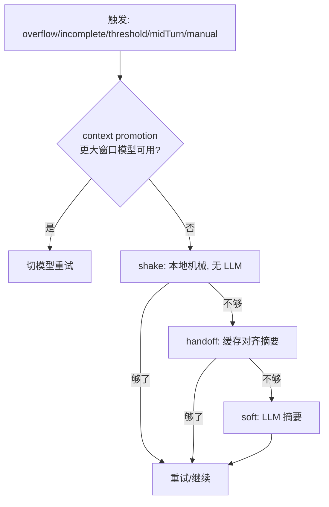

# Agent Note: omp P0 批次 — 三层审批 / Capability 注册表 / 重试韧性 / Handoff+Shake 压缩

Status: proposed

## Problem

[omp 机制深读](../../../../docs/omp-mechanism-deep-dive.md)的 P0 五条，对准两类问题：

1. **接线债**（[p0-tech-debt.md](../../../../docs/p0-tech-debt.md) P0-1/P0-2，2026-08-30 复核仍成立）：
   - `pkg/permissions.NewPermissionChecker` 全仓库零调用方；`engine.NewQueryEngine` 默认 `AllowAllPermissions{}`（pkg/engine/query_engine.go:177）；`BashTool` 直接 `exec.CommandContext`（pkg/tools/builtin/bash.go:73），`execCtx.AskPermission` 无任何 builtin 工具调用。三种 permission-mode 行为完全相同。
   - `BuildRuntime` 中 `mcpConfigs := make(map[string]mcp.McpServerConfig)`（pkg/ui/runtime.go:129），`settings.McpServers` 被静默丢弃；`engineOpts` 至今未追加 `engine.WithHookExecutor(hookExec)`——RuntimeBundle 携带 HookExecutor 但 engine 拿不到。
2. **韧性/正确性缺口**：`pkg/api` 已有基础传输重试（`retryableStatusCodes` + `getRetryDelay`），但无错误分类、无 replay-safety、无 fallback 链、无重试台账；compaction 仍是单一 LLM 摘要路径，`session.KindCompaction` 全仓库无写入方（已 grep 复核）。

本 note 是 P0 批次的可执行设计。压缩的**持久化语义**（KindCompaction 落树、append-only 不变量）由 [harness-v2-durability-core](./2026-08-29-harness-v2-durability-core.md) Phase 1 拥有，本文只定义「压缩产什么」；与 [pi-omp-implementation-design](./2026-08-22-pi-omp-implementation-design.md) 的关系：其 #4（流规则）、#5（advisor）、#7（记忆）分别由 P1 note 深化，#8（provider 韧性）由本文 F3 取代并深化。

## Proposal 总览

```mermaid
graph TD
    subgraph F2 Capability 注册表（其余一切的地基）
        R[loadCapability 统一发现] --> T1[工具+审批 F1]
        R --> T2[hooks 注入]
        R --> T3[MCP 配置复活]
    end
    T1 --> E[RunQuery executeToolCall]
    T2 --> E
    subgraph 压缩方法瀑布 F4+F5
        S1[overflow/threshold] --> S2[shake 本地机械]
        S2 --> S3[handoff 缓存对齐摘要]
        S3 --> S4[soft LLM 摘要]
    end
    E --> S1
    F3[Replay-safe 重试] -.error 分流.- E
    S2 -.溢出恢复.- F3
```

实施顺序：F2 → F1（连带 MCP/hooks 两处一行接线）→ F3 → F5 → F4。每个 feature 独立可发布，各自带「拆掉即失败」的接线测试。

---

## F1 三层工具审批模型

### 数据结构

```go
// pkg/permissions/approval.go
package permissions

type Tier string

const (
    TierRead Tier = "read"   // 读数据 / 仅 UI 态
    TierWrite Tier = "write" // 变更工作区/会话态，不执行任意代码
    TierExec Tier = "exec"   // 执行代码 / shell / 浏览器 / 生成子代理
)

type Policy string // "" | "allow" | "deny" | "prompt"

// Decision 是单次调用的完整判定。零值 = exec（未知工具的安全默认）。
type Decision struct {
    Tier     Tier
    Reason   string
    Override bool   // critical 模式：即使 yolo 也强制弹窗
    Policy   Policy // 工具自带 policy（参数级 deny/prompt）
}

// Approver 是 BaseTool 的可选扩展接口。未实现或返回畸形值的工具按 exec 处理。
type Approver interface {
    Approval(args json.RawMessage) Decision
    FormatApprovalDetails(args json.RawMessage) []string // 审批弹窗正文行
}
```

### 解析序（omp approval-mode.md 的语义，全序）

```go
// Resolve 是唯一的判定入口，顺序不可调换。
func (c *ThreeTierChecker) Resolve(toolName string, tool tools.BaseTool, args json.RawMessage) Resolution {
    d := execDecision()                       // 1. 兜底 exec
    if ap, ok := tool.(Approver); ok {
        d = normalize(ap.Approval(args))      // 畸形 → exec
    }
    if d.Policy == PolicyDeny { return deny(d.Reason) }        // 2a. 工具 deny 恒拒
    if up := c.userPolicy(toolName); up == PolicyDeny {        // 2b. 用户 deny 恒拒
        return deny("denied by tools.approval." + toolName)
    }
    if c.mode == ModeYolo {                                     // 3. yolo
        if d.Policy == PolicyAllow || d.Policy == PolicyPrompt { return fromPolicy(d) }
        if up := c.userPolicy(toolName); up != "" { return fromUser(up, d) }
        if d.Override { /* yolo 忽略裸 override */ }
        return allow(d)
    }
    if d.Override {                                             // 4. 非 yolo + override
        if d.Policy == PolicyAllow { return allow(d) }
        return prompt(d) // override 只能配合工具 allow 放行，其余一律弹窗
    }
    if d.Policy == PolicyAllow || d.Policy == PolicyPrompt {    // 5. 显式工具 policy 胜
        return fromPolicy(d)
    }
    if up := c.userPolicy(toolName); up != "" { return fromUser(up, d) }
    // 6. 无 policy → 模式×tier 表：always-ask{read:自动} / write{read,write:自动} / yolo 全自动
    return byMode(c.mode, d)
}
```

### Bash：不对称 compound 匹配 + 环境加固

```go
// pkg/tools/builtin/bash.go
// splitCompound 按 && || ; | & 子shell 换行 切段——deny/prompt 匹配整条或任一段，
// allow 必须匹配整条命令且命令含任何 shell 控制语法时直接不给 allow。
func (b *BashTool) Approval(args json.RawMessage) permissions.Decision {
    var in bashInput
    _ = json.Unmarshal(args, &in)
    cmd := in.Command
    if m, hit := matchBashPatterns(b.patterns, cmd); hit { // settings.bash.patterns
        switch m.Action {
        case "deny":   return permissions.Decision{Tier: permissions.TierExec,
                            Policy: permissions.PolicyDeny, Reason: m.Reason}
        case "prompt": return permissions.Decision{Tier: permissions.TierExec,
                            Policy: permissions.PolicyPrompt, Reason: m.Reason}
        case "allow":  // allow 要求整命令匹配且无控制语法，matchBashPatterns 内保证
            return permissions.Decision{Tier: permissions.TierWrite, Reason: m.Reason}
        }
    }
    if isCritical(cmd) { // rm -rf / 、fork bomb、curl|sh 远程执行、写 /etc/passwd、shutdown
        return permissions.Decision{Tier: permissions.TierExec, Override: true,
            Reason: "critical pattern detected: " + isCriticalReason}
    }
    return permissions.Decision{Tier: permissions.TierExec}
}

// 非交互子进程环境加固（omp bash-tool-runtime 全套，垫在 caller env 之下）
var hardenedEnv = []string{
    "PAGER=cat", "GIT_PAGER=cat", "GIT_EDITOR=true", "TERM=dumb",
    "GIT_TERMINAL_PROMPT=0", "SSH_ASKPASS=/usr/bin/false", "NO_COLOR=1", "CI=true",
    "npm_config_yes=true", "PIP_NO_INPUT=1", "CARGO_TERM_NONINTERACTIVE=1",
}
```

### 接线

```go
// pkg/ui/runtime.go BuildRuntime（~line 193 区域）：
checker := permissions.NewThreeTierChecker(settings.Permission, settings.BashPatterns)
engineOpts = append(engineOpts, engine.WithPermissionChecker(checker))
engineOpts = append(engineOpts, engine.WithHookExecutor(hookExec)) // 顺带修 hooks 死接线
// executeToolCall 中 PermissionChecker.Check 返回 RequiresConfirmation 时，
// 通过 qctx.AskPermission 走 HITL 弹窗（签名扩展为携带 Decision.Reason 与 details 行）。
```

`engine.PermissionChecker` 接口保持 `Check(ctx, toolName, input) error` 不变；`ThreeTierChecker` 内部完成 tier×policy 解析，`prompt` 结果转为 `requiresConfirmationError{decision}`，由 executeToolCall 统一升级为 HITL 调用——权限路径仍从 checker → executeToolCall → side effect 单向贯通。

### 判定时序



**接线测试**（拆掉即失败）：settings 注入 `bash.patterns: [{match: "rm -rf *", action: deny}]`，断言 yolo 模式下 `cd /tmp && rm -rf build` 被拒；再断言 BuildRuntime 产出的 engine 非 `AllowAllPermissions`（reflect 判型）。

---

## F2 Capability 注册表

### 数据结构

```go
// pkg/capability/capability.go
package capability

type ID string // "skills" | "hooks" | "commands" | "mcp" | "context-files" | "rules"

// Provider 是一个发现源。Priority 大者胜；同优先级按注册序。
type Provider[T any] struct {
    Name     string                                    // "builtin" | "project" | "user" | "plugin"
    Priority int
    Key      func(T) string                            // 去重键；nil 则不去重
    Load     func(ctx context.Context) ([]T, error)    // 单源失败只记 warning
}

type Scored[T any] struct {
    Item     T
    Provider string
    Priority int
    Shadowed bool // 被更高优先级同名项遮蔽（保留用于排障）
}

type Result[T any] struct {
    Items    []T          // 去重后的生效项，顺序=优先级降序（确定性）
    All      []Scored[T]  // 全量含 _shadowed
    Warnings []error      // 单源加载失败，不致命
}

func Load[T any](ctx context.Context, id ID, providers ...Provider[T]) Result[T] {
    sortProviders(providers) // 稳定排序：Priority 降序，同级保持注册序
    var res Result[T]
    seen := map[string]int{}
    for _, p := range providers {
        items, err := p.Load(ctx)
        if err != nil { res.Warnings = append(res.Warnings, fmt.Errorf("%s: %w", p.Name, err)); continue }
        for _, it := range items {
            k := ""
            if p.Key != nil { k = p.Key(it) }
            s := Scored[T]{Item: it, Provider: p.Name, Priority: p.Priority}
            if k != "" {
                if _, dup := seen[k]; dup { s.Shadowed = true } else { seen[k] = 1; res.Items = append(res.Items, it) }
            } else { res.Items = append(res.Items, it) }
            res.All = append(res.All, s)
        }
    }
    return res
}
```

### 提供者与优先级（对齐 omp，数字即语义）

| ID | Providers（优先级降序） | 现有实现迁移 |
|---|---|---|
| `skills` | project `.openharness/skills`(100) > user(90) > builtin(10) | pkg/skills loader 收编 |
| `hooks` | project(100) > user(90) > builtin stream-rules(10) | pkg/hooks loader 收编 |
| `mcp` | CLI overlay > project config > user config | pkg/config settings.McpServers 接入 |
| `context-files` | `.openharness/AGENTS.md`(100) > `CLAUDE.md`(80) > `AGENTS.md`(10)，depth 规则见 P1 note | runtime.go ClaudeMD 发现收编 |
| `commands` | builtin(100) > project(50) | slash 命令表 |

### BuildRuntime 消费 + 装配自检

```go
// pkg/ui/runtime.go：全部发现走注册表；bundle 自检失败即 fail-fast。
func validateBundle(b *RuntimeBundle) error {
    if b.Engine == nil { return errors.New("wiring: engine missing") }
    if b.Store == nil { return errors.New("wiring: session store missing") }
    if b.Settings.Permission.Mode != "" && !b.engineHasPermissionChecker { // reflect 或显式 flag
        return errors.New("wiring: permission checker not injected into engine")
    }
    if len(b.Settings.McpServers) > 0 && b.mcpServerCount == 0 {
        return errors.New("wiring: configured MCP servers were dropped")
    }
    return nil
}
```



**接线测试**：同一 hook key 分别放 project 与 user 目录，断言生效的是 project 版且 `Result.All` 中 user 版 `Shadowed==true`；删除 `WithHookExecutor` 接线行后 `validateBundle` 必须报错（测试断言错误信息）。

---

## F3 Replay-safe 自动重试 + Fallback 链

### 错误分类与重试状态机

```go
// pkg/api/retry.go
type ErrorClass int
const (
    ClassTransient ErrorClass = iota // 429/5xx/网络/超时/overloaded → 重试
    ClassUsage                        // usage limit/quota → 凭证轮换或 fallback
    ClassOverflow                     // context overflow → 交给压缩路径，绝不重试
    ClassRefusal                      // classifier refusal → 仅 fallback 可续
    ClassFatal
)

func Classify(err error) (ErrorClass, time.Duration /*retryAfter*/) // 解析 Retry-After / retry-after-ms 头
```



### Replay-safety 门（pkg/api 流式层）

```go
// replayGuard 随单次请求存活：任何「对模型/用户可见」的输出出现后，重试必须禁止，
// 否则产生重复副作用。thinking-only / 空白 partial 可安全丢弃。
type replayGuard struct{ visible bool }

func (g *replayGuard) observe(ev LLMStreamEvent) {
    if ev.TextDelta != "" || ev.Message != nil && hasToolUse(ev.Message) {
        g.visible = true
    }
}
// 空补全重试：done 但零输出 → 缓冲已收到的 pre-output 事件，
// 500ms 指数退避重试 ≤2 次；一旦 observe 到可见输出即放弃缓冲。
```

### retryRecovery 台账（错误 entry 不删除，标记后从 LLM 上下文剔除）

```go
// pkg/session/store.go：错误消息仍以 KindMessage 落树，Meta 携带标记：
// Meta["retryRecovery"] = {"status":"recovered"|"superseded", "kind":"rate_limit",
//                          "attempt":3, "note":"429; switched account; retried",
//                          "supersededBy":"<entryID>"}
// pkg/engine 重建上下文时跳过带 retryRecovery 标记的 entry；
// UI 渲染为暗色一行注记（保留可审计性）。
```

**配置**（pkg/config）：`retry.maxRetries=10`、`retry.baseDelayMs=500`、`retry.maxDelayMs=300000`、`retry.modelFallback=true`、`retry.fallbackChains=[]`（`{role, models[]}`）。

**补充（同批顺手做）**：流式 tool-call 参数解析加 256 字节增长节流（避免每 delta 全量重解析 JSON）+ 解析失败返回 `{}` 而非中断流；Google 通道加 ThinkingLoopDetector（逐字尾重复 ≥180 字符 / trigram Jaccard ≥0.8 → 合成可重试错误）可后置到 P1。

**接线测试**：mock 流式 client 先吐 `text_delta` 再断流 → 断言不重试且 EventError 透出；空流两次后成功 → 断言 attempt=2 成功且 session 中错误 entry 带 `retryRecovery` 标记。

---

## F4 Handoff：缓存对齐的就地压缩

### 压缩 entry（session 树一等公民）

```go
// pkg/session/store.go：KindCompaction 的写入方（持久化语义归 durability Phase 1）
type CompactionMeta struct {
    Summary          string `json:"summary"`
    ShortSummary     string `json:"shortSummary,omitempty"`
    FirstKeptEntryID string `json:"firstKeptEntryId"` // 边界：此后消息原样保留
    TokensBefore     int    `json:"tokensBefore"`
    Method           string `json:"method"` // handoff | shake | soft
    Details          map[string]any `json:"details,omitempty"` // readFiles/modifiedFiles
}
// Append(Entry{Kind: KindCompaction, Meta: ...})

// 上下文重建（pkg/engine LoadMessages 改造）：
// 活跃路径上最新 KindCompaction → 一条 summary user 消息
//   + FirstKeptEntryID..压缩点之间的消息 + 压缩点之后的消息。
```

### Side request 的缓存对齐三原则

1. **同管线**：system prompt、tools、消息历史与活轮完全同构（同 ToAPISchema、同消息转换），仅追加**末尾一条 user 消息**（handoff 提示词）——前缀逐字节一致，provider 缓存全命中。
2. **toolChoice none**：`LLMRequestParams` 增加 `ToolChoice string` 字段；provider 拒绝显式 none 时降级 `auto` 重试一次，返回内容只取 text 块、丢弃 tool_use 块。
3. **就地提交**：产物写回**当前会话**的 KindCompaction entry，session id / 文件 / 转录 / 缓存键不变。



**触发**：`/handoff` 命令（≥2 条消息守卫）+ 自动 `methodOrder` 中的 handoff 档 + 异步预生成（预备带 `[threshold−clamp(threshold×0.125, 8192, 32000), threshold)`，跨阈值瞬间提交；分支前缀变化即弃置）。

---

## F5 Shake：本地机械压缩 + 方法级联

### 算法与守则

```go
// pkg/services/shake.go
type ShakePolicy struct {
    ProtectRecentToolTokens int // 40000：最新 tool 输出不动
    MinSavingsTokens        int // 20000：总节省低于此不动手
    MinPruneTokens          int // 50：占位符 ~8 token，剪小结果负收益
}
// 候选：非保护的旧 tool_result（skill 结果、活动 plan 引用文件除外）与大 fenced/XML 块。
// 替换：全文 spill 到 artifact 文件（<sessionDir>/artifacts/<id>.log），
//       原位替换为 "[saved ~N tokens — full output: artifact://<id>]"。
// 时机（cache-aware）：仅当候选之后的后缀 ≤8k token、或会话闲置超过 provider 缓存寿命，
//       才改写历史中段——否则只在新请求边界追加，绝不搅动缓存前缀。
```

### 方法级联（CompactionConfig 扩展）

```go
type MethodOrder []string // 默认 ["handoff","shake","soft"]；omp 顺序为 remote,snapcompact,handoff,shake,soft
// 触发原因六种：manual / overflow / incomplete(stopReason=length) / threshold / midTurn / idle。
// overflow：先试更大窗口模型切换，失败走 methodOrder（handoff 因复用溢出输入而跳过，shake 无输入限制可跑）；
//           成功后自动重试被中止的 turn；单次对话输入至多恢复一次，再遇直接报错（循环有界）。
```



**接线测试**：构造 200k token 历史跑 shake → 断言零 LLM 调用、节省 ≥MinSavings、artifact 文件存在且 `artifact://` 引用可解析回全文；删除 shake 在 methodOrder 中的注册后 overflow 恢复测试失败。

---

## Alternatives considered

- **只做一行接线（`WithPermissionChecker(permissions.NewPermissionChecker(...))`）**：最便宜，但现有 `Evaluate(toolName, isReadOnly, filePath, command)` 表达不了 tier×policy×args 三层语义，也没有 bash compound 段匹配——修完 P0-1 仍是「工具名黑白名单」级别的能力，二次重构不可避免。选择了直接落三层模型。
- **BuildRuntime 逐点修补而不引入 capability 注册表**：每个子系统一行代码也能复活（MCP 一行、hooks 一行），但这正是 p0-tech-debt 复发的模式——装配完整性靠人肉记忆。注册表 + validateBundle 把「接线」变成类型化产物，shadowed 标记提供排障面。
- **重试只加 fallback 不加 replay-safety**：fallback 链会放大重复副作用风险（第一模型已吐工具调用、第二模型再来一遍）。replay-safety 门是 fallback 的前置而非可选项。
- **压缩继续走单一 LLM 摘要**：soft 摘要每次都全缓存失效且依赖模型可用性；shake/handoff 两档分别覆盖「零成本快速回血」和「保缓存的深度压缩」，cascade 让 overflow 恢复不再依赖网络。

## Acceptance criteria

- P0-1/P0-2 关闭：`go run ./cmd/openharness --permission-mode default` 下 bash 危险命令触发确认；`openharness mcp add` 后重启会话能连上 server；`engineOpts` 含 `WithHookExecutor` 且 PreToolUse 钩子真实触发。
- `go build ./... && go vet ./... && go test ./...` 通过；触及 engine 的改动带 `-race`。
- 每个接线点有「拆掉即失败」的测试（F1 权限注入、F2 validateBundle、F3 fallback 链、F4 KindCompaction 写入、F5 shake 注册）。
- 重试链结束后，会话文件中每个错误 entry 都带 retryRecovery 标记；`/cost` 与日志可解释每次恢复。
- F1–F5 各自更新或新增 Agent Note（本 note 即 F1–F5 的载体，实现时按迁移规则改写为 implemented）。

## Risks

- **行为面变化**：default 模式从「全放行」变为「弹窗」，REPL 无 HITL 上下文时（print/JSONLines 模式）prompt 策略需明确定义为拒绝而非静默放行（对齐 omp headless 语义）。
- **retryRecovery 需要每个 JSONL 消费者跳过标记 entry**：ListIDs/ActiveMessages/fork 路径都要覆盖，否则恢复的对话里会出现幽灵错误消息（durability note 的 Risks 同款问题，一起验收）。
- **handoff 的 toolChoice 字段**触及两个 API client 的请求构造，OpenAI 兼容路径的等价参数（`tool_choice:"none"`）需要各自的降级探测。
- **shake 改写历史中段**与 durability Phase 1 的 append-only 不变量存在张力：落地顺序必须是 Phase 1 的 KindCompaction 先行，shake 只允许在「缓存过期或后缀很小」的窗口内改写，且改写结果以新 entry 表达而非原地篡改 JSONL。
