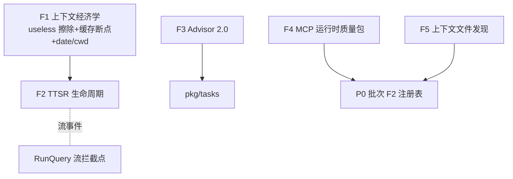
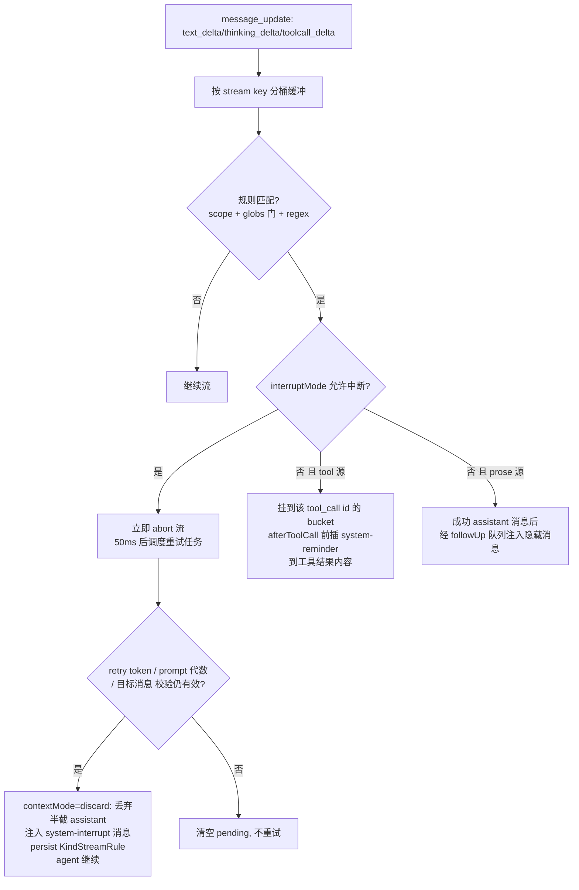
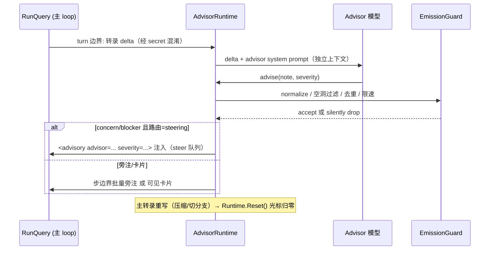
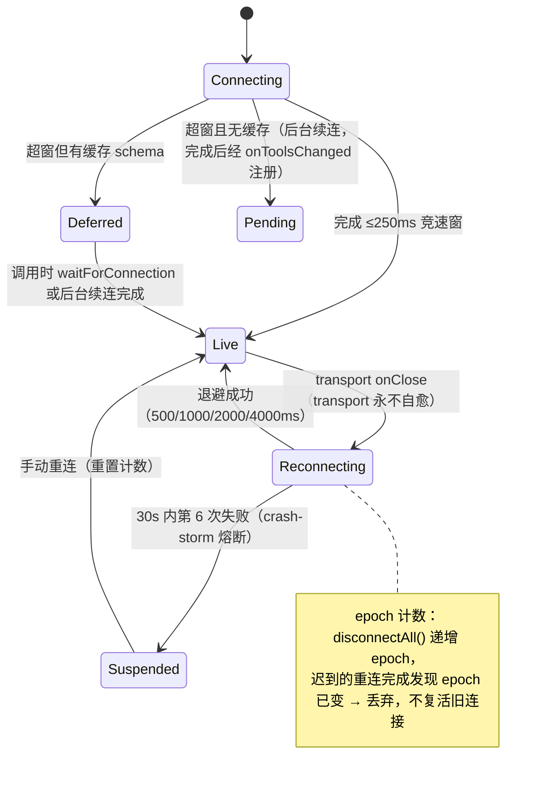

# Agent Note: omp P1 批次 — 上下文经济学 / TTSR 生命周期 / Advisor 2.0 / MCP 运行时 / 上下文文件发现

Status: proposed

## Problem

[omp 机制深读](../../../../docs/omp-mechanism-deep-dive.md)的 P1 五条。前提依赖 [omp P0 foundations](./2026-08-30-omp-p0-foundations.md) 的 capability 注册表（本批所有「发现类」能力挂在注册表上）。现状锚点：

- 上下文侧：`pkg/services/compact.go` 只有 L1–L5 字符级管线，无 useless 语义；`pkg/api` Anthropic 通道未管理 cache_control 断点；date/cwd 拼在 system prompt 里（pkg/ui/runtime.go 装配处）。
- 流规则侧：`session.KindStreamRule` entry 已定义、`pkg/hooks` 事件总线就位，但没有流拦截层、没有规则匹配器、没有注入生命周期。
- 子代理侧：`pkg/tasks` SubAgentExecutor 只返回文本；engine 无旁路评审通道。
- MCP 侧：`pkg/mcp/client.go`（439 行）连不上配置（P0-2），更没有重连/熔断/慢启动语义。
- 上下文文件侧：runtime.go 的 ClaudeMD 发现「多条路径只读第一条」（p0-tech-debt 次级问题）。

## Proposal 总览



实施顺序：F1（独立小改）→ F5（修真 bug）→ F4 → F2 → F3。F2/F3 依赖 P0 批次的 KindCompaction 落树与 hooks 注入。

---

## F1 上下文经济学三件套

### 1a. useless / superseded 原位擦除

```go
// pkg/tools/base.go：ToolResult 增加上下文经济学元数据
type ToolResult struct {
    Output   string
    IsError  bool
    Useless  bool   `json:"useless,omitempty"`  // 零命中搜索、空信箱 drain 等「无事件」结果
    Metadata map[string]any
}

// pkg/services/elide.go：原位替换，不改历史结构、不破坏 tool call/result 配对
const uselessNotice = "[Uneventful result elided]"

func ElideUseless(msgs []types.ConversationMessage, budget CacheBudget) []types.ConversationMessage
// 时机（cache-aware，二选一才动手）：
//   a) 候选之后的后缀 ≤ 8k token（改写不破坏有效缓存前缀）
//   b) 会话闲置已超过 provider prompt-cache 寿命（缓存本就要失效）
// 小于 notice 本身的结果不擦（负收益）；isError 的结果永不擦。
// 摘要序列化：useless pair 整对丢弃（serializeConversation 语义）。
```

superseded reads 同机制：同一文件被再次 read 且内容未变时，旧 read 结果按上述时机替换为占位符。

### 1b. Anthropic 缓存断点滚动窗

```go
// pkg/api/anthropic_cache.go
// 断点挂「最近两条消息的尾部」（跳过 thinking/redacted 块）随对话滚动推进；
// 合成 "Continue." pad 时锚定前一条真实 assistant 消息，避免断点落在合成块上。
func ApplyRollingCacheBreakpoints(req *AnthropicRequest, maxBreakpoints int) {
    // system 块固定 1 个断点；消息尾部窗口内 2 个滚动断点；
    // 超出 maxBreakpoints(=4) 时最旧的自动失效——无需手动清理。
}
```

### 1c. date/cwd 出 system prompt

`BuildRuntime` 把 `当前日期` 与 `cwd` 从 system prompt 拆出，注入**首轮** user 侧 `<system-reminder>`（作为 custom 消息进上下文，不进 system 块）。跨午夜会话刷新日期只追加一条 reminder，system prompt 逐字节稳定 → 开放权重 provider 的前缀缓存跨会话可复用。

**接线测试**：同会话两轮请求的 system prompt 字节相等（date 挪走后即可成立）；useless 擦除仅在后缀 ≤8k 时发生（构造大后缀断言不擦）。

---

## F2 TTSR 完整生命周期

### 领域模型

```go
// pkg/hooks/ttsr/rule.go
type ScopeToken struct {
    Source string // "text" | "thinking" | "tool"
    Tool   string // tool 源时的工具名；"" = 任意
    Glob   string // tool:edit(*.ts) 的路径 glob；"" = 任意
}

type Rule struct {
    Name          string
    Condition     string       // 正则；(?i)/(?m)/(?s) 内联 flag 翻译为 Go regexp flag
    ASTCondition  []string     // 可后置：tree-sitter 结构模式（Go 侧先只做 regex）
    Scopes        []ScopeToken // 空 = 默认监听 text+tool（不含 thinking）
    InterruptMode string       // always | prose-only | tool-only | never
    RepeatMode    string       // once | after-gap
    RepeatGap     int          // after-gap 的完成 turn 间隔
    Content       string       // 注入的规则正文
    Globs         []string     // 全局路径门：匹配上下文须至少命中一个
}

type InjectionRecord struct { RuleName string; LastInjectedTurn int } // 持久化到 KindStreamRule entry
```

### 匹配与三种交付路径



```go
// pkg/engine/query.go 流拦截点（RunQuery 的 streamCh 消费循环内）：
//   ev.TextDelta / ev.ReasoningDelta / ev.Message(tool_use 增量) → ttsr.OnDelta(source, delta)
// pkg/hooks/ttsr/manager.go：
//   checkDelta(source, delta, mctx) []Rule   // 同步正则；无规则监听该 source 时零开销直通
//   onTurnEnd()                              // messageCount++，驱动 after-gap
// pkg/engine executeToolCall 的 PostToolUse 位置：afterToolCall 把 bucket 内 reminder
//   前插到 ToolResult.Output（渲染层按 <system-reminder 前缀识别，真实输出跟在后面）。
```

**持久化与恢复**：注入发生时 `store.Append(Entry{Kind: KindStreamRule, Meta: {"rules": [...]}})`；会话恢复时沿活跃路径回放重建 `InjectionRecord`（`repeatMode: once` 的规则 reload 后保持抑制）。

**规则发现挂 P0 注册表**（`capability.ID("rules")`），同时移植 omp 内嵌 Go 卫生规则为 builtin provider（源：omp `discovery/builtin-rules/go-*.md` 12 条，如 go-add-cleanup、go-ioutil、go-join-hostport、go-rand-v2、go-range-int——正文即 condition+content，可直接转 YAML/MD）。

**同族补充**：streaming edit guard——`toolcall_delta` 上检测到 edit/write 调用且编辑目标快照已过期时提前 abort（复用同一拦截点，先落 TDD 再扩展）。

**接线测试**：注册 `condition: "rm -rf"` + `interruptMode: always` 规则，mock 流式输出命中后断言：流被 abort、半截输出被丢弃、`<system-interrupt>` 注入、KindStreamRule entry 落树、重试成功完成；`interruptMode: never` + tool 源断言 reminder 前插且流未中断。

---

## F3 Advisor 2.0

### 组件与交付路由

```go
// pkg/advisor/runtime.go
type Runtime struct {
    Model       string            // 独立模型（settings.modelRoles.advisor）
    Tools       []tools.BaseTool  // 默认 read/grep/glob；独立 ToolSession 与审批面
    Cursor      int               // 已消费的主转录长度（增量 delta 评审）
    Guard       *EmissionGuard
    ImmuneUntil int               // immuneTurns：成功 concern/blocker 后 N 轮内降级为旁注
    Recorder    *TranscriptRecorder // <sessionDir>/artifacts/__advisor.jsonl
}

type Severity string // nit | concern | blocker

// advise 工具：advisor 唯一的输出通道（对主 agent 是普通工具结果 "Recorded."）
// 交付路由（关键：不打断用户刻意中断的流程）：
//   主 loop streaming 中        → steering 注入活 turn
//   idle + 尾部是终止答案        → concern 存为可见卡片（下轮 resume 再进上下文）；blocker 仍 steering
//   idle + 中途 yield           → concern/blocker 触发新 turn
//   plan mode / 用户刚中断      → 一律卡片化，绝不自动唤醒
```

```go
// pkg/advisor/guard.go — EmissionGuard（防噪音洪水，全部在 advise 返回前完成，模型不可见）
type EmissionGuard struct {
    history map[string]struct{} // NFKC 归一化 + 非字母数字折叠为单空格 后的精确去重，FIFO 上限 4096
    acceptedThisUpdate bool    // 每次 advisor prompt() 周期至多采纳一条
}
var contentFree = []string{"stop", "done", "complete", "lgtm", "nothing to add", "no issue"}
// suppress：空洞短语 / 已接受重复 / 本周期已采纳 → 降级静默忽略；
// 同义降级（nit→nit）忽略，真升级（nit→concern）放行。
```

### 时序



安全约束：advisor 的工具跑在独立 ToolSession（审批面照常生效）；异常输出（请求未授权工具、破坏性指令特征）整轮隔离丢弃，连续两次隔离即重置 advisor 上下文；advisor 不进 hub 对等名单、不可被主 agent 主动召唤。

**接线测试**：mock advisor 模型连发 3 条相同 note → 断言主转录只进 1 条；plan mode 下 blocker 尝试 steering → 断言被卡片化（不打断 plan 审批流）。

---

## F4 MCP 运行时质量包

### Manager 状态机



```go
// pkg/mcp/manager.go 改造（现有 client.go 之上）
type Manager struct {
    mu          sync.Mutex
    connections map[string]*Conn          // name → conn
    deferred    map[string]*DeferredTool  // name → 有缓存 schema 的占位工具
    epoch       int                        // 防僵尸复活
    reconnects  []time.Time                // 30s 窗口内的重连时间戳（熔断）
    cfg         map[string]ServerConfig    // 未解析的原始配置（重连时重新解析凭据）
}

// 快速启动门：connectAll 启动全部 goroutine 后 select { case <-allDone: case <-time.After(250ms): }
// DeferredTool.Call() → 阻塞等该 server 连接完成（带超时）→ 真实调用。
```

### 确定性工具命名与冲突裁决（provider-facing determinism）

```go
// 工具名 = mcp__<server>_<tool>：小写、非 [a-z0-9_] → "_"、折叠下划线、剥冗余 server 前缀；
// >64 字符：可读前缀 + hash 后缀。命名必须与发现/重连顺序无关。
func dedupeTools(tools []Named) []Named {
    sort.Slice(tools, func(i, j int) bool { // origin key = server\x00tool 字典序
        return tools[i].originKey() < tools[j].originKey()
    }) // 字典序定胜者 → 重连或发现顺序无法改变归属
}
```

**补充**：秘密解析两级（`${VAR}` 发现期展开；连接前 env 求值）先做第一级即可；`!cmd` shell 求值后置。凭据绑定与 OAuth 后置到 P2。

**接线测试**：fake server 阻塞 2s → 断言会话 250ms 内就绪且工具列表含 DeferredTool、真实调用在连接完成后返回；fake server 连续崩溃 6 次 → 断言熔断挂起且手动重连恢复；两个 server 暴露同名工具 → 断言胜者恒为字典序较小者（打乱启动顺序重跑断言不变）。

---

## F5 上下文文件多源发现与 shadowing

### 发现与去重规则（修「ClaudeMD 只读第一条」）

```go
// pkg/config/contextfiles.go（挂在 P0 注册表 capability.ID("context-files")）
type Candidate struct {
    Path    string
    Level   string // "user" | "project"
    Depth   int    // cwd=0，父目录 1，…（配置子目录 .claude/ 与其祖先同深度）
    Source  string // provider 名
    Priority int   // openharness(100) > claude(80) > codex(70) > agents-md(10)
}

// 去重：同一 user 全局只留一个（最高优先级）；每深度留一个（同深度高优先级遮蔽）；
// 字节相同折叠取最靠近 cwd 者。注入顺序：远祖先在前 → 近者在后 → user 最后（越靠后越显著）。
// 更深处未被加载的 AGENTS.md 以 <dir-context> 指针列出（路径 + "编辑前先读"指令），不注入全文。
```

### `@` 导入展开

```go
// pkg/config/imports.go
// 规则：相对路径基于导入文件自身目录（非 cwd）；~/ 基于家目录；
// 围栏代码块/行内代码内的 @token 不展开；git@ / 邮箱形 token 不算导入
//（@ 必须在行首或空格/tab 后）；路径尾标点剥除；递归 ≤5 层；环跳过；缺失保留原文本。
func ExpandImports(root string, maxDepth int) (string, error)
```

**sticky 规则**：顶层 `RULES.md`（`.openharness/RULES.md` 或 `~/.openharness/RULES.md`）不走一次性注入，而走 always-apply 通道——每轮作为紧贴当前 turn 的 reminder 重新附着（与 P1 F2 的注入机制共用 reminder 通道），长会话中不失效；frontmatter 不能关掉其 sticky 属性。

**接线测试**：构造 `repo/AGENTS.md` + `repo/pkg/api/AGENTS.md` + `repo/pkg/api/CLAUDE.md` 三层，cwd=repo/pkg/api → 断言注入顺序为 `[repo/AGENTS.md, CLAUDE.md]`（同深度 claude 80 遮蔽 agents-md 10），且两份都在；`@docs/a.md` 引用链 + 环形引用 → 断言展开 ≤5 层且环只进一次。

---

## Alternatives considered

- **useless 擦除做进 compaction 管线而不是独立通道**：L1–L5 管线按 token 阈值触发，擦除的收益恰恰在「没触发压缩的会话」里；且擦除时机由缓存寿命驱动而非 token 阈值驱动，放一起会互相污染触发条件。独立 `ElideUseless`，压缩序列化时复用其判定。
- **TTSR 用 HookExecutor.PreToolUse 实现**：PreToolUse 在工具执行前才跑，管不到「流式输出中途违规」——TTSR 的核心价值就是在 token 层拦截。必须在 RunQuery 的流事件循环内做，HookExecutor 只承载 afterToolCall 的 reminder 前插。
- **advisor 用现有 task 子代理实现**：task 子代理是请求-应答模型，没有「随主转录增量推进的常驻光标」与 emission guard；advisor 的本质是有状态旁路评审器，独立 `pkg/advisor` 更小更可控。
- **MCP 重连放在 transport 层**：omp 的结论明确——transport 自愈会掩盖协议层错误并让重试语义失控；transport fail-fast、manager 持有策略。Go 侧同理：`pkg/mcp/client.go` 保持无状态连接语义，重连状态机收在 manager。
- **上下文文件只支持 AGENTS.md 一种**：与生态兼容（CLAUDE.md 等）是多 provider 发现的核心价值，且 shadowing 语义让「谁生效」可预测；代价只是候选枚举。

## Acceptance criteria

- F1：两轮请求 system prompt 字节一致；useless 擦除有「后缀保护」测试；Anthropic 请求断点数 ≤4 且随对话滚动。
- F2：命中规则的中断-注入-重试全链路有 e2e 测试；`repeatMode: once` 跨会话恢复仍抑制；12 条 Go builtin 规则可发现可注入。
- F3：advisor note 交付路由矩阵（streaming/idle×terminal/idle×midwork/plan-mode）全覆盖单测；emission guard 限速与去重有测试。
- F4：250ms 门、熔断、epoch、字典序冲突四个语义各有测试；`openharness mcp list` 能展示 deferred/pending/live 状态。
- F5：三层目录 shadowing 用例通过；`@` 导入 5 层/环/代码块三条边界有测试。
- 全批依赖 P0 注册表；每个接线点带反拆除测试；`go test -race ./...` 通过（F2/F3/F4 均有并发面）。

## Risks

- **TTSR 的中断-重试与 P0 批次 replay-safety 的交互**：TTSR abort 属于「可见输出已产生但必须重试」的唯一合法例外——重试门需要为 TTSR 开显式旁路（injection 消息即重试的上下文差异），否则两个机制互相锁死。
- **擦除/断点两类改动都直接动 LLM 请求体**：需要 wire-level 测试锁住「useless 替换后 tool_use/tool_result 配对完整」与「断点不落在 thinking 块」两条不变量，防止后续改动悄悄破坏 provider 端校验。
- **advisor 成本失控**：常驻第二模型按 turn 评审，默认关闭（`advisor.enabled=false`）并在 `/advisor status` 露出 token/cost；immuneTurns 与每更新一条的限速是硬约束不是调优项。
- **MCP 熔断阈值**（30s/5 次）对慢启动 server 偏激进：先按 omp 默认值落地，观察后再暴露配置。
- **上下文文件 shadowing 是行为变化**：现有用户若同时有 CLAUDE.md 与 AGENTS.md，生效文件会切换——需要在加载时打一行日志声明被遮蔽项（利用注册表 shadowed 数据）。
