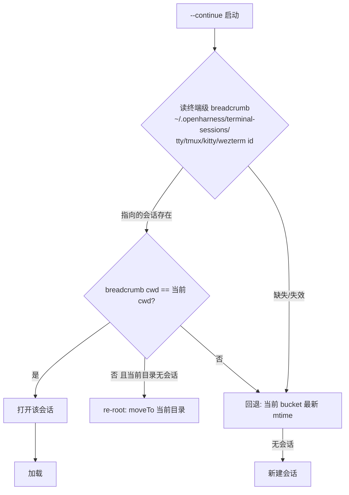
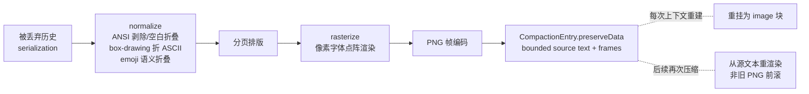
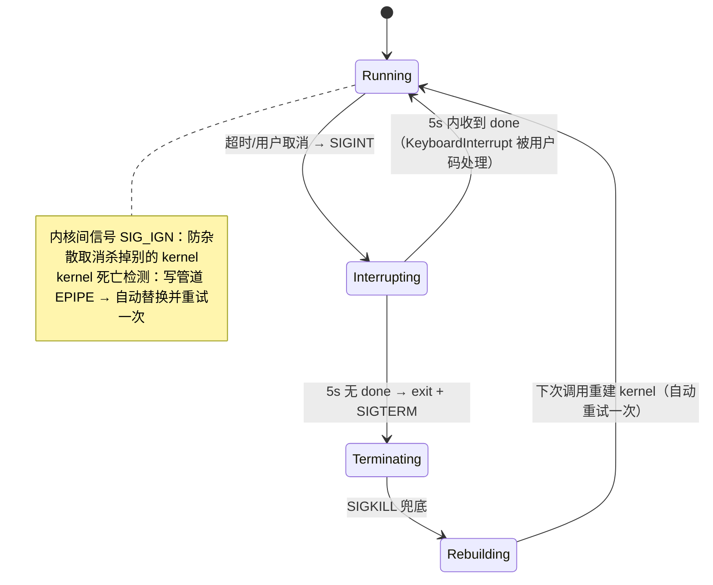

# Agent Note: omp P2 批次 — 会话操作 / Snapcompact / Eval 内核 / Prewalk / 记忆管线 2.0

Status: proposed

## Problem

[omp 机制深读](../../../../docs/omp-mechanism-deep-dive.md)的 P2 五条：差异化能力与长周期投入，不阻塞任何现有债务修复。前提：P0 批次的 KindCompaction 落树（F1/F2 需要）与 modelRoles 表（F4 需要）。每条独立可发布，无相互依赖。

## Proposal 总览

```mermaid
graph LR
    subgraph F1 会话操作四件套
        A1[/fresh 轮换 provider 态] --- A2[reset_boundary]
        A3[fork 缓存键继承] --- A4[breadcrumb --continue]
    end
    B[F2 Snapcompact 位图归档] -.methodOrder 新档.- P0F5[P0 批次压缩级联]
    C[F3 Eval 持久内核] --> D[F4 Prewalk 模型接力]
    E[F5 记忆管线 2.0] -.preCompactionContext.- P0F4[P0 批次 handoff]
```

---

## F1 会话操作四件套

### 1a. `/fresh`：只轮换 provider 侧状态

```go
// pkg/engine/query_engine.go
// Fresh() 与 /clear 的本质区别：本地转录、会话文件、sessionID 一个字节都不动，
// 只重铸「provider 视角的身份」——治僵死 prompt cache / 服务端会话漂移。
func (qe *QueryEngine) Fresh() error {
    qe.mu.Lock(); defer qe.mu.Unlock()
    if qe.running { return errors.New("fresh: query in progress") }
    qe.providerSessionID = uid.NewHex()      // 新 provider 会话标识
    qe.invalidateAppendOnlyContext()          // 下一请求全量重放本地转录
    qe.memoryKeys = rekeyMemory(qe.sessionID) // 记忆 key 重挂到新 id（P2 F5 落地后）
    return nil
}
```

### 1b. `/clear` = 持久 `reset_boundary`

```go
// pkg/session/store.go 新 entry kind：
KindResetBoundary EntryKind = "reset_boundary"
// 语义：磁盘全史保留；ActiveMessages 与折叠转录从「最新边界」开始；
// /export 全量转录仍含边界前历史。boundary 优先级高于同路径上的最新 KindCompaction
//（/clear 之后的压缩只摘要边界后的消息）。
```

### 1c. `/fork` 继承 provider 缓存键

`Store` header Meta 增加 `providerPromptCacheKey`；fork 时继承源值（除非模型/系统提示/工具形状变了——那会使缓存键作废，必须重置）。fork 后第一轮请求即可能命中源会话缓存。

### 1d. `--continue` 走终端 breadcrumb



```go
// pkg/session/breadcrumb.go
func WriteBreadcrumb(terminalID, sessionPath, cwd string) error // best-effort，失败仅日志
// 附加第三行 "fresh"：标记 /new 后尚未落盘的会话边界，防止 continue 复活旧转录。
// 会话列表（pkg/session.ListIDs 升级）：只读每文件 4KiB 前缀 + 32KiB 尾，
//   前缀出 id/title/首条消息预览，尾出 lifecycle 状态（complete/interrupted/aborted）；
//   stat-keyed 缓存 + 有界并行 worker。
```

**接线测试**：kill 进程后 `--continue` 精确回到同一终端的会话（另开终端测试不串）；`/clear` 后 ActiveMessages 从边界开始而 JSONL 行数只增不减。

---

## F2 Snapcompact：位图归档压缩

### 管线



```go
// pkg/snapcompact/shape.go — shape 按「读取端模型的计费实测」选择（omp 研究结论）
type Shape struct {
    Font       string // "8x13" 点阵
    AdvancePx  int    // 字符步进（Claude 11px / Gemini/OpenAI 22px / Kimi-GLM 16px）
    WidthPx    int    // Claude 1932 / Gemini 2048 / OpenAI 1568
    Billing    string // "patch"(OpenAI 面积比例) | "fixed"(Gemini 每图固定) | "token"(Anthropic)
}
func ResolveShape(model string) Shape          // 按 model id 匹配；未测模型按 wire API 家族回退
func ResolveShapeForText(model, text string) Shape // CJK 占优时自动切 silver16 16px 网格字体

// preserveData 结构（写进 KindCompaction.Meta）：
// {"snapcompact": {"archiveText": "<有界序列化文本，head 0.6 / tail 比例>",
//                  "frames": ["<frame blob ref>", ...], "shape": "11on16-bw"}}
// 重建块序：最旧纯文本边 → 图像中段（HQ/LQ/HQ 中心凹视）→ 最新纯文本边。
// 纯 Go 实现：embed X.org 8x13 BDF + Silver TrueType（freetype 渲染），image/png 编码。
// 门槛：仅当当前模型 input 含 "image" 才启用；否则 methodOrder 跳到下一档。
```

**前提**：需要 tool 结果序列化预算参数（toolResultMaxChars 2000 / toolArgMaxChars 500）与 `artifact://` spill（P0 批次 F5）先行。作为 `compaction.methodOrder` 的新档插入 `["snapcompact","handoff","shake","soft"]` 首位（有视觉模型时）。

**接线测试**：golden-image 测试锁住渲染确定性（同输入逐字节同 PNG）；SQuAD 式召回 eval 脚本（omp packages/snapcompact/research 的方法）验证 Claude/Gemini 各 shape 的 recall 成本曲线。

---

## F3 Eval 持久内核（code mode）

### NDJSON 子进程协议

```go
// pkg/eval/protocol.go — 每语言一个持久 runner 子进程（python -u runner.py / node runner.mjs）
// 帧（一行一 JSON）：
// {"t":"started","lang":"py"}                       → runner 就绪
// {"t":"stdout","text":"..."} / {"t":"stderr",...}  → 流式输出
// {"t":"display","values":[...]}                    → 富显示（每值 8000 字符封顶进模型文本）
// {"t":"result","value":...} / {"t":"error","ename":...,"evalue":...,"traceback":[...]}
// {"t":"done"}                                       → cell 结束
// agent 桥（宿主回调）：runner 发 {"t":"agent","op":"completion","prompt":...}
//   → 宿主执行 → {"t":"agent_result","id":...} 回写。桥调用期间 cell 超时按引用计数暂停。
```

### 取消分级状态机



环境：白名单继承 + 常见 API key 变量 denylist 剥离；matplotlib `MPLBACKEND=Agg` 且每 cell 后把 fignums 存为 PNG image 输出；`input()` 显式拒绝（`Kernel requested stdin; interactive input is not supported.`）；输出走 P0 批次的 OutputSink（50KiB 尾窗 + artifact spill）。`.ipynb` 不做执行集成——只是 `# %% [code] cell:N` 标记的编辑视图转换（标记本身转义为 `# %%%`），执行一律走 eval。

**接线测试**：死循环 cell 超时 → 断言 5s 升级击杀且下一 cell 正常；cell 内 `agent()` 桥调用 → 断言期间超时暂停、结束后恢复计时。

---

## F4 Prewalk 模型接力

### 闸门流程

```mermaid
flowchart TD
    A[armed: --prewalk 或 /prewalk] --> B[注入 planning nudge<br/>规划阶段用强模型]
    B --> C{todo 工具调用成功?<br/>含只读 view}
    C -- 是 --> D[闸门打开]
    C -- 否 --> B
    D --> E{首次 edit/write<br/>真实落盘调用?}
    E -- 是 --> F[切换 model → 目标<br/>默认 modelRoles.smol]
    F --> G[prewalk 自行解除<br/>一次性]
    E -- 否 --> D
    note right of A
        xd:// 类只读设备请求不算写；
        目标与当前模型+thinking 已一致 → 不空切
    end note
```

```go
// pkg/engine/prewalk.go
type Prewalk struct {
    Armed      bool
    Target     string // model id 或 role 名
    GateOpen   bool   // todo 成功调用置位
    Consumed   bool
}
// RunQuery 内两个观测点（与 F2 TTSR 同一拦截层）：
//   工具结果侧：tool=="todo" && !isError → GateOpen = true
//   工具执行侧：tool∈{edit,write} && GateOpen && !Consumed → 切模型（model_change 语义）+ Consumed = true
// 前置：settings.modelRoles 表（pkg/config）——{"smol": "provider/model", ...}，
//   F4 是它的第一个用例；后续 advisor/task/commit 角色复用同一张表。
```

**接线测试**：mock 两模型（贵/便宜），todo 调用后首次 edit → 断言模型切换且后续 turn 全用便宜模型、只切换一次。

---

## F5 记忆管线 2.0

### 两阶段本地管线

```mermaid
flowchart TD
    subgraph Phase 1 抽取（default 角色, 并发 8, lease 120s）
        S1[遍历已持久化会话<br/>跳过: 太新 <12h / 太老 >30d / 活跃] --> S2[每会话抽取持久信号:<br/>决策/约束/失败教训/工作流]
    end
    S2 --> C{Phase 2 归并<br/>smol 角色, lease 180s + heartbeat 30s<br/>防多进程双跑}
    C --> O1[MEMORY.md 长期记忆文档]
    C --> O2[memory_summary.md<br/>启动注入 ≤5000 token]
    C --> O3[skills/ 可复用步骤书<br/>记忆直接晋升为技能]
    O2 -.首轮 system-reminder.- LIVE[活动会话]
```

### 存储与召回（mnemopi-lite：SQLite）

```sql
-- ~/.openharness/memories/mnemopi.db
CREATE TABLE memories(
  id TEXT PRIMARY KEY, bank TEXT, store TEXT,          -- working|episodic
  content TEXT, embed_text TEXT,                        -- embed_text 剥离协议标记再索引
  importance REAL, veracity REAL, session_id TEXT,
  created_at INT, accessed_at INT);
CREATE VIRTUAL TABLE memories_fts USING fts5(content, embed_text);
-- embeddings 表：本地模型（bge-base-en-v1.5, 768d）或 OpenAI 兼容 endpoint；noEmbeddings 时 FTS-only。
```

```go
// pkg/memory/recall.go — polyphonic recall（4 路 + 倒数排名融合）
func ReciprocalRankFusion(rankings ...[]string) []string {
    score := map[string]float64{}
    for _, r := range rankings {
        for i, id := range r { score[id] += 1.0 / float64(60+i+1) } // k=60
    } // FTS / 向量 / 图（可选后置）/ 时间 四路各出一个 ranking
}
// 保留节奏：autoRetain 每 4 个 user turn 批量写入（16 条/5s debounce）；
// retain 失败只告警用户、绝不告诉模型（结果不是持久化回执）；
// 工作记忆 → 情景记忆：TTL 24h，sleep 归并选择 >12h 未归并行。
// 协议：recall 结果预览截断 500 字符带 (id: <id>)；memory://<id> 读全行（YAML frontmatter 元数据）；
//   memory_edit update 前必须先读全行，否则把截断预览写回会删掉看不见的尾部——写进工具错误提示。
// 压缩联动：handoff/摘要请求把召回结果作为 <additional-context> 附入（preCompactionContext）。
```

**接线测试**：注入 3 条跨会话事实后新会话首轮断言 `<memories>` 块出现且 ≤5000 token；预览截断的行做 update → 断言被拒绝并提示先 `read memory://`。

---

## 补充：本批顺手的低 omp 成本件

- **启动相位标记**：`OH_DEBUG_STARTUP=1` 时向 stderr 同步写 `[startup] <phase>:start/:done`（cfg 加载 / 注册表发现 / MCP 连接 / engine 构建各一个相位）——硬挂死时 stderr 最后一行即卡点，机制与 `PI_DEBUG_STARTUP` 相同，实现半天。
- **TUI/协议 history-viewport 双通道**（远期，pkg/protocol JSON-lines 模式）：history 批次带单调 id、前端 ack 后才提交（重试/合并渲染安全）；viewport 全帧逐行 diff。是 collab/远程前端的前置。
- **Collab E2E 共享**（更远期）：view-only（32B key）/full（+16B write token）双强度链接，AES-256-GCM 密封所有帧，relay 内容盲（只见 room id 与密文长度）。依赖 pkg/protocol 的快照+事件协议成熟后再立项。

## Alternatives considered

- **/fresh 用「新建会话 + 复制历史」实现**：会换 sessionID、丢 fork 链与缓存键继承；provider 态轮换是纯内存操作，语义干净得多。
- **Snapcompact 直接复用 omp 的 TypeScript 包**：引入 bun/node 运行时依赖违背纯 Go 单二进制形态；点阵渲染与 PNG 编码在 Go 标准库 + freetype 内即可完成，shape 表是纯数据。
- **Eval 用 Jupyter kernel（jupyter-client 协议）**：ZeroMQ 五通道协议与 jupyter 依赖对终端用户是沉重安装负担；omp 的自研 NDJSON runner 证明单文件 runner + 两种帧类型就够，且取消语义完全自控。
- **记忆先做向量库（外部服务）**：SQLite FTS + 本地 embedding 已覆盖单机场景 recall 需求，外部服务引入网络依赖与隐私边界问题；backend 接口按 omp 的多 backend 形状设计，hindsight 类远端后端留作接口实现位。
- **Prewalk 做成多轮切换**：一次性的「规划→执行」接力是最小闭环；多轮往返（cheap→expensive→cheap）需要 turn 级分类器，先不做。

## Acceptance criteria

- F1：`--continue` 在双终端场景精确回会话；`/clear` 后磁盘行数只增、重建上下文从边界开始；`/fresh` 后转录字节不变且下一请求全量重放。
- F2：同输入渲染逐字节确定（golden test）；无视觉模型时 methodOrder 正确跳档。
- F3：取消分级三档各有测试；桥调用暂停计时有测试；kernel 崩溃自动重建。
- F4：接力只发生一次、目标角色解析失败时打印警告并保持武装前状态。
- F5：注入限额、 retain 失败旁路、截断预览防误写三条契约各有测试。
- 全部带反拆除接线测试；`go test -race ./...` 通过（F3/F5 有子进程与并发面）。

## Risks

- **Snapcompact 的 shape 表依赖视觉模型计费细节**，provider 调价即失效——shape 做成配置可覆写（`snapcompact.shape`），golden test 锁渲染而不锁 shape 选择。
- **Eval 子进程是攻击面放大器**：env denylist + 白名单继承必须与审批模型（P0 F1 的 exec tier）联动——eval 工具恒为 exec tier，不能借道绕过 bash.patterns（omp 文档明确点名的旁路）。
- **记忆管线的归并质量依赖 smol 模型**：无可用角色时静默降级为「只 retain 不归并」，绝不让记忆缺失阻塞会话启动（backend 初始化 best-effort，失败仅告警）。
- **Prewalk 与 modelRoles 的耦合**：role 表变更是全局语义变化，需要在 P0 批次之外单独小 PR 落表，F4 只消费。
- **本批整体是投入型而非还债型**：必须在 P0 批次与 durability Phase 1/2 之后再启动，避免在未持久化的会话层上叠差异化能力。
