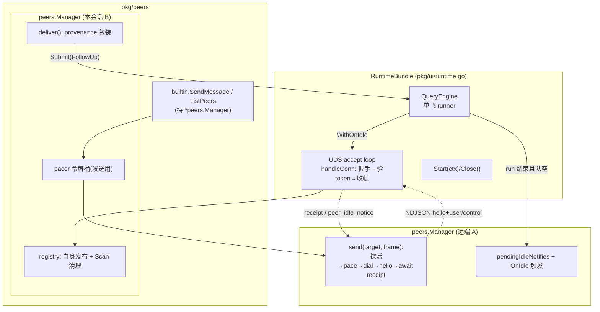
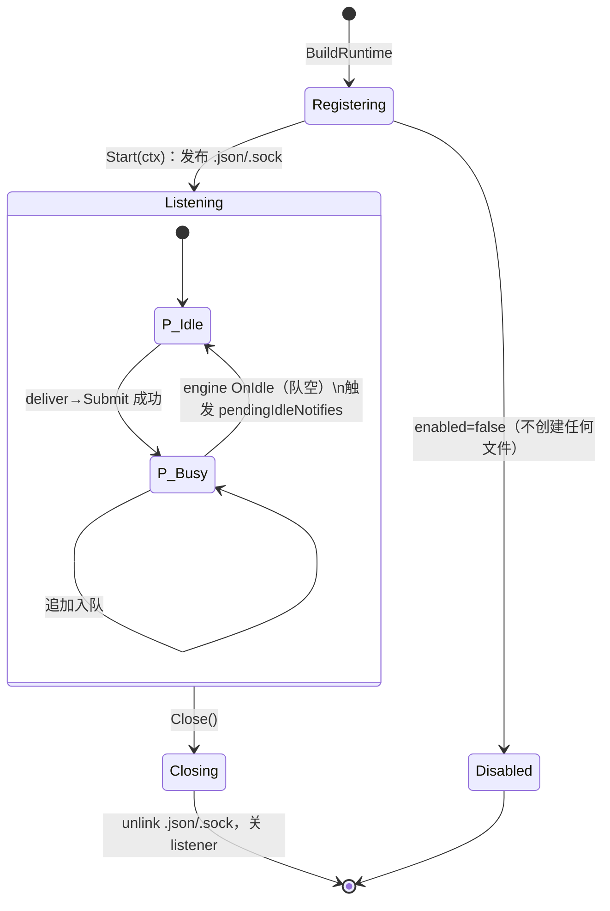

# Agent Note: Cross-Session Messaging — 本机多 REPL 会话的点对点消息

Status: proposed

Scope（拟新增/改动）: `pkg/peers`（新包：注册表 + UDS 传输 + pacer）、`pkg/tools/builtin/peer_tools.go`（新：SendMessage / ListPeers）、`pkg/ui/runtime.go`（BuildRuntime 接线 + Start/Close 生命周期）、`pkg/engine/query_engine.go`（新增 `WithOnIdle`、`PendingCount()`，loop 零改动）、`pkg/config/settings.go`（新增 `peers` 配置段）、`pkg/prompts/system.go`（系统提示追加一行 messaging 能力说明，仅 enabled 时）

调研对象（2026-08-27）:

- Claude Code v2.1.247 Cross-Session Messaging 逆向调研全文：`~/.gemini/antigravity/brain/4908ed00-085a-4f2a-b12f-524eccfa370a/claude_code_cross_session_messaging_research.md`（会话注册中心、NDJSON 帧协议、安全防护、状态机四节）
- 本仓库机制与协议参考（帧 schema 的 canonical home）：[docs/cross-session-messaging-design.md](../../../../docs/cross-session-messaging-design.md)；本 note 只保留决策相关蒸馏与实施细节。

## Problem

开发者常态是多终端并行运行多个 openharness REPL（前端重构 / 后端 API / 长构建），目前会话间零 IPC，上下文同步靠人工复制粘贴。已有的 [TaskSendMessage](../../../../pkg/tools/builtin/task_tools.go) 只覆盖**本进程内**子代理信箱（TaskRegistry 内存 map），跨进程会话不可达；[session.Store](../../../../pkg/session/store.go) 是持久化树不是通信通道。没有点对点消息，"A 会话改完接口 → 通知 B 会话更新调用方"这类协作要么人肉中转，要么两个会话各自重复读盘猜测对方进度。

本文提议为模型与用户提供同机会话级点对点消息：去中心化自动发现、投递不中断目标正在执行的工作、发送方可选零轮询完成回调。

## Research findings

Claude Code 调研的三条可移植结论：

1. **UDS + 目录注册表是无守护进程自发现的黄金范式**。每个进程写 `<pid>.json` 元数据 + 监听 `<pid>.sock`；发现 = 扫目录 + 三步探活（`kill(pid,0)` 查活、比对 procStart 防 PID 复用错认、250ms 拨号探针失败即清孤儿文件）。无需 broker，崩溃即自然注销。
2. **接收绝不同步打断**：消息入队优先级 `next`——当前步骤完成后立即消费，但不中断进行中的子进程/工具。openharness 已有等价机制：QueryEngine 单飞队列的 `SubmissionKind` FIFO，跨会话消息只是"另一种来源的普通提交"，agent loop 可以零改动。
3. **`notify_when_idle` 用反向控制帧终结轮询**：发送方注册一次性监听，接收方在引擎排空转 idle 时回发通知。工程上的本质是"idle 转移必须由队列权威方回调"，不能靠发送方猜。

不值得照搬的部分：`bridge`/`cloud` peer 类型（跨机器与云端沙箱，超出本地 UDS 信任域）；长连接全双工通道（其收益抵不过连接生命周期管理成本，见 Alternatives）；Node 实现细节（`net.connect` 探针对应 Go 侧是 `DialTimeout`，语义一致但实现不移植）。安全清单整体保留并改造：0700 目录校验、lstat 拒 symlink 在纯 Go 下直接可行；Peer Credential 校验从 OS getsockopt 改为注册表 startToken 握手（可移植，等价强度）。

## Proposal

### 选型决策

| 维度 | 决策 | 理由 |
|---|---|---|
| 新包归属 | `pkg/peers`，engine 与 peers 互不 import | ui 装配层用注入回调衔接，避免 pkg/engine 反向依赖传输细节 |
| 传输 | Unix domain socket，**短连接**（一连一帧） | 免连接生命周期管理；协议版本字段保留将来升级长连接的余地 |
| 帧格式 | NDJSON，单帧 ≤64 KiB | 与 hitl/protocol 既有 JSON 风格一致；行分界免粘包处理 |
| 入队 kind | `SubmissionFollowUp` | Steering 是 turn 内语义（会在当前推理中途插入）；FollowUp 进 runner FIFO，天然满足"不打断当前工具执行"。详细对比见 Alternatives |
| 限流 | 每 target 手写令牌桶 {burst 4, refill 1/s}，纯 stdlib | 防模型互刷死循环；避免为此引入 x/time 依赖 |
| 审批门 | M2 复用运行时 AskPermissionFunc 回调 | 权限面统一走既有链路（P0-1 接线后同享修复），不新造审批通道 |
| 默认开关 | M1/M2 `peers.enabled=false`，M3 转 true | 提权面与注入路径需先经审批门与人审验证 |

### 与 Claude Code 的概念映射

| Claude Code | 本方案 | 变化点及理由 |
|---|---|---|
| `/tmp/cc-socks-<uid>/` | `$XDG_RUNTIME_DIR/openharness-peers/` → `/tmp/<uid>/openharness-peers/` → `$OH_PEER_DIR` 直指定（测试用） | macOS socket 路径 104 字节上限，解析时显式拒绝超长路径 |
| `<pid>.json` 元数据 | 同构 [docs §3.2](../../../../docs/cross-session-messaging-design.md)，加 `startToken` 字段 | 握手身份验证替代 OS Peer Credential（macOS 无稳定 pid 凭据 API）|
| `ListAgents` 工具 | `ListPeers` 工具 + REPL `/peers` 命令 | 只暴露 uds 一种 kind，cloud/bridge 记为非目标 |
| `SendMessage` 工具 | 同名工具（注册表无冲突：任务侧叫 `TaskSendMessage`） | 输出附结构化收据 reason，错误全部可行动 |
| `DPe={now,next,later}` 优先级 | 映射到 SubmissionKind：peer 恒 `SubmissionFollowUp` | 引擎单飞 runner FIFO 已提供 next 语义 |
| `origin:{kind:"peer",…}` 注入 | `<peer_message from=…>` 文本包装后 Submit | 模型可见来源；避免改 ConversationMessage 类型 |
| Sender Pacer `reserve()` | `peers.pacer` 令牌桶 | 拒发时同步返回限流错误给模型 |
| held/denied 审批态 | M2 `peers.requireApproval` → AskPermissionFunc | M1 不实现，收据值域预留 |

### 领域模型与数据结构

```go
// pkg/peers/types.go
package peers

const (
    PeerProtocolV1      = 1
    MaxFrameBytes       = 64 << 10
    MaxPendingPerTarget = 16        // 未投递 peer 消息上限（配合 QueryEngine.PendingCount）
    ProbeTimeout        = 250 * time.Millisecond
    NotifyIdleTTL       = 10 * time.Minute
)

// 注册表 <pid>.json 的内存形态
type SessionInfo struct {
    MessagingSocketPath string   `json:"messagingSocketPath"`
    Pid                 int      `json:"pid"`
    ProcStart           int64    `json:"procStart"`    // 进程启动锚点 ns，防 PID 复用
    StartToken          string   `json:"startToken"`   // 32 hex，握手身份凭据
    SessionID           string   `json:"sessionId"`
    Name                string   `json:"name"`         // cwd basename 默认；重名追加 -<sid 后4位>
    Cwd                 string   `json:"cwd"`
    Model               string   `json:"model,omitempty"`
    Status              string   `json:"status"`       // "idle" | "busy"
    StartedAt           int64    `json:"startedAt"`    // wall clock ms
    PeerProtocol        int      `json:"peerProtocol"`
    PeerFeatures        []string `json:"peerFeatures,omitempty"` // idle_notify, approval_gate
}

type Config struct {
    Enabled         bool
    Name            string // 空 → filepath.Base(cwd)
    Cwd             string
    SessionID       string
    Model           string
    RegistryDir     string // 空 → 按 docs §3.1 解析
    RequireApproval bool   // M2 生效
    Logger          logger.Logger
}

// 入队结果 —— 由 ui 注入的回调返回，Manager 不认识 engine
type EnqueueResult struct {
    Queued bool   // false 且 Err==nil 表示被容量上限拒收
    Err    error
}

type DeliveryHooks struct {
    Submit func(wrappedPrompt string) (EnqueueResult, error)
}

// notify_when_idle 注册项（接收侧持有）
type IdleNotifyEntry struct {
    MessageID  string
    FromName   string
    FromPid    int
    SocketPath string
    Deadline   time.Time
}
```

### 组件架构图



### 执行流程时序图

忙碌目标 + 空闲回调（最完整路径；空闲目标则第一步就直接开新 turn）：

```mermaid
sequenceDiagram
    participant Loop as A: 引擎 loop
    participant Tool as A: SendMessage tool_use
    participant PA as A: peers.Manager
    participant PB as B: peers.Manager
    participant Eng as B: QueryEngine 单飞 runner

    Loop->>Tool: execute({to:"backend-api", message:"...", notify_when_idle:true})
    Tool->>PA: Send(target, user 帧, wantIdle=true)
    PA->>PA: pacer.Allow(target)? 探活 probe(sock)?
    PA->>PB: dial sock; 发送 hello{pid,startToken}
    PB->>PB: 读 <pid>.json 验 token ✓
    PB->>Eng: hooks.Submit(<peer_message …>) → 入队 PendingCount<16
    Eng-->>Loop: (B 忙碌：继续当前 run，不打断工具)
    PB-->>PA: control(peer_message_status, delivered)
    PA-->>Tool: "delivered to backend-api (busy; queued)"
    Note over PB,Eng: B 当前 run 结束 → 弹出 follow_up → 新 turn 推理
    Eng->>PB: WithOnIdle() 两队列皆空
    PB->>PB: status=idle 写注册表; 取 pendingIdleNotify(未过 TTL)
    PB->>PA: dial; control(peer_idle_notice, msgId)
    PA->>PA: hooks.Submit("<peer_idle_notice from=backend-api>")
    PA-->>Loop: B 完成 taskId…… 零轮询闭环
```

### 状态机

接收侧 Manager 与引擎状态联动（含 Disabled 旁路）：



单条消息生命周期即收据状态集 `delivered / dropped(queue-full|rate-limit|oversize|bad-frame) / expired / held→delivered|denied(M2)`，状态图与语义表见 [docs §4.1、§8](../../../../docs/cross-session-messaging-design.md)。

### 关键实现片段（sketch）

注册表探活与清理（`pkg/peers/registry.go`）：

```go
// Scan 列出存活 peer 并就地清理孤儿文件；输出按 (name, startedAt, pid) 确定排序。
func Scan(dir string) ([]SessionInfo, error) {
    entries, _ := os.ReadDir(dir)
    var live []SessionInfo
    for _, e := range entries {
        if filepath.Ext(e.Name()) != ".json" { continue }
        info, err := readSessionInfo(filepath.Join(dir, e.Name())) // 内部 Lstat 拒 symlink
        if err != nil { removePeerFiles(dir, e.Name()); continue } // 损坏文件按孤儿处理
        if !alive(info) { removePeerFiles(dir, e.Name()); continue }
        live = append(live, *info)
    }
    sort.Slice(live, func(i, j int) bool { ... }) // provider 确定性纪律
    return live, nil
}

func alive(s *SessionInfo) bool {
    if err := syscall.Kill(s.Pid, 0); err != nil && !errors.Is(err, syscall.EPERM) { return false }
    if processStartNanos(s.Pid) != s.ProcStart { return false } // PID 复用防线
    ctx, cancel := context.WithTimeout(context.Background(), ProbeTimeout)
    defer cancel()
    var d net.Dialer
    conn, err := d.DialContext(ctx, "unix", s.MessagingSocketPath)
    if err != nil { return false }
    conn.Close(); return true
}
```

接收连接处理（`pkg/peers/manager.go`）：

```go
func (m *Manager) handleConn(ctx context.Context, c net.Conn) {
    defer c.Close()
    c.SetReadDeadline(time.Now().Add(5 * time.Second)) // 帧间最长等待
    hello, err := decodeHello(c)                        // 版本≠1 或 Lstat 异常 → 关闭
    meta, err := readSessionInfo(registryPath(m.dir, hello.Pid))
    if err != nil || subtle.ConstantTimeCompare([]byte(meta.StartToken), []byte(hello.StartToken)) != 1 {
        writeControl(c, ActionPeerMessageStatus, ReasonBadToken); return
    }
    frame, err := decodeUserFrame(c)                    // >MaxFrameBytes → oversize 收据
    if m.requireApprovalGate(ctx, frame) { /* M2: AskPermissionFunc; deny → gate-denied */ }
    if m.pending >= MaxPendingPerTarget || m.hooks == nil {
        writeControl(c, ActionPeerMessageStatus, ReasonQueueFull); return
    }
    wrapped := WrapPeerMessage(frame)                   // <peer_message from=… …>
    res, err := m.hooks.Submit(wrapped)
    m.setBusyAndPublish()                               // 注册表 status=busy（节流 200ms）
    writeControl(c, ActionPeerMessageStatus, ReasonDelivered)
    atomic.AddInt64(&m.pending, 1)                      // run 开始消费时递减需 engine 回调，M1 简化为按事件近似
}
```

引擎扩展（`pkg/engine/query_engine.go`，唯一触碰 engine 的改动）：

```go
func WithOnIdle(fn func()) QueryEngineOption { return func(qe *QueryEngine) { qe.onIdle = fn } }

func (qe *QueryEngine) PendingCount() int {
    qe.mu.Lock(); defer qe.mu.Unlock()
    return len(qe.turnQueue) + len(qe.steeringQueue)
}

// run() 归还令牌处、释放 mu 之后：
if qe.onIdle != nil && len(qe.turnQueue) == 0 && len(qe.steeringQueue) == 0 {
    go qe.onIdle() // 锁外异步：registry 写盘不得占引擎锁
}
```

装配接线（`pkg/ui/runtime.go` BuildRuntime 尾段 + Start/Close）：

```go
peerMgr := peers.NewManager(peers.Config{Enabled: settings.Peers.Enabled,
    Name: settings.Peers.Name, Cwd: cwd, SessionID: sessionID, Model: model})
if settings.Peers.Enabled {
    reg.Register(builtin.NewSendMessageTool(peerMgr))
    reg.Register(builtin.NewListPeersTool(peerMgr))
}
peerMgr.SetDeliver(peers.DeliveryHooks{Submit: func(prompt string) (peers.EnqueueResult, error) {
    ch := qe.Submit(engine.SubmissionFollowUp, prompt) // baseCtx 由 REPL 首次用户提交种下
    r.consumePeerSubmission(ch)                        // 与用户提交共用的事件消费路径（状态回执/转录）
    return peers.EnqueueResult{Queued: true}, nil      // 容量拒绝经 PendingCount 前置判定，不走到这里
}})

func (r *RuntimeBundle) Start(ctx context.Context) error { // 现有 MCP ConnectAll 之后
    r.peerCtx = ctx
    return r.PeerManager.Start(ctx) // 发布自身注册文件，起 accept loop
}
func (r *RuntimeBundle) Close() error { err := r.PeerManager.Close(); /* …既有 MCP/session 关闭次序保持 */ }
```

发送端令牌桶（`pkg/peers/pacer.go`）：

```go
type pacer struct{ mu sync.Mutex; tokens map[string]int; last map[string]time.Time }

func (p *pacer) Allow(target string) bool { // burst 4, refill 1/s；纯 stdlib
    p.mu.Lock(); defer p.mu.Unlock()
    now := time.Now()
    p.tokens[target] = min(4, p.tokens[target]+int(now.Sub(p.last[target]).Seconds()))
    p.last[target] = now
    if p.tokens[target] >= 1 { p.tokens[target]--; return true }
    return false
}
```

工具结果文本（Actionable errors 约定的落地点）：所有失败分支输出「原因 + 下一步」，如 `no reachable session named "backend"; run ListPeers to see current sessions, or address by session id`。

### 安全边界声明

同机其它 UID 进程是威胁源：(a) 目录强制 0700 + 属主校验，不符即整体降级为无 messaging；(b) 一切路径操作前 Lstat 拒符号链接；(c) 握手 startToken 校验使第三方无法冒充已注册 pid——token 只存在于对端内存与本机 0700 目录；(d) peer 消息对引擎是不可信外部文本，只是带 provenance 标签的用户内容，其触发的工具调用仍完整经过 PermissionChecker（P0-1 接线后同享）；审批门(requireApproval)在权限系统之下再叠一层"入队需人批"。已知残余风险：kill(0)+procStart 与真实拨号之间存在理论窗口，危害上限是把消息投给一个恰以同 pid 重启的非 openharness 进程的 sock 文件——由 token 校验兜底拒绝。

### 测试计划

每条都对应一条会在回归时变红的断言（AGENTS.md wiring rule 含 T7/T8）：

1. `pkg/peers/registry_test.go`：伪 `.json`(死 pid) + 孤儿 `.sock` → Scan 后文件消失、live 表不含它；PID 复用场景（procStart 不匹配）同样清理。
2. `pkg/peers/protocol_test.go`：三帧编解码 round-trip；64KiB 边界；非法 action/priority 拒解码。
3. `pkg/peers/manager_test.go`：两个真 Manager 于 t.TempDir() 全链路——空闲目标收到 delivered、target 引擎 stub 收到 wrapped prompt 文本包含 provenance 标签；bad-token 握手被断连。
4. `pkg/peers/pacer_test.go`：第 5 连发允许后第 5 被拒，1s 后恢复。
5. `pkg/peers/idle_test.go`：notify_when_idle 注册后 stub OnIdle → 对端收到 peer_idle_notice；TTL 过期收到 expired。
6. `pkg/engine/query_engine_test.go`：WithOnIdle 恰好一次地在两队列排空后触发；PendingCount 反映 enqueued/dequeued。
7. `pkg/ui/runtime_test.go`：enabled 时 BuildRuntime 后 ToolRegistry.Get("SendMessage")/"ListPeers" 非 nil 且 RuntimeBundle.PeerManager 非 nil；Close 后注册表目录无残留——接线被删即红。
8. `pkg/ui/runtime_test.go`：enabled=false 时 registry 干净（Disabled 旁路零文件）。

### 分期落地

- **M1**：pkg/peers 全量（registry/protocol/pacer/cleanup）、两工具、runtime 接线、engine `WithOnIdle`+`PendingCount()`；settings 增加 `peers.enabled(false)`。出口：双 REPL 手动互通 + 忙碌排队演示；`go vet/test -race ./...` 绿。
- **M2**：notify_when_idle 回调链、requireApproval 审批门（held/gate-denied/expired 收据）、系统提示能力行。出口：零轮询协作 demo（A 发完休眠，B 完成主动唤醒 A）。
- **M3**：默认 enabled=true、REPL `/peers` 命令与 `@<name>` 语法糖（REPL 行首识别→转 SendMessage 投递）、protocol JSON-lines 前端事件。

## Alternatives considered

- ****集中式 daemon/broker**（tmux-server 式常驻进程做发现与转发）：失去"崩溃即注销"的去中心化性质，引入守护进程生命周期管理这一全新运维面；孤儿 socket 清理问题从每会话自愈变成需要 daemon 兜底。输给 UDS 点对点。
- ****文件信箱 + 轮询/mkdir 锁**（headlong 式 FS 姿势）：实现极简、与仓库 file-first 传统契合，但投递延迟受轮询间隔支配、无法携带即时收据与空闲回调（active-wait 违背 zero-polling 目标）；作为将来跨机器桥接层的候选重新评估。
- ****单一长连接双向复用**（一次 dial 常驻读写两个 goroutine）：省反复建连，但要为每对 peer 维护重连状态机，发送方/接收方重启的组合爆炸正是短连接方案刻意避开的；帧格式已带 protocol 字段，将来升级不破坏线上形态。
- ****入队 kind 用 Steering**：可在当前 turn 内尽早消费，看似延迟更低；但 steering 语义是"插进正在进行的推理中间"，而跨会话协作更新的正确时序是"不打断进行中的工作、当前 run 结束后立即处理"——且 steering 在非 running 时行为退化为 new turn 的双路径会让测试矩阵翻倍。选 FollowUp。
- ****把收发器塞进 pkg/engine**：能让 Submit 直调无回调间接层，但 engine 从此背上 socket/listener 生命周期与平台细节；subagents/tasks 将来想广播也复用不了。选独立包 + DeliveryHooks 注入。

## Acceptance criteria

- 两个 REPL 在同一台机器不同终端（不同或相同 cwd）互通：一方 SendMessage，另一方无论 idle/busy 都在同一 FIFO 序最终推理该消息文本，全程不打断进行中的 Bash/Edit。
- 任一进程被 kill -9 后 ≤250ms 内的下次扫描不再列出它，孤儿文件被清除；幸存会话功能不受影响。
- 未启用 messaging 的会话不在注册表产生任何文件，工具不出现在 schema 中（provider 缓存不因未用功能扰动）。
- 所有失败路径（peer 不存在/token 不符/限流/超限/坏帧）返回结构化 reason 且工具输出含下一步动作。
- 双会话互刷 100 条消息，双方均存活：发送侧被 pacer 截停，接收侧 dropped(queue-full) 有界，无 goroutine 泄漏（`go test -race` 覆盖 T3/T5）。

## Risks

- **macOS socket 路径 104 字节限制**：XDG_RUNTIME_DIR 深路径可能越界；resolveDir 显式检查并在超长时报可行动错误（用户可用 OH_PEER_DIR 迁移）。
- **Prompt 注入面扩大**：任一会话都可向本会话注入指令文本。缓解：provenance 标签 + M3 前默认关闭 + M2 审批门；文档明示"peer 消息=不可信输入"。
- **状态写放大**：idle/busy 每次转移写 `.json`；以 200ms 节流，最坏每秒 5 次小文件覆盖写，可忽略但不节流会成为多会话风暴放大器。
- **OnIdle 回调时序**：回调必须锁外异步且幂等（连续两次 run 排空各触发一次）；Manager 侧以当前 status 判断是否真的转移，防重复发 notice。
- **M1 默认关闭期间接线腐化风险**：与历史上 hooks/MCP 断线同型——由 T7 接线测试固化，CI 化之前手动评审 checklist 引用 AGENTS.md wiring rule。

## Supersession check

2026-08-27 对 `.agents/notes/**` 全文检索 `cross.?session|messaging|peer|domain socket|uds|跨会话`：无任何现存 note 声明本主题的所有权，无需 supersede。边界澄清：[TaskSendMessage]（task_tools.go）是进程内 TaskRegistry 信箱，寻址空间与生命周期均不同，不构成本决策的前置约束；`session.Store.ForkTo` 属于会话树复制（另一条 future 线），本文不涉及。
