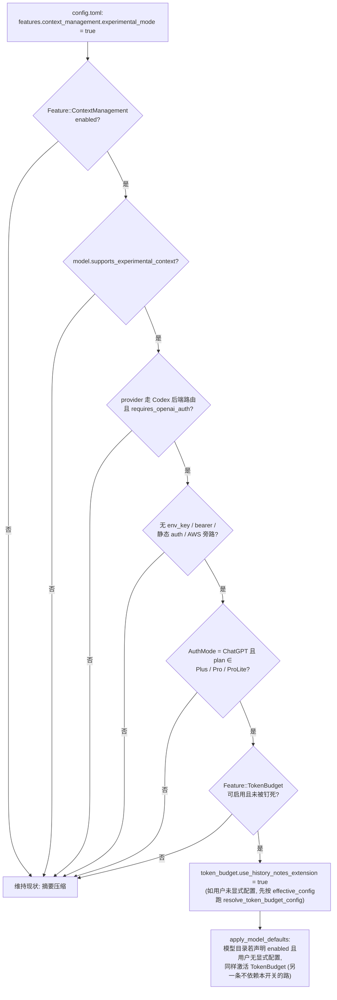
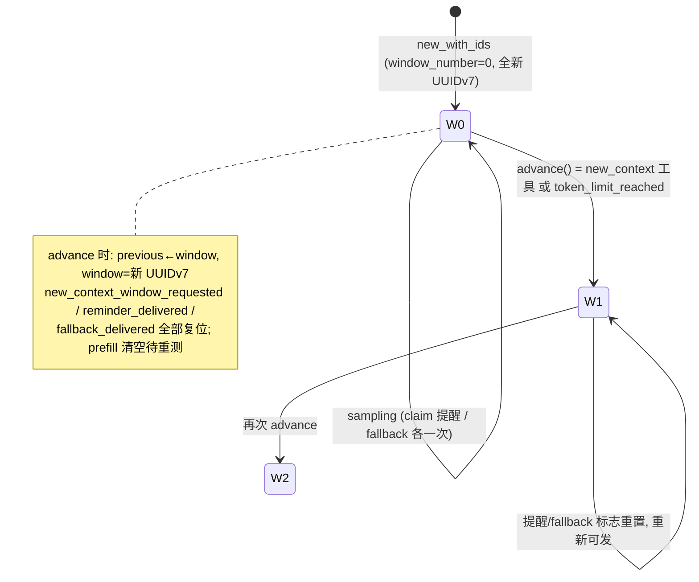
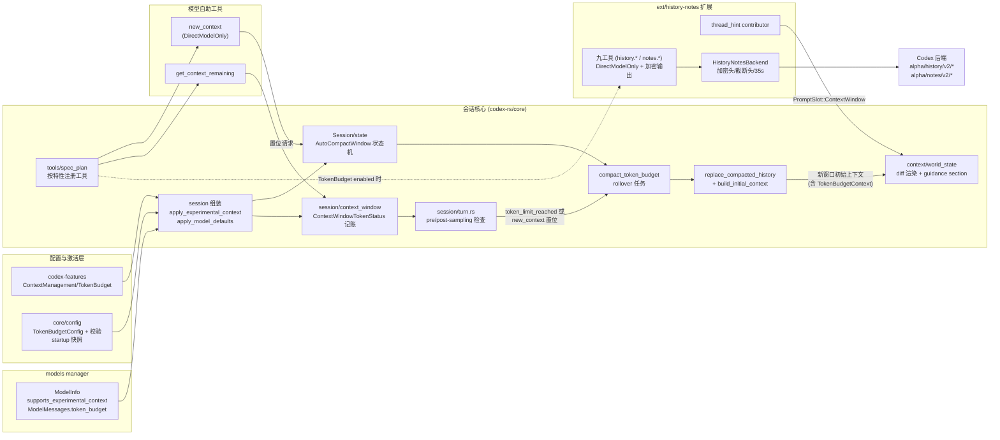
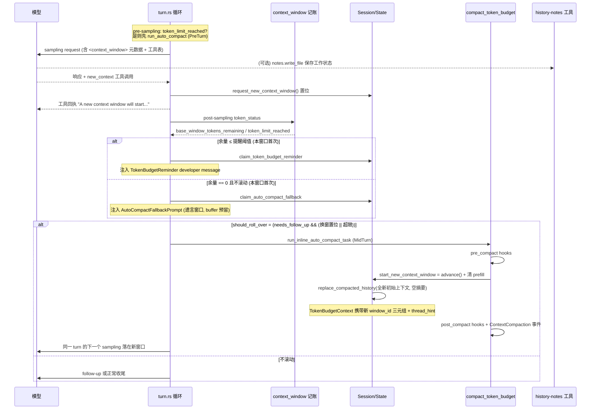

# 调研报告：Codex 上下文管理（Token Budget / experimental_mode）源码深读

> 调研日期：2026-09-07
> 来源：
> - openai/codex 源码（本地浅克隆 `/tmp/codex`，main@ac192cd「Allow guarded legacy resume with background migration enabled (#43178)」；行号均以该版本为准，只能作为定位参考而非长期锚点）
> - PR #27438「Add token budget context feature」、PR #27488「Add new context window tool」、PR #39827「Add history and notes tools for token-budget sessions」（GitHub 页面调研，本地无对应提交）
> 方法：以 `features.context_management` 为入口反向追踪全部消费点，逐文件精读 features 门控、session/token_budget、state/auto_compact_window、session/context_window、turn 循环、compact 家族、context/ 片段、tools/spec_plan、ext/history-notes 九条线；PR 页面与当前代码做「初版 → 终态」演进对照。
> 与既有研究的关系：[codex-context-management.md](codex-context-management.md) 是方法论层结论（压缩有损 / 换窗保忆 / 三层架构 / 设计哲学），本文不重复其结论，只承载源码证据、PR 考古与可核对的机制细节。落地设计须遵守根 [AGENTS.md](../AGENTS.md) 的接线纪律。

## 目录

- [Part 1：特性门控——experimental_mode 到底开了什么](#part-1特性门控experimental_mode-到底开了什么)
- [Part 2：窗口状态机与 token 记账](#part-2窗口状态机与-token-记账)
- [Part 3：turn 循环——预算检查与滚动的精确时机](#part-3turn-循环预算检查与滚动的精确时机)
- [Part 4：滚动执行——compaction 生命周期复用](#part-4滚动执行compaction-生命周期复用)
- [Part 5：感知层——五种模型可见片段](#part-5感知层五种模型可见片段)
- [Part 6：管理层工具——new_context 与 get_context_remaining](#part-6管理层工具new_context-与-get_context_remaining)
- [Part 7：记忆层——history-notes 扩展与服务端后端](#part-7记忆层history-notes-扩展与服务端后端)
- [Part 8：模型侧配置下发（model-owned defaults）](#part-8模型侧配置下发model-owned-defaults)
- [Part 9：PR 考古——三步产品化与演进对照](#part-9pr-考古三步产品化与演进对照)
- [Part 10：组件架构与端到端时序](#part-10组件架构与端到端时序)
- [Part 11：对 openharness-go 的证据化落地映射](#part-11对-openharness-go-的证据化落地映射)
- [附录：关键文件索引](#附录关键文件索引)

---

## Part 1：特性门控——experimental_mode 到底开了什么

### 1.1 特性注册：UnderDevelopment、默认关闭

`codex-rs/features/src/lib.rs`（FeatureSpec 单一注册表）：

```rust
FeatureSpec {
    id: Feature::ContextManagement,
    key: "context_management",
    stage: Stage::UnderDevelopment,
    default_enabled: false,
},
```

`FeaturesToml` 中的配置槽与展开逻辑（同文件 778/832-836 行）：`context_management: Option<FeatureToml<ContextManagementConfigToml>>`，`apply` 时取 `enabled()` 写入布尔表。

配置结构（`codex-rs/features/src/feature_configs.rs:300-312`）——**`experimental_mode` 是唯一字段，且直接就是开关**：

```rust
#[derive(Serialize, Deserialize, Debug, Clone, Default, PartialEq, Eq, JsonSchema)]
#[serde(deny_unknown_fields)]
pub struct ContextManagementConfigToml {
    /// Enables experimental context management.
    #[serde(skip_serializing_if = "Option::is_none")]
    pub experimental_mode: Option<bool>,
}

impl FeatureConfig for ContextManagementConfigToml {
    fn enabled(&self) -> Option<bool> {
        self.experimental_mode
    }
}
```

即 `[features.context_management] experimental_mode = true` 与简写 `context_management = true` 等价。JSON schema 在 `codex-rs/config/src/schema.rs:111-118` 单独注册。

### 1.2 激活资格门：五重条件全过才生效

消费点全库只有一处：`codex-rs/core/src/session/token_budget.rs:25` 的 `apply_experimental_context()`（会话组装时调用，见 1.4）。全文引用：

```rust
fn experimental_context_is_eligible(auth_mode: AuthMode, plan_type: Option<PlanType>) -> bool {
    auth_mode == AuthMode::Chatgpt
        && matches!(
            plan_type,
            Some(PlanType::Plus | PlanType::Pro | PlanType::ProLite)
        )
}

pub(super) fn apply_experimental_context(
    config: &mut Config,
    auth: Option<&CodexAuth>,
    starting_model: &ModelInfo,
) -> std::io::Result<()> {
    let provider = &config.model_provider;
    if !config.features.enabled(Feature::ContextManagement)
        || !starting_model.supports_experimental_context
        || !provider.supports_codex_backend_routes()
        || !provider.requires_openai_auth
        || provider.env_key.is_some()
        || provider.experimental_bearer_token.is_some()
        || provider.auth.is_some()
        || provider.aws.is_some()
        || !auth.is_some_and(|auth| {
            experimental_context_is_eligible(auth.auth_mode(), auth.account_plan_type())
        })
        || config.features.enable(Feature::TokenBudget).is_err()
        || !config.features.enabled(Feature::TokenBudget)
    {
        return Ok(());
    }

    if config.token_budget.is_none() {
        let config_toml = config
            .config_layer_stack
            .effective_config()
            .try_into()
            .map_err(|err| std::io::Error::new(std::io::ErrorKind::InvalidData, err))?;
        config.token_budget = resolve_token_budget_config(&config_toml, &config.features)?;
    }

    config
        .token_budget
        .get_or_insert_default()
        .use_history_notes_extension = true;
    Ok(())
}
```

拆解：条件 1 用户显式 opt-in；条件 2 模型能力位 `supports_experimental_context`（`protocol/src/openai_models.rs:475`，由 models manager 下发）；条件 3-4 provider 必须走 Codex 官方后端路由且要求 OpenAI auth；条件 5 禁止任何静态凭据旁路（env_key / bearer token / 静态 auth / AWS Bedrock）；条件 6 **订阅资格**——ChatGPT Plus/Pro/ProLite（附带的单测逐一断言 Free/Enterprise/ApiKey 全部不合格）；条件 7 `TokenBudget` 特性必须可启用（管理侧 requirements 可能把特性钉死为 off，`enable()` 返回 Ok 但 `enabled()` 仍为 false）。

满足后做的事只有一件：**强制 `token_budget.use_history_notes_extension = true`**。结论：`context_management.experimental_mode` 自身不含任何机制，它是「实验性上下文管理」的资格门 + 激活器，真正机制全部挂在 `Feature::TokenBudget` 下。

### 1.3 会话组装调用点与配置分层

调用链（`codex-rs/core/src/session/mod.rs:692-704`）：

```rust
let inherits_token_budget = matches!(&conversation_history, InitialHistory::Forked(_))
    && config.token_budget_startup_config.is_some();
if !inherits_token_budget {
    Arc::make_mut(&mut config)
        .prepare_token_budget_for_startup()
        .map_err(|err| CodexErr::InvalidRequest(err.to_string()))?;
    // Resolve activation for this runtime, including when resuming saved history.
    token_budget::apply_experimental_context(
        Arc::make_mut(&mut config),
        auth.as_ref(),
        &model_info,
    )?;
    token_budget::apply_model_defaults(Arc::make_mut(&mut config), &model_info);
}
```

注释原文说明了继承规则："Forked subagents keep their parent's activation with the copied history. Fresh children restore configured preferences before applying startup defaults."

配置分层快照（`codex-rs/core/src/config/token_budget_startup.rs`，全文 31 行）：启动前把用户的显式偏好（feature 开关 + token_budget 配置）快照进 `TokenBudgetStartupConfig`，fresh 子会话先恢复快照再套模型默认值——保证「模型默认值」每次会话启动都能基于用户原始意愿重新计算，而不是被上一轮激活结果污染。

### 1.4 激活资格流程图



---

## Part 2：窗口状态机与 token 记账

### 2.1 AutoCompactWindow：滚动状态机全量字段

`codex-rs/core/src/state/auto_compact_window.rs`（核心字段与方法的完整摘录）：

```rust
pub(super) struct AutoCompactWindow {
    window_number: u64,
    ids: AutoCompactWindowIds,
    new_context_window_requested: bool,
    /// Absolute input-token baseline for the current compaction window.
    ///
    /// `body_after_prefix` subtracts this from later active-context usage. It is
    /// not the growth itself; server-observed usage replaces estimated
    /// resume/recompute baselines when available.
    prefill_input_tokens: Option<AutoCompactWindowPrefill>,
    token_budget_reminder_delivered: bool,
    auto_compact_fallback_delivered: bool,
}

#[derive(Debug, Clone, Copy, PartialEq, Eq)]
pub(crate) struct AutoCompactWindowIds {
    pub(crate) first_window_id: Uuid,
    pub(crate) previous_window_id: Option<Uuid>,
    pub(crate) window_id: Uuid,
}
```

关键方法语义：

- `advance()`：window_number+1，`previous_window_id ← window_id`，生成新 UUIDv7，**重置两个 one-shot 标志与换窗请求位**；
- `claim_token_budget_reminder()` / `claim_auto_compact_fallback()`：`!std::mem::replace(&mut flag, true)` 的标准 one-shot 领取模式——每个窗口只发一次提醒；
- `request_new_context_window()` / `take_new_context_window_request()`：`new_context` 工具置位、turn 循环消费；
- prefill 基线两个来源：`ensure_server_observed_prefill_from_usage()`（首个响应的 `usage.input_tokens`，优先）与 `set_estimated_prefill()`（估算，兜底）；一旦 ServerObserved 落定，估算值不再覆盖；
- `snapshot()` 只暴露 `prefill_input_tokens` 给记账层；恢复会话时 `restore(window_number, ids)` 保住窗口编号与 id 链。

`state/session.rs:267` 的 `start_new_context_window()`：`advance()` + `clear_prefill()`，返回 `(u64, AutoCompactWindowIds)`。

状态机：



### 2.2 记账：ContextWindowTokenStatus 全文

`codex-rs/core/src/session/context_window.rs`（核心计算，全文引用）：

```rust
pub(crate) struct ContextWindowTokenStatus {
    // Full active context usage, independent of the configured auto-compact scope.
    pub(crate) active_context_tokens: i64,
    // Usage counted against `model_auto_compact_token_limit` for the current scope.
    pub(crate) auto_compact_scope_tokens: i64,
    pub(crate) auto_compact_scope_limit: Option<i64>,
    pub(crate) full_context_window_limit: Option<i64>,
    pub(crate) base_window_tokens_remaining: Option<i64>,
    pub(crate) auto_compact_window_prefill_tokens: Option<i64>,
    pub(crate) full_context_window_limit_reached: bool,
    pub(crate) token_limit_reached: bool,
}
```

```rust
let (auto_compact_scope_tokens, auto_compact_scope_limit, auto_compact_window_prefill_tokens) =
    match config.model_auto_compact_token_limit_scope {
        AutoCompactTokenLimitScope::Total => (
            active_context_tokens,
            model_info.auto_compact_token_limit(),
            None,
        ),
        AutoCompactTokenLimitScope::BodyAfterPrefix => {
            let window = sess.auto_compact_window_snapshot().await;
            let baseline = window.prefill_input_tokens.unwrap_or(active_context_tokens);
            let scope_limit = config
                .model_auto_compact_token_limit
                .or_else(|| model_info.auto_compact_token_limit());
            (
                active_context_tokens.saturating_sub(baseline),
                scope_limit,
                window.prefill_input_tokens,
            )
        }
    };

let full_context_window_limit = model_info.resolved_context_window().map(|context_window| {
    context_window.saturating_mul(model_info.effective_context_window_percent) / 100
});

let base_window_tokens_remaining = [
    tokens_remaining(auto_compact_scope_limit, auto_compact_scope_tokens),
    tokens_remaining(full_context_window_limit, active_context_tokens),
]
.into_iter()
.flatten()
.min();

let auto_compact_fallback_buffer_tokens = config
    .token_budget
    .as_ref()
    .map_or(0, crate::config::TokenBudgetConfig::fallback_buffer_tokens);
let buffered_auto_compact_limit = auto_compact_scope_limit
    .map(|limit| limit.saturating_add(auto_compact_fallback_buffer_tokens));

let token_limit_reached = buffered_auto_compact_limit
    .is_some_and(|limit| auto_compact_scope_tokens >= limit)
    || full_context_window_limit_reached;
```

要点：

- **两种口径**（`config/mod.rs:631-635`）：`model_auto_compact_token_limit` 配置 + `model_auto_compact_token_limit_scope` 选择全上下文还是「窗口前缀之后的增量」。预算模式用 `BodyAfterPrefix`——初始上下文很大时，只有本窗口内新增的 token 才消耗预算，基线取服务端观测值；
- **剩余量取双上限的最小值**：auto-compact 上限与「模型全窗口 × 有效百分比」；
- **fallback buffer 只在有 fallback prompt 时计入**（`fallback_buffer_tokens()` 检查 `auto_compact_fallback_prompt.is_some()`）——「遗言缓冲」不是无条件预留；
- `model_info.auto_compact_token_limit()` 的量级参考：协议层单测断言某模型为 `Some(360_000)`（`protocol/src/openai_models.rs:1990`）。

---

## Part 3：turn 循环——预算检查与滚动的精确时机

### 3.1 post-sampling 检查（滚动判定的主入口）

`codex-rs/core/src/session/turn.rs:476-560`（判定段摘录）：

```rust
let (has_pending_input, token_status) = async {
    let has_pending_input =
        sess.input_queue.has_pending_input(&sess.active_turn).await;
    let token_status = super::context_window::context_window_token_status(
        sess.as_ref(),
        turn_context.as_ref(),
    )
    .await;
    (has_pending_input, token_status)
}
.await;
let needs_follow_up = model_needs_follow_up || has_pending_input;
let token_limit_reached = token_status.token_limit_reached;
// ... trace! 日志(包含 auto_compact_scope_tokens 等全部记账字段) ...

let should_roll_over = needs_follow_up
    && (sess.take_new_context_window_request().await || token_limit_reached);
let allow_auto_compact_fallback = !should_roll_over && !token_limit_reached;
super::token_budget::maybe_record(
    sess.as_ref(),
    turn_context.as_ref(),
    token_status.base_window_tokens_remaining,
    allow_auto_compact_fallback,
)
.await;

if should_roll_over {
    if let Err(err) = run_auto_compact(
        &sess,
        Arc::clone(&step_context),
        /*fallback_step_context*/ None,
        &mut client_session,
        InitialContextInjection::BeforeLastUserMessage {
            world_state: Arc::clone(&world_state),
            step_context: Arc::clone(&step_context),
        },
        CompactionReason::ContextLimit,
        CompactionPhase::MidTurn,
    )
    .await
    { /* TurnAborted 上抛; 其余 emit_turn_error 后 return */ }
    // ...
    can_drain_pending_input = !model_needs_follow_up;
    continue;  // 同一 turn 内, 下一个 sampling step 落在新窗口
}
```

四个精确语义：

1. `should_roll_over` 要求 `needs_follow_up`（模型要继续或队列有输入）——**窗口只在还有下一跳时才切**，任务收尾的最后一跳不切；
2. `new_context` 请求与 token 超限走同一条 `run_auto_compact` 路径，但**换窗请求在判定处就被 take 消费掉**，避免重复；
3. `allow_auto_compact_fallback` 只在「不滚动且未达硬限」时为 true——fallback prompt（见 3.3）恰好在「超出提醒阈值但还有缓冲余量」的窗口期发射；
4. 滚动后 `continue` 是**同一 turn 的循环内继续**，不是新 turn。

### 3.2 pre-sampling 检查与模型降档

turn 开始、任何采样之前（`turn.rs:1086-1105`）：

```rust
async fn run_pre_sampling_compact(...) -> CodexResult<()> {
    maybe_run_previous_model_inline_compact(sess, turn_context, client_session, cancellation_token)
        .await?;
    let token_status =
        super::context_window::context_window_token_status(sess.as_ref(), turn_context.as_ref())
            .await;
    // Compact if the configured auto-compaction budget or usable context window is exhausted.
    if token_status.token_limit_reached {
        let step_context = sess
            .capture_step_context(Arc::clone(turn_context), cancellation_token)
            .await?;
        run_auto_compact(
            sess, step_context, None, client_session,
            InitialContextInjection::DoNotInject,
            CompactionReason::ContextLimit,
            CompactionPhase::PreTurn,
        ).await?;
    }
    Ok(())
}
```

`maybe_run_previous_model_inline_compact`（turn.rs:1154 起）另有两个非预算触发源：`comp_hash` 变化（前后两个 turn 声明的压缩兼容哈希不同，`CompactionReason::CompHashChanged`）与模型降档（新窗口比旧窗口小且旧模型用量已超新窗口，`CompactionReason::ModelDownshift`）——先用旧模型的 turn context 执行压缩以最大化兼容。

### 3.3 提醒与 fallback 注入：maybe_record

`codex-rs/core/src/session/token_budget.rs` 的 `maybe_record()`（判定段）：

```rust
pub(super) async fn maybe_record(
    sess: &Session,
    turn_context: &TurnContext,
    base_window_tokens_remaining: Option<i64>,
    allow_auto_compact_fallback: bool,
) {
    if !turn_context.config.features.enabled(Feature::TokenBudget) { return; }
    let Some(base_window_tokens_remaining) = base_window_tokens_remaining else { return; };
    // ...
    if config
        .reminder_threshold_tokens
        .is_some_and(|threshold| base_window_tokens_remaining <= threshold)
    {
        let reminder_due = {
            let mut state = sess.state.lock().await;
            state.claim_token_budget_reminder()
        };
        if reminder_due {
            let response_item =
                ContextualUserFragment::into(crate::context::TokenBudgetReminder::new(
                    &config.reminder_message_template,
                    base_window_tokens_remaining,
                ));
            sess.record_conversation_items(turn_context, std::slice::from_ref(&response_item))
                .await;
        }
    }

    if !allow_auto_compact_fallback || base_window_tokens_remaining != 0 {
        return;
    }
    let Some(prompt) = config.auto_compact_fallback_prompt.as_deref() else { return; };
    let fallback_due = { /* claim_auto_compact_fallback ... */ };
    if !fallback_due { return; }
    let response_item =
        ContextualUserFragment::into(crate::context::AutoCompactFallbackPrompt::new(prompt));
    sess.record_conversation_items(turn_context, std::slice::from_ref(&response_item))
        .await;
}
```

两层提醒互补：阈值提醒（余量 ≤ threshold，一次性）预告即将重置；fallback prompt（**余量恰好归零**且暂不滚动，一次性）要求模型立即把状态写进 notes——此时距离硬限还剩 `auto_compact_fallback_buffer_tokens` 的缓冲。

### 3.4 run_auto_compact 的模式分派

`turn.rs:1252-1290`：TokenBudget 分支在最前面拦截，**不走任何 provider 能力判断**：

```rust
let turn_context = &step_context.turn;
let _profile_guard = turn_context.turn_timing_state.begin_compaction();
if turn_context.config.features.enabled(Feature::TokenBudget) {
    // Compaction is the reset request, so force a new context window
    // instead of consuming a pending `new_context` tool request.
    crate::compact_token_budget::run_inline_auto_compact_task(
        Arc::clone(sess),
        step_context,
        initial_context_injection,
    )
    .await?;
    return Ok(());
}

match turn_context.provider.capabilities().remote_compaction {
    RemoteCompactionSupport::V2 if ... Feature::RemoteCompactionV2 => { /* remote_v2 */ }
    RemoteCompactionSupport::V2 => { /* remote */ }
    RemoteCompactionSupport::Unsupported => { /* local 摘要 */ }
}
```

注释值得注意：强制滚动时**不消费** pending 的 `new_context` 请求（"Compaction is the reset request, so force a new context window instead of consuming a pending `new_context` tool request"）——压缩本身就是换窗，工具请求留给下个窗口重新评估。

---

## Part 4：滚动执行——compaction 生命周期复用

### 4.1 手动 /compact 的路由

`codex-rs/core/src/tasks/compact.rs`（`CompactTask::run`）：

```rust
let _profile_guard = ctx.turn_timing_state.begin_compaction();
if ctx.config.features.enabled(Feature::TokenBudget) {
    crate::compact_token_budget::run_manual_compact_task(session, ctx).await?;
    return Ok(None);
}

let result = match ctx.provider.capabilities().remote_compaction {
    RemoteCompactionSupport::V2 if ctx.config.features.enabled(Feature::RemoteCompactionV2) => { ... }
    RemoteCompactionSupport::V2 => { ... }
    RemoteCompactionSupport::Unsupported => {
        let input = vec![UserInput::Text {
            text: ctx.config.compact_prompt
                .as_deref()
                .unwrap_or(crate::compact::SUMMARIZATION_PROMPT)
                .to_string(),
            text_elements: Vec::new(),
        }];
        crate::compact::run_compact_task(session.clone(), ctx, input).await
    }
};
```

### 4.2 token-budget 压缩任务：跳过摘要但保留生命周期

`codex-rs/core/src/compact_token_budget.rs:33-38` 的文档注释（原文）：

> Runs token-budget manual compaction as a normal compaction lifecycle.
>
> Token-budget compaction skips model/server summarization and installs a fresh context window instead. It is still modeled as compaction so compact hooks and `ContextCompaction` turn items observe the same lifecycle as local or remote compaction.

执行体 `run_compact_task_inner`（同文件 72-93 行）：

```rust
let pre_compact_outcome = run_pre_compact_hooks(sess, turn_context, trigger).await;
match pre_compact_outcome {
    PreCompactHookOutcome::Continue => {}
    PreCompactHookOutcome::Stopped => return Err(CodexErr::TurnAborted),
}

let compaction_item = TurnItem::ContextCompaction(ContextCompactionItem::new());
sess.emit_turn_item_started(turn_context, &compaction_item)
    .await;
sess.start_new_context_window(step_context, world_state)
    .await;
sess.emit_turn_item_completed(turn_context, compaction_item)
    .await;

let post_compact_outcome = run_post_compact_hooks(sess, turn_context, trigger).await;
if let PostCompactHookOutcome::Stopped = post_compact_outcome {
    return Err(CodexErr::TurnAborted);
}
```

对 UI 与 hook 消费者而言，rollover 与摘要压缩是不可区分的同一条事件流（`TurnStarted` → `ContextCompaction` started → 完成 → hooks）。

### 4.3 窗口替换：start_new_context_window

`codex-rs/core/src/session/mod.rs:4219-4262`（核心段）：

```rust
pub(crate) async fn start_new_context_window(
    &self,
    step_context: &StepContext,
    world_state: Arc<WorldState>,
) -> u64 {
    let retained_client_developer_messages =
        if self.enabled(Feature::RetainClientDeveloperMessages) {
            let history = self.clone_history().await;
            crate::compact_remote_v2::truncate_retained_messages_for_remote_compaction(
                history
                    .annotated_items()
                    .iter()
                    .filter(|item| {
                        crate::compact_remote_v2::is_client_authored_developer_message(item)
                    })
                    .cloned()
                    .collect(),
                crate::compact_remote_v2::RETAINED_MESSAGE_TOKEN_BUDGET,
            )
        } else {
            Vec::new()
        };
    let window = {
        let mut state = self.state.lock().await;
        state.start_new_context_window()
    };
    let (window_number, window_ids) = window;
    let context_items = self
        .build_initial_context_with_world_state(turn_context, world_state.as_ref())
        .await
        .into_iter()
        .map(ResponseItemEnvelope::new)
        .chain(retained_client_developer_messages)
        .collect();
    let turn_context_item = turn_context.to_turn_context_item();
    self.replace_compacted_history(
        context_items,
        Some(turn_context_item),
        Some(world_state),
        CompactedHistoryMetadata {
            message: String::new(),
            window_number,
            window_ids,
            compaction_response_id: None,
            compaction_model_hash: None,
        },
    )
    .await;
    self.recompute_token_usage(turn_context).await;
    window_number
}
```

`CompactedHistoryMetadata`（`core/src/compact.rs:86-94`）持久化窗口号与 id 链（`message` 为空字符串——没有摘要文本），`replace_compacted_history` 保证 live 与持久化历史一致。可见「压缩检查点」的持久化结构完全复用，只是内容从「摘要 + 尾部历史」换成了「全新初始上下文 + 空摘要」。

### 4.4 初始上下文重建：新窗口里到底有什么

`session/mod.rs:3934` 起的 `build_initial_context_with_world_state` 装配顺序（按代码顺序）：

1. developer instructions（guardian 场景单独隔离为独立 developer message）；
2. 插件推荐说明（contextual user sections）；
3. **extension context contributors**——按 slot 分流：`PromptSlot::ContextWindow` 的片段全部收进 `context_window_hints`；`DeveloperPolicy` / `DeveloperCapabilities` 进 developer sections；
4. extension turn-context contributors；
5. **TokenBudget 块**（`Feature::TokenBudget` 且模型有上下文窗口时）：
   - 若原生 notes 未启用，先尝试 MCP legacy 桥取 `notes.thread_hint`（失败不回退，注释原文："Keep the legacy bridge hint when native Notes is disabled. A failed native request must not fall back to the bridge."）；
   - 组装 `TokenBudgetContext`（独立 developer message，含 agent path、first/previous/current window id、hints 拼接的 thread hint）；
6. world state 全量渲染（`render_full()`）：model switch 指令插到最前，multi-agent mode / 角色指令 / managed instructions 各按标记独立成条；
7. 最终按 developer 聚合包、独立 developer 包、contextual user 包排序成 items 数组。

也就是说新窗口 = 环境与指令的**满血重装** + 对话轨迹**零保留**（可选保留 client-authored developer 消息的截断版），模型对「之前发生了什么」的一切追溯都要走 Part 7 的 history/notes 工具。

---

## Part 5：感知层——五种模型可见片段

### 5.1 片段定义（context/token_budget_context.rs）

| 片段 | role | content_kind | 标记 | body（原文语义） |
|---|---|---|---|---|
| `TokenBudgetContext` | developer | `token_budget.context_window` | `<context_window>`…`</context_window>`（`requires_separate_message = true`） | Agent name / First context window id / Current context window id /（可选）Previous context window id /（可选）thread hint |
| `ContextWindowGuidance` | developer | `token_budget.context_window_guidance` | `<context_window_guidance>`… | guidance_message 原文 |
| `TokenBudgetRemainingContext` | developer | `token_budget.remaining_tokens` | 无 | "You have {N} tokens left in this context window." / unknown 变体 |
| `TokenBudgetReminder` | developer | `token_budget.reminder` | 无 | 提醒模板 + `{n_remaining}` 替换 |
| `AutoCompactFallbackPrompt` | developer | `compaction.auto_fallback_prompt` | 无 | fallback prompt 原文 |

协议常量（`codex-rs/protocol/src/protocol.rs:137-139`）：

```rust
pub const CONTEXT_WINDOW_OPEN_TAG: &str = "<context_window>";
pub const CONTEXT_WINDOW_GUIDANCE_OPEN_TAG: &str = "<context_window_guidance>";
```

`TokenBudgetContext` 实现了 `WorldStateSection`（`ID = "context_window"`，snapshot 为 agent path，仅在 agent path 变化时 render_diff 重发）——窗口元数据随 world state 的 diff 机制做增量维护，只有跨 agent 才重发全量。

### 5.2 默认提醒模板（config/mod.rs 原文）

```rust
const DEFAULT_TOKEN_BUDGET_REMINDER_MESSAGE_TEMPLATE: &str = concat!(
    "Your context window is nearly exhausted (only {n_remaining} tokens remaining) and will be automatically reset for you soon. ",
    "Once reset, message items in current context window will be cleared in the new window, but notes and history items will be persistent across windows."
);
```

模板直接向模型承诺了语义：**窗口会自动重置、消息会清空、notes 和 history 跨窗口持久**。

### 5.3 TokenBudgetConfig 的校验契约（config/mod.rs）

- `reminder_threshold_tokens` 必须为正；
- `reminder_message_template` 非空且 ≤ 2000 字节（guidance、fallback prompt 同上限）；
- **`auto_compact_fallback_prompt` 与 `auto_compact_fallback_buffer_tokens` 必须成对出现**（设 prompt 不设 buffer 直接校验失败）；
- `fallback_buffer_tokens()`：无 prompt 时恒为 0——buffer 语义绑定 fallback prompt 存在性。

---

## Part 6：管理层工具——new_context 与 get_context_remaining

### 6.1 new_context

工具 spec（`core/src/tools/handlers/new_context_window_spec.rs` 全文）：

```rust
pub(crate) const NEW_CONTEXT_WINDOW_TOOL_NAME: &str = "new_context";

pub fn create_new_context_window_tool() -> ToolSpec {
    ToolSpec::Function(ResponsesApiTool {
        name: NEW_CONTEXT_WINDOW_TOOL_NAME.to_string(),
        description: "Start a new context window. Does not clear, reset, or otherwise affect environment state.".to_string(),
        strict: false,
        defer_loading: None,
        parameters: JsonSchema::object(BTreeMap::new(), None, Some(false.into())),
        output_schema: None,
    })
}
```

handler（`new_context_window.rs`）——置位 + 固定回执，仅接受 Function payload：

```rust
invocation.session.request_new_context_window().await;
Ok(boxed_tool_output(FunctionToolOutput::from_text(
    NEW_CONTEXT_WINDOW_MESSAGE.to_string(),   // "A new context window will start without summarizing conversation history."
    Some(true),
)))
```

注册门控（`core/src/tools/spec_plan.rs:1206-1208`）：

```rust
if features.enabled(Feature::TokenBudget) {
    registry.add_with_exposure(NewContextWindowHandler, ToolExposure::DirectModelOnly);
    registry.add(GetContextRemainingHandler);
}
```

`DirectModelOnly`：工具对 UI 隐藏，仅模型可见可调。

### 6.2 get_context_remaining

handler 复用记账层（`get_context_remaining.rs:69-80`）：

```rust
let token_status = crate::session::context_window::context_window_token_status(
    invocation.session.as_ref(),
    invocation.turn.as_ref(),
)
.await;
Ok(boxed_tool_output(GetContextRemainingOutput::new(
    token_status.base_window_tokens_remaining,
)))
```

输出文本即 `TokenBudgetRemainingContext` 片段渲染（"You have N tokens left in this context window."），code mode 下返回 `{"tokens_left": ...}` JSON。模型随时可以主动询价，不必等系统提醒。

---

## Part 7：记忆层——history-notes 扩展与服务端后端

### 7.1 扩展安装与资格

`codex-rs/ext/history-notes/src/extension.rs`：`install()` 注册四类 contributor（thread_lifecycle / config / prompt / tool）。运行时资格（`update_config`）：

```rust
if config.token_budget.as_ref()
    .is_some_and(|token_budget| token_budget.use_history_notes_extension)
    && config.model_provider.is_openai()
    && self.auth_manager.current_auth_uses_codex_backend()
{
    thread_store.insert(HistoryNotesExtensionConfig { backend: ... });
} else {
    thread_store.remove::<HistoryNotesExtensionConfig>();
}
```

三层缺一不可：配置开关 + OpenAI provider + Codex 后端 auth。agent 身份从 session source 的 agent path 推导（缺失回退 root）。

### 7.2 thread_hint：每次窗口启动的续接提示

`contribute_thread_context`（extension.rs:100-152）：调用后端 `alpha/notes/v2/thread_hint`，成功则产出 `PromptSlot::ContextWindow` 的 `PromptFragment`——即被 `build_initial_context_with_world_state` 收进 `TokenBudgetContext` 的 hints。边界控制：

```rust
const MAX_THREAD_HINT_BYTES: usize = 4_000;
```

超限即 `ThreadHintStatus::Failed` 且不注入（宁缺毋滥）；成功/失败均上报 analytics。

### 7.3 九个工具与两个命名空间

`tools.rs` 的 `HistoryNotesAction`（端点即 Codex 后端 HTTP 路径）：

| 工具 | 端点 | 并行安全 |
|---|---|---|
| history.list_windows | `alpha/history/v2/list_windows` | ✓ |
| history.list_items | `alpha/history/v2/list_items` | ✓ |
| history.read_item | `alpha/history/v2/read_item` | ✓ |
| history.search_contents | `alpha/history/v2/search_contents` | ✓ |
| notes.list_files_by_prefix | `alpha/notes/v2/list_files_by_prefix` | ✓ |
| notes.read_file | `alpha/notes/v2/read_file` | ✓ |
| notes.search_contents | `alpha/notes/v2/search_contents` | ✓ |
| notes.append_to_file | `alpha/notes/v2/append_to_file` | ✗ |
| notes.write_file | `alpha/notes/v2/write_file` | ✗ |

命名空间描述原文（工具的「使命宣言」，`HISTORY_DESCRIPTION` 摘引）：

> Recover prior conversation after a context-window reset by listing, reading, and searching normalized history using agent names and the opaque window and item IDs returned by these tools. … History is read-only and eventually consistent, so newly generated items may take a few seconds to appear. **This is private model-only state. Use it silently to continue the task. Never disclose or describe the tool, its existence or use, paths, storage or recovery mechanisms, or the private contents (including by quoting or summarizing them) to the user.**

NOTES_DESCRIPTION 额外约束：虚拟路径（非文件系统路径）、相对路径落在 `<agent_name>/notes`、绝对路径可跨 agent 读写、单文件上限 1,000,000 UTF-8 字节、读写立即可见而 list/search 最终一致。所有描述句尾都带同一段「对用户不可见」禁令。

`read_item` 的寻址方式值得注意：item_id 取的是「目标条目内容尾部 `[id: ...]` 标记里展示的短 id 后缀」，配合完整 window_id 定位——模型从 history 工具输出里拿到的 id 可原样回传。

### 7.4 后端传输层（backend.rs 全量语义）

`codex-rs/ext/history-notes/src/backend.rs` 关键证据：

```rust
const HISTORY_NOTES_BACKEND_TIMEOUT: Duration = Duration::from_secs(35);
const ENCRYPTED_TOOL_ARGUMENTS_HEADER: &str = "x-openai-encrypted-tool-arguments";
const TOOL_OUTPUT_TRUNCATION_POLICY_HEADER: &str = "x-openai-tool-output-truncation-policy";
```

`call()` 流程：向 arguments 注入 `context: {session_id, current_agent_name}`（服务端凭此做租户/agent 隔离）→ POST provider 构建的请求 → 两个自定义头——

- **截断策略头**：客户端把 `TruncationPolicy`（history-notes 工具统一按调用方传入的 truncation policy）序列化进 `x-openai-tool-output-truncation-policy`，**由服务端在加密前完成输出预算裁剪**（tools.rs 注释原文："The server applies the requested output budget before encryption."）；
- **加密参数头**：`search_contents`（history/notes）与 `append_to_file` / `write_file` 四个端点带 `x-openai-encrypted-tool-arguments: true`——查询词与写入内容走服务端加密通道，对应 tools.rs 输出侧的 `encrypted_output` 内容项；

超时 35s，错误统一前缀 `Unable to perform operation:`。工具输出层（tools.rs `HistoryNotesToolOutput::new`）从结果中拆出 `encrypted_output` 与 `images`：前者组装为 `EncryptedContent` 内容项回传给模型（客户端不解密、日志只见密文），后者转成 base64 data URL 的 `InputImage` 内容项，且 `post_tool_use_response` 特意剔除图片（注释："Hooks must not receive model-only image attachments."）。

### 7.5 legacy MCP 桥

原生 notes 未启用时的兜底（session/mod.rs:4027 区域）：向 MCP runtime 同步调用 `notes` / `thread_hint`（`{"threadId": ...}`），取到非空文本即拼入 context_window_hints。注释明确失败不回退："A failed native request must not fall back to the bridge."——两条通道互斥，避免双份 hint。

---

## Part 8：模型侧配置下发（model-owned defaults）

### 8.1 模型目录里的 TokenBudget 默认值

`codex-rs/protocol/src/openai_models.rs:610-621`：

```rust
/// Model-owned defaults for the context-window token-budget feature.
pub struct ModelTokenBudgetConfig {
    #[serde(default)]
    pub enabled: bool,
    #[serde(default)]
    pub use_history_notes_extension: bool,
    pub reminder_threshold_tokens: i64,
    pub reminder_message_template: String,
    pub guidance_message: String,
    pub auto_compact_fallback_prompt: String,
    pub auto_compact_fallback_buffer_tokens: i64,
}
```

挂在 `ModelMessages.token_budget`（openai_models.rs:575）——提示词层配置的一部分，随 models manager 下发。**提醒阈值、提醒文案、guidance、fallback prompt 全部是模型自己的资产**，不同模型可以带不同的「预算行为人格」。

### 8.2 两条激活/合并路径（session/token_budget.rs）

- `apply_model_defaults`：模型目录声明 `enabled` 且用户**没有任何** token_budget 显式配置（含 `[features] token_budget` 键存在性检测）时，自动启用 `Feature::TokenBudget` 并写入 `use_history_notes_extension: model_defaults.use_history_notes_extension` 的最小配置，提示词字段留空——"Keep prompts unresolved so later turns and model switches use their own defaults."。这是不依赖 `context_management` 开关的第二条激活路（对应方法论文档的「从手动到自动」）；
- `resolve_token_budget`：每 turn 按当前模型把用户配置与模型默认合并——模型默认接管全部 prompt/threshold 字段，用户配置只保留 `use_history_notes_extension` 位；合并结果跑 `validate()`，非法则告警并退回用户配置。

`has_explicit_settings`（token_budget.rs:71-88）负责区分「用户显式配置」与「继承自激活注入」，防止激活产物被误判为用户意愿而屏蔽模型默认值。

---

## Part 9：PR 考古——三步产品化与演进对照

三个 PR 与方法论文档「三层架构」一一对应，前两个同日合并（2026-06-10/11，作者 pakrym-oai），第三个两个月后（2026-08-21，copyberry bot / pmccrary-oai）。

### 9.1 PR #27438（感知层）——无状态阈值检测的原始设计与放弃

- 初版阈值触发**不做状态记录**：对采样前后 `get_total_token_usage()` 快照对比，用量跨过阈值才提醒——"intentionally avoiding persistent threshold bookkeeping (state)"；
- connector bot 指出漏洞：用量快照在排队输入记录之后才取，超大输入可从 24% 直接跳到 26%，25% 提醒永不触发。作者："Ok for the initial version."
- bolinfest 从 name mismatch 到测试断言写法提了系列意见（如建议 Rust raw strings），后续 commit 吸收；
- 测试覆盖 25%/50%/75% 阈值 + 全上下文元数据。

**演进**：当前代码已改为 `AutoCompactWindow` 上的 one-shot claim 标志（Part 2.1），随窗口滚动重置——状态化方案胜出，且挂在正确的生命周期（窗口）而非全局。

### 9.2 PR #27488（管理层）——new_context 与三条被接受的缺陷

- `DirectModelOnly` 的 `new_context`；请求存于 `AutoCompactWindow`，采样后消费，**同 turn 的下一个 follow-up 请求即落在新窗口**（附 snapshot 测试 `token_budget_new_context_window_tool_full_context`）；
- 新窗口定义为 "no-summary compaction checkpoint"，只含 fresh initial context；
- review 中三条边缘缺陷作者均接受：①并行工具调用时兄弟结果被丢出窗口（"this is ok"）；②流失败不清 pending 请求，重试响应可能被丢进新窗口（"It's ok to only reset after successful request for implementation simplicity"）；③bolinfest 的命名与类型洁癖（`set_new_context_window_request_flag()`、`WindowId(u64)` newtype、"AutoCompactWindow 在没有 compaction 时还成立吗"、"fresh full context 更像 empty context"）——**均未采纳**，当前代码仍是原命名 + u64 + UUID 组合。

### 9.3 PR #39827（记忆层）——1232 行的教训清单

新增 `ext/history-notes` crate（与 `ext/goal`、`ext/git-attribution` 同级），九工具 + 传输 + 资格门控 + 测试。automated review 8 条：

1. 某明文输出分支未套 10K token 下限，`notes.read_file` 可无界返回（bounded-output 违例）；
2. `append_to_file` / `write_file` 无 text 上限与 schema maxLength，1MB 文件可把超大条目推进对话历史；
3. Bazel lockfile 未刷新（CI drift check 拦截）；
4. 缺「模型派发 → 后端 → 结果回注」SSE 端到端测试；
5. PR 过大（21 文件），reviewer 建议三阶段拆分：config plumbing → history 工具 → notes 工具；
6. 后端构建 legacy 默认 HTTP client 而非路由感知的 `HttpClientFactory`，`respect_system_proxy` 场景直接坏；
7. auth 资格只在 thread 启动/配置变更时检查，中途登录/登出导致工具 advertised 状态漂移；
8. 无 path 子代理（review delegate）回退 `/root` agent path，可能读写 root 的笔记。

当前代码对 2 的回应：notes 描述明确写死 1MB 上限且 output truncation policy 头让服务端先行裁剪（Part 7.4）。

### 9.4 初版 → 终态演进对照

| 维度 | PR 初版（6/11） | 当前 main（9 月） |
|---|---|---|
| 阈值提醒 | 无状态快照对比 | 窗口级 one-shot claim 标志 |
| 滚动触发 | 仅 new_context 工具 + token 超限 | 同前 + pre-turn / comp_hash / model-downshift / 手动 /compact 全路归一 |
| 记忆层 | 无（历史直接丢弃） | history/notes 九工具 + thread_hint + fallback buffer 遗言窗口 |
| 资格 | 单一 feature flag | model 能力 × provider × 订阅 plan × TokenBudget 可启用 四重门 + model-owned 默认自动激活 |
| 窗口元数据 | 剩余 token 提示 | `<context_window>` 全套（id 三元组 + thread hint）+ guidance diff 机制 |
| 用户可见性 | — | 全工具 DirectModelOnly + "never disclose" 提示词，UI 零打扰 |

---

## Part 10：组件架构与端到端时序

### 10.1 组件架构



### 10.2 一个 turn 的完整时序（含模型主动换窗）



---

## Part 11：对 openharness-go 的证据化落地映射

按 PR 合并顺序（reviewer 对 PR #39827 过大的批评反证了该顺序）：

1. **感知层（PR #27438 的终态而非初态）**：`pkg/services` 增加窗口级 one-shot 提醒标志（可挂在现有 session state 上），阈值触发注入 developer 提醒；`pkg/api` 的 usage 流式字段可支撑 `BodyAfterPrefix` 基线（首响应 `input_tokens` 落基线）。跳过「无状态快照对比」——Codex 自己已经放弃了这条路；
2. **管理层（PR #27488 + 终态）**：`new_context` 工具 + 换窗请求位；rollover 复用 `pkg/services` 现有 compaction 生命周期（事件、hook、检查点元数据），历史替换为初始上下文重装。关于初版三条被接受的缺陷：并行工具调用结果丢失在 openharness-go 的 `executeToolCall` 串行收集点有现成拦截位，建议修掉而非接受；流失败清 pending 请求同理（rollback 成本低于状态漂移排查成本）；
3. **记忆层（PR #39827）**：notes 做本地实现（会话 scratchpad），history 复用已有 rollout/会话内存存储暴露有界查询工具——Codex 的服务端形态（加密头、截断头、后端路由）不需要照搬，但 8 条 review 中三条必须第一版就处理：输出有界（AGENTS.md「Bounded output」规则）、写入上限（1MB 类硬顶）、子代理 path 隔离（对齐 `pkg/tasks` 的 agent 标识）。

资格门控裁剪：Codex 的订阅/model 能力门是其商业形态产物；openharness-go 的等价物是「模型配置显式声明支持 + 用户 feature flag」两层，model-owned defaults 可作为 `pkg/prompts` 的模型差异配置位后置。

---

## 附录：关键文件索引

| 文件（codex-rs/ 下） | 职责 |
|---|---|
| `features/src/lib.rs` | FeatureSpec 注册表、FeaturesToml 展开 |
| `features/src/feature_configs.rs` | `ContextManagementConfigToml` / `TokenBudgetConfigToml` |
| `core/src/session/token_budget.rs` | 激活资格门、model defaults、maybe_record 注入 |
| `core/src/config/token_budget_startup.rs` | 启动偏好快照 |
| `core/src/config/mod.rs` | `TokenBudgetConfig` 定义 + 校验 + 默认提醒模板 |
| `core/src/state/auto_compact_window.rs` | 窗口状态机（id 三元组、claim 标志、prefill 基线） |
| `core/src/state/session.rs` | 状态门面（advance/claim/start window） |
| `core/src/session/context_window.rs` | `ContextWindowTokenStatus` 记账与双上限判定 |
| `core/src/session/turn.rs` | pre/post-sampling 检查、run_auto_compact 分派 |
| `core/src/tasks/compact.rs` | 手动 /compact 路由 |
| `core/src/compact_token_budget.rs` | rollover 任务（hooks + ContextCompaction 事件） |
| `core/src/session/mod.rs` | `start_new_context_window`、`build_initial_context_with_world_state`、MCP legacy 桥 |
| `core/src/compact.rs` | `CompactedHistoryMetadata`、`InitialContextInjection` |
| `core/src/context/token_budget_context.rs` | 五种 developer 片段 |
| `core/src/context/world_state/context_window_guidance.rs` | guidance 的 world-state section（diff 去重） |
| `core/src/tools/handlers/new_context_window*.rs` | new_context spec/handler |
| `core/src/tools/handlers/get_context_remaining.rs` | 余量查询工具 |
| `core/src/tools/spec_plan.rs` | TokenBudget 门控下的工具注册 |
| `ext/history-notes/src/{extension,tools,backend}.rs` | 记忆层扩展：资格、九工具 schema、后端传输 |
| `protocol/src/openai_models.rs` | `ModelTokenBudgetConfig`、模型能力位 |
| `protocol/src/protocol.rs` | `<context_window>` 等标签常量 |
| `core/tests/suite/token_budget.rs` | 1612 行集成测试（阈值、guidance 顺序、new_context 流、model defaults） |
