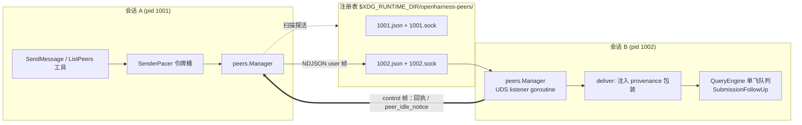
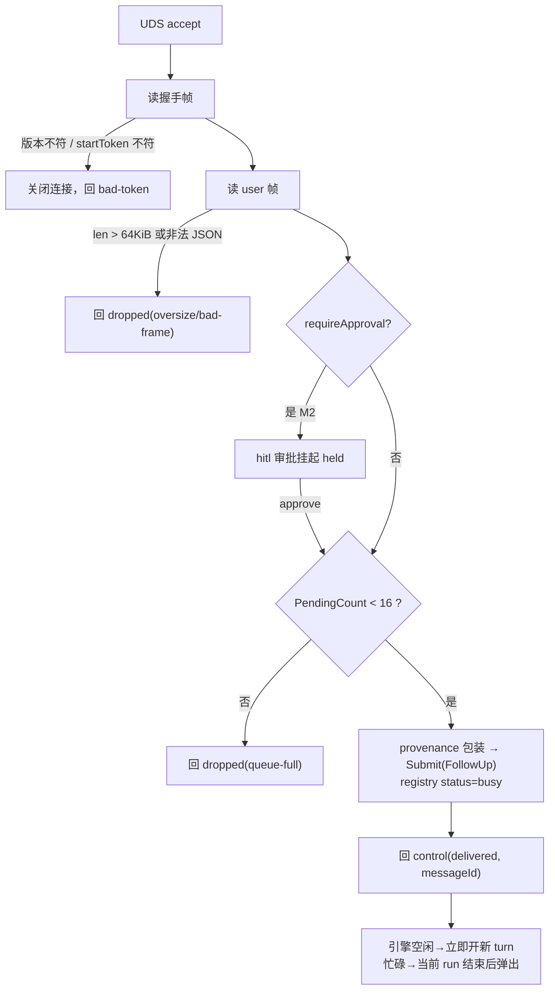
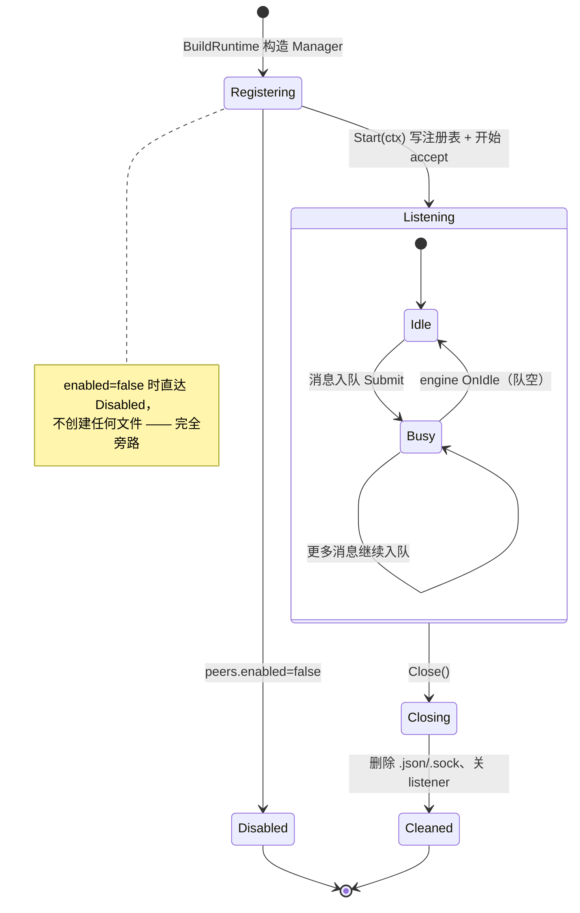
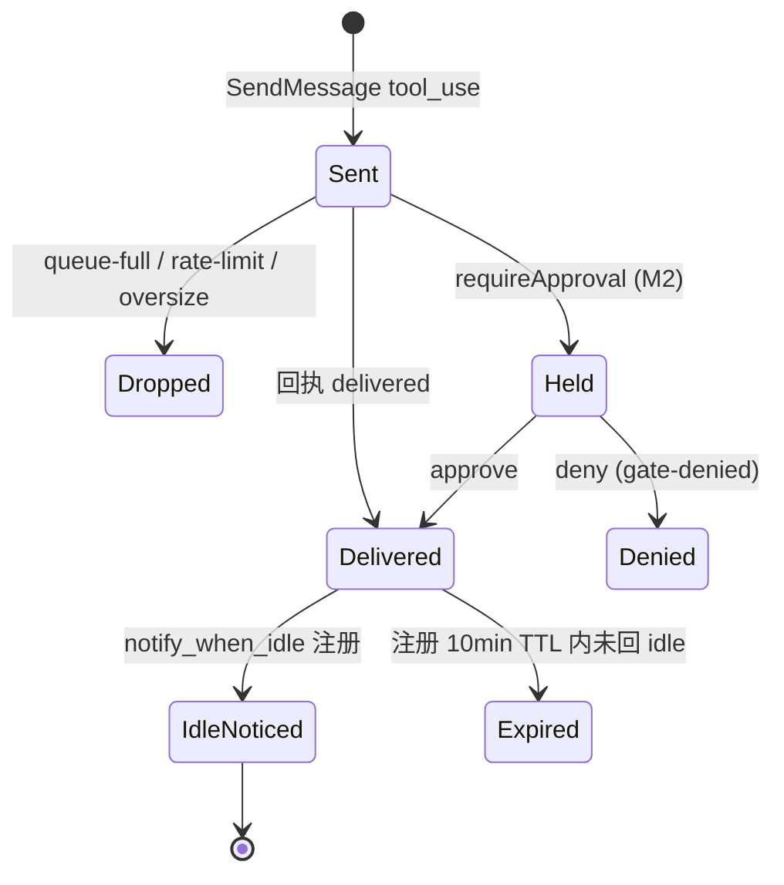

# 技术方案：Cross-Session Messaging（跨会话点对点消息）

> 配套文档：本文（机制与协议参考）与 [.agents/notes/proposed/feature/2026-08-27-cross-session-messaging.md](../.agents/notes/proposed/feature/2026-08-27-cross-session-messaging.md)（决策记录 + 实施方案：数据结构、代码片段、时序/状态机、测试计划）。
> 调研输入：Claude Code v2.1.247 Cross-Session Messaging 逆向调研（`~/.gemini/antigravity/brain/4908ed00-085a-4f2a-b12f-524eccfa370a/claude_code_cross_session_messaging_research.md`）。
> 本文定义机制契约；决策理由与取舍见 Agent Note。

## 1. 目标与非目标

多个 openharness REPL 同时运行在开发者的不同终端里（前端重构、后端 API、长构建），彼此上下文同步目前只能靠人工复制粘贴。本功能让模型和用户可以**点对点地向同机其他会话投递文本消息**，投递后不中断目标会话正在执行的工作，由其单飞队列在安全边界消费。

做：

- 同机多会话自动发现（无守护进程，去中心化注册表 + socket 探活）；
- `SendMessage` / `ListPeers` 两个模型可见工具；REPL `/peers` 斜杠命令给用户看同一份清单；
- 忙碌目标排队、空闲目标立即唤醒，发送方可选 `notify_when_idle` 零轮询回调；
- 每条消息回执（delivered / dropped / rate-limit 等），错误信息可行动。

不做（记录为非目标，防止范围蔓延）：

- 跨机器桥接、云端沙箱会话（Claude Code 的 `bridge` / `cloud` peer 类型）；
- 与本进程内子代理通信——子代理消息已有 [pkg/tasks](../pkg/tasks/executor.go) 的 `TaskSendMessage` 承担，两者寻址空间独立；
- 会话状态或文件树共享（[session.Store.ForkTo](../pkg/session/store.go) 是将来的另一条线）；
- Windows Named Pipes（M1 仅 Unix 域套接字）。

## 2. 总览：复用单飞队列，不动 agent loop

接收侧最关键的事实：[QueryEngine](../pkg/engine/query_engine.go) 已实现单飞提交队列——同一时刻最多一个 agent loop 在跑，新提交经 `Submit(kind, prompt)` 进入 FIFO，忙碌时入队、结束当前 run 后消费。**跨会话消息对引擎而言就是一种远程来源的普通提交**，因此 `pkg/engine` 只需增加一个 idle 回调选项，agent loop 本体（RunQuery、交付点 A/B）零改动：



职责划分：

| 组件 | 归属 | 职责 |
|---|---|---|
| 注册表读写、探活清理 | 新包 `pkg/peers` | 目录布局、`<pid>.json` 元数据、stale 清理 |
| UDS 服务端 / 客户端 | `pkg/peers` | NDJSON 编解码、握手校验、尺寸上限 |
| 发送限流 | `pkg/peers` | 每目标令牌桶 |
| 接收→提交映射 | `pkg/ui/runtime.go` 接线 | peers.Manager 的 deliver 回调调用 `engine.Submit` |
| 队列与唤醒 | 已有 [pkg/engine](../pkg/engine/query_engine.go) | 不改 loop；新增 `WithOnIdle` / `PendingCount()` |
| 状态发布 | `pkg/peers` | 收到消息置 busy，OnIdle 置 idle 并写注册表 |

## 3. 会话注册中心

### 3.1 目录布局

按优先级解析单一目录 `$OH_PEER_DIR` → `$XDG_RUNTIME_DIR/openharness-peers/` → `/tmp/<uid 转义>/openharness-peers/`。创建目录时强制 `0700` 且属主必须是当前 UID（安全模型见 §5）。该目录是全局的而非 per-cwd——正是要跨工作区互发消息。

每个存活进程占两个文件：

```
openharness-peers/
├── 1001.json   # 注册元数据
├── 1001.sock   # Unix domain socket（服务端监听）
├── 1002.json
└── 1002.sock
```

### 3.2 注册元数据

```json
{
  "messagingSocketPath": "/var/folders/.../openharness-peers/1001.sock",
  "pid": 1001,
  "procStart": 1787719500000000000,
  "startToken": "9f3ab21cd8e74f05b0c2d6aa41e78f3c",
  "sessionId": "session_1787719498123",
  "name": "backend-api",
  "cwd": "/Users/dev/project",
  "model": "claude-sonnet-4",
  "status": "idle",
  "startedAt": 1787719500000,
  "peerProtocol": 1,
  "peerFeatures": ["idle_notify", "approval_gate"]
}
```

字段契约：

- **`procStart`**：进程启动锚点（纳秒）。探活时除 `syscall.Kill(pid, 0)` 外还必须比对它——OS 复用 PID 时避免错认活体。
- **`startToken`**：每次进程启动随机生成 32 hex。握手身份验证用（§5.3），也用于 `rename` 后的重名消歧。
- **`status`**：`idle | busy`。Manager 在消息入队时写 busy，引擎 OnIdle 回调写 idle；写入失败仅记日志，不影响通信。
- **`peerProtocol`**：整数协议版本，封闭集合，当前恒为 1。发现阶段双方版本不等则跳过该 peer。
- **`name`**：人类可读寻址名。默认取 cwd basename；重名时自动追加 `-<sessionID 后 4 位>` 保证本地唯一；模型端始终可用 `"uds:<socket path>"` 或 sessionId 兜底寻址。

### 3.3 探活与 stale 清理

任何 `ListPeers` 扫描都执行三步过滤，并将孤儿文件就地 `unlink` 清理：

1. `syscall.Kill(pid, 0)` 为 nil 或 EPERM → PID 存活；否则进入第 3 步；
2. PID 存活但 `procStart` 与元数据不符 → 视为 PID 复用，进入第 3 步；
3. 以 250ms 超时拨号 `<socket>`；`ENOENT` / `ECONNREFUSED` / 超时 → 确认死会话，删除 `.json` 与 `.sock`。

扫描结果排序键为 `(name, startedAt, pid)`——进 prompt 的列表必须确定有序（provider 缓存纪律，同 [ToolRegistry.ListTools](../pkg/tools/base.go) 的约定）。

## 4. 传输协议：NDJSON over UDS

连接语义：短连接。每帧一发一连，连接内首个帧必为握手帧，其后至多一个业务/控制帧，读完即关。这免去了跨goroutine 连接生命周期管理，也让"向某人回发通知"只是再查一次注册表再连一次的平凡操作。单帧上限 **64 KiB**（含换行符）；超限直接断连并回 `dropped(oversize)` 收据。

### 4.1 帧类型

```go
// pkg/peers/protocol.go
type FrameType string // "hello" | "user" | "control"

// 握手帧：连接后第一帧，client → server。
type HelloFrame struct {
    Type       string `json:"type"`       // "hello"
    Protocol   int    `json:"protocol"`   // 必须 == PeerProtocolV1，否则 server 关闭连接
    Pid        int    `json:"pid"`
    StartToken string `json:"startToken"`
}

// 业务帧：一条待注入目标会话的文本消息。Action 上不做任何控制语义。
type UserFrame struct {
    Type          string `json:"type"` // "user"
    MessageID     string `json:"messageId"`     // uuid，回执与幂等去重键
    Priority      string `json:"priority"`      // 恒为 "next"
    From          string `json:"from"`          // 发送方 name
    FromSessionID string `json:"fromSessionId"`
    FromCwd       string `json:"fromCwd,omitempty"`
    Summary       string `json:"summary,omitempty"` // ≤120 词，UI/转录预览
    Message       string `json:"message"`           // 纯文本，拒绝内部协议语法
}

type ControlAction string // 封闭枚举：notify_when_idle | peer_idle_notice | peer_message_status

type ControlFrame struct {
    Type      string        `json:"type"`   // "control"
    Action    ControlAction `json:"action"`
    MessageID string        `json:"messageId,omitempty"`
    Reason    string        `json:"reason,omitempty"` // delivered|dropped|rate-limit|oversize|bad-token|queue-full|expired|gate-denied
}
```

`reason` 的值域与收据状态一一对应（receivers 回发 `control(peer_message_status)`）：

| reason | 含义 | 触发场景 |
|---|---|---|
| `delivered` | 已入队目标会话引擎 | 默认成功态；不代表已推理完成 |
| `dropped` / `queue-full` | 目标侧未消费先丢弃 | 未投递 peer 消息超过每会话 16 条上限 |
| `dropped` / `rate-limit` | 发送方 pacer 本地拦截 | 突发超 token bucket |
| `dropped` / `oversize` | 帧超过 64 KiB | 序列化前即可判定 |
| `bad-token` / 连接拒绝 | 握手身份不符 | 安全模型触发 |
| `expired` | notify_when_idle 注册等待中 TTL 到期 | 默认 10 分钟未回 idle |
| `held` / `gate-denied` | M2 审批门挂起 / 用户拒绝 | `peers.requireApproval=true` |

### 4.2 provenance 注入格式

入队前把 UserFrame 包装为带来源的纯文本 prompt 再交给 `Submit`，使 LLM 能区分「远端 peer 协作更新」与「控制台真人指令」：

```
<peer_message from="backend-api" session="session_172…" cwd="/repo/backend" summary="接口字段已更新">
POST /api/v2/users 接口字段已更新完毕。
</peer_message>
```

## 5. 安全模型

威胁面是同机其它 UID 的进程与 `/tmp` 类目录的可预测路径。四层防护：

1. **目录权限**：目录不存在则创建并 `chmod 0700`；启动时校验既有目录 mode 为 0700 且 uid 属主是当前用户或 root，不符即拒绝启用 messaging 并告警（降级为无此功能的正常会话）。
2. **符号链接防御**：注册表读写、socket 建连前对目标路径 `Lstat`，是 symlink 一律拒绝操作（防 `/tmp` 布点劫持）。
3. **握手身份验证**：server 收到 HelloFrame 后读取注册表目录里 `<pid>.json`，比对 `startToken`。token 只存在于对端自己的内存与本机 0700 注册目录，第三方无法伪造「某 pid 的合法会话」身份。校验失败静默关闭连接并回 `bad-token`。
4. **发送端令牌桶（pacer）**：每目标 {burst 4, refill 1/s}，超出立刻返回工具错误而不是真的打出去——防模型死循环互刷把两个会话都拖垮。

权限语义边界（要向 reviewer 讲清的一条）：peer 消息入队只产生一轮对话文本，**不会绕过权限系统**——消息内容驱动的任何工具调用仍走 `PermissionChecker` 全链路（即便当前处于 P0-1 未接线状态，未来接线后同样生效）。`peers.requireApproval` 是在其之上叠加的「入队本身需人审批」门（M2），复用运行时的 AskPermissionFunc 回调，不新造审批通道。

## 6. 接收路径与引擎集成



要点：

- 监听 goroutine 挂在 runtime 生命周期 ctx 上；每个连接派生 `context.WithCancel(ctx)`，单连接卡死不影响 accept 循环，Ctrl-C 取消当前 query 时监听器照常收消息入队——符合「会话上下文活得过中断」的纪律。
- 入队用的 kind 是 `SubmissionFollowUp`：引擎的单飞 runner 保证它绝不打断进行中的工具执行；它与真人 follow-up 共享同一 FIFO，因此**同会话内不出现乱序**。
- 「队列满」的容量语义来自新增访问器 `QueryEngine.PendingCount() int`（turnQueue+steeringQueue 长度），阈值 16。
- idleness 的唯一权威是引擎：runner 归还令牌且两队列皆空时回调 `WithOnIdle(fn)`。Manager 在该回调里：写注册表 `status=idle`、消费 `notify_when_idle` 注册表项（对仍存活的发送方回发 `peer_idle_notice`）、过期注册回 `expired`。

发送侧 `SendMessage` 工具流程：解析 `to`（name → 匹配唯一；`session_…` → 直接定位；`uds:` 前缀 → 字面路径）→ 读注册表 → 探活 → pacer 申请令牌 → 连接 + 握手 + 发帧 → 等回执（500ms 超时视为送达不确定，如实报告给模型）→ 把 `reason` 映射成结构化结果文本；任何失败都附带下一步建议（重新 ListPeers / 换 sessionId 寻址），满足可行动错误约定。

## 7. 面向模型与用户的接口

### SendMessage（模型工具）

```
name: SendMessage
input: {
  to:              string  # name | session_<id> | uds:<path>
  message:         string  # 必填，纯文本
  summary:         string  # 可选，≤120词，UI 预览
  notify_when_idle: boolean # 可选，目标排空后回调本会话
}
```

输出示例（成功）：`delivered to backend-api (idle; will start a new turn)`；（受限）：`held: target requires human approval for peer messages`；（限流）：`rate-limited by local pacer; wait ~1s before resending`。

### ListPeers（模型工具）

自省行 + 表格：当前会话自称（名称/token）让模型知道别人怎么称呼自己，然后列 `(kind=uds, name, sessionID, cwd, status)`。M1 只有 `uds` 一种 kind。

### /peers 斜杠命令

REPL 侧渲染与 ListPeers 相同的数据源，属于用户视图；不加审批、不改状态。

## 8. 会话级状态机（接收侧）



消息自身生命周期（对应 §4.1 收据）：



## 9. 分期

| 期 | 内容 | 出口标准 |
|---|---|---|
| M1 | pkg/peers 全量（注册表/传输/pacer/清理）+ SendMessage/ListPeers 工具 + runtime 接线 + OnIdle/PendingCount 引擎扩展；`peers.enabled` 默认 false | 两 REPL 手动互通收发与忙碌排队；接线测试在移除注册时变红 |
| M2 | notify_when_idle 回调链 + 审批门（held/denied 收据）+ 过期回收；默认仍 off | 零轮询协作演示（A 发完即歇，B 干完主动敲 A）|
| M3 | 默认 enabled=true + `@<name>` REPL 语法糖 + JSON-lines 前端事件 | 文档与 AGENTS.md 根规则补一条引用 |

M1 刻意默认关闭：风险敞口（本地提权面、prompt 注入路径）应在审批门与人审之后才转默认开启——这与仓库「权限当前处于 P0-1 未接线状态」的现状一致。

## 10. 与既有约定的对齐自查

- **Wiring completeness**：Manager 由 BuildRuntime 创建并在 `Start(ctx)/Close()` 建立与拆除；测试断言 ToolRegistry 含 SendMessage/ListPeers 且 `RuntimeBundle.PeerManager != nil`。
- **Provider-facing determinism**：peer 清单与 ListPeers 输出排序固定；工具 schema 经 BaseToolHelper 天然稳定。
- **Context discipline**：listener 用 session ctx；每连接 own-cancelable ctx；Ctrl-C 只 cancel query。
- **Single-flight**：所有外部输入汇入 `Submit` 单一 chokepoint，不为消息开 goroutine 跑 loop。
- **Bounded output**：单帧 64 KiB、per-peer 未投递 16 条、pending notify TTL 10min、工具结果按既有 cap 截断。
- **可行动错误**：所有失败附下一步动作。
