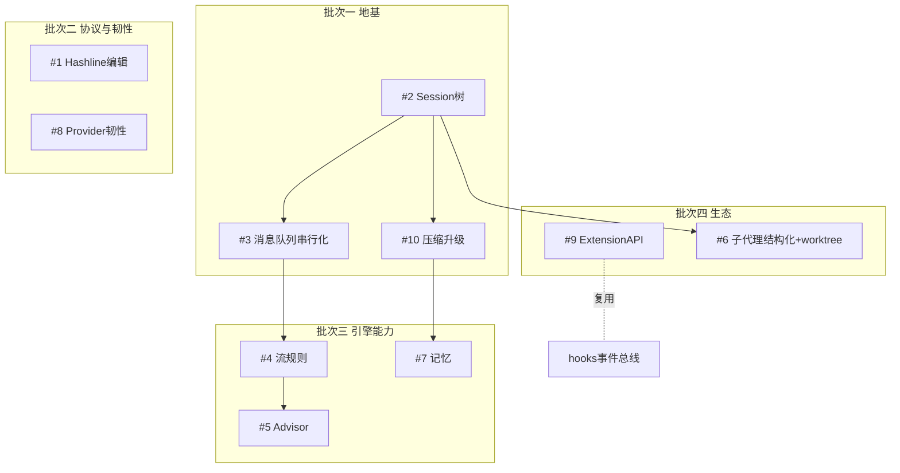
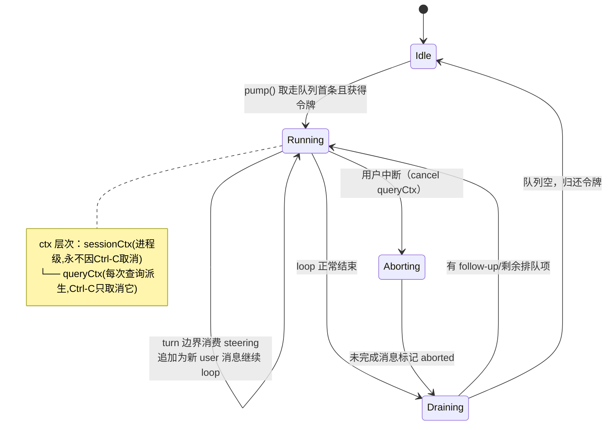
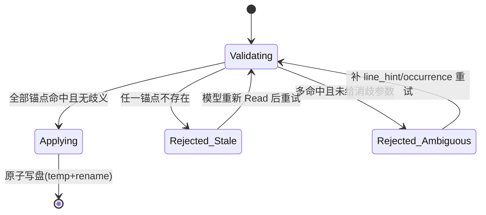
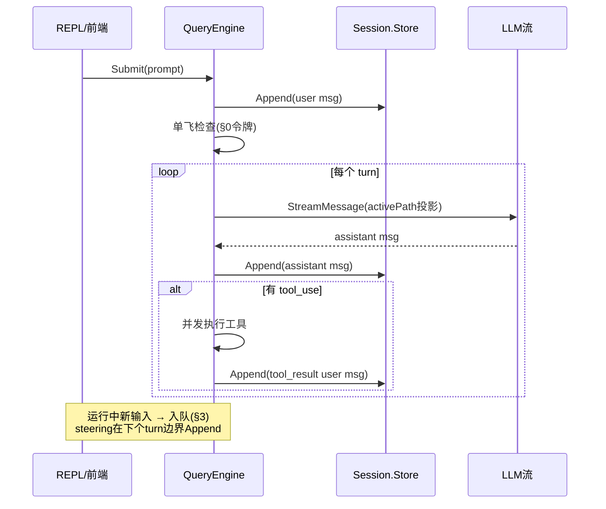
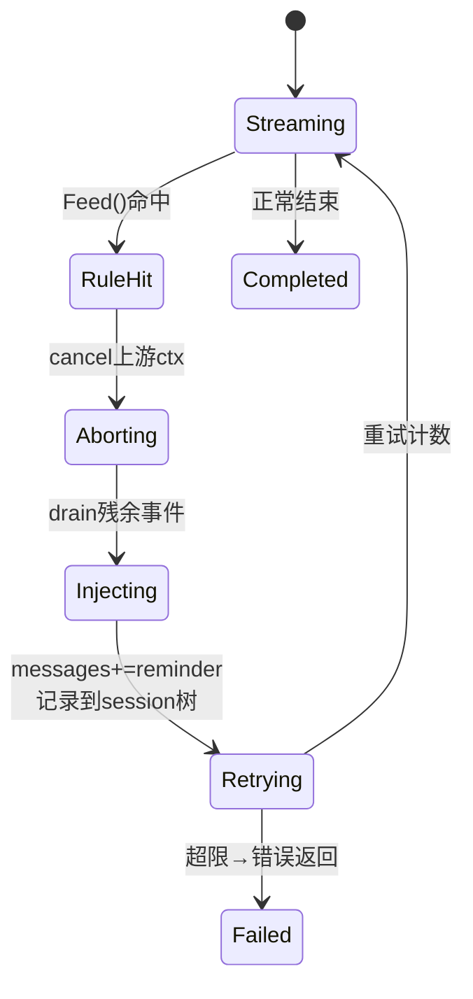
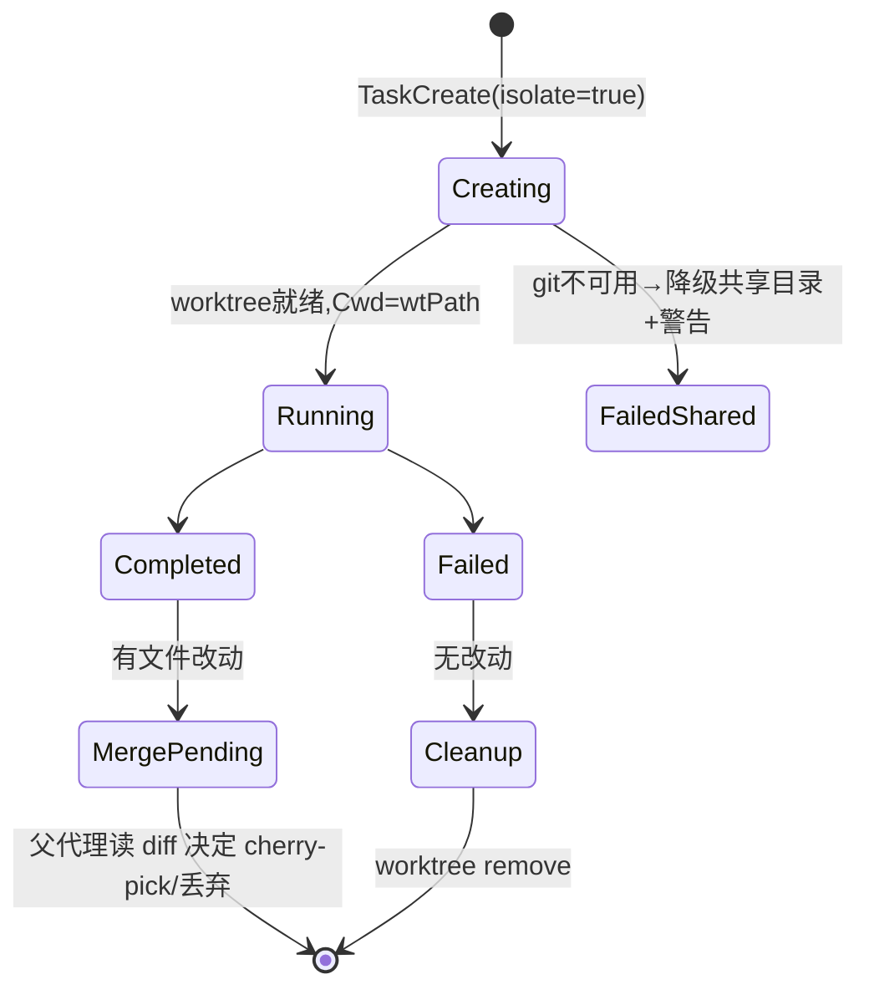
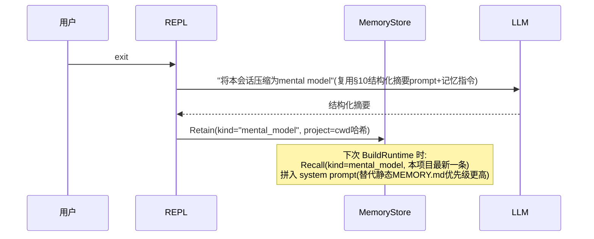
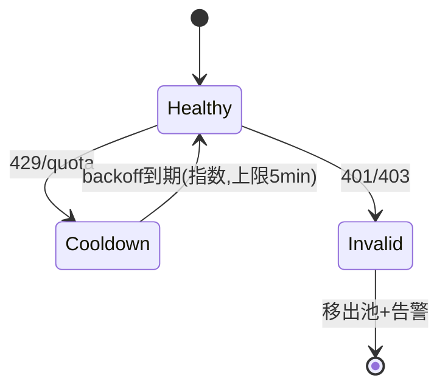
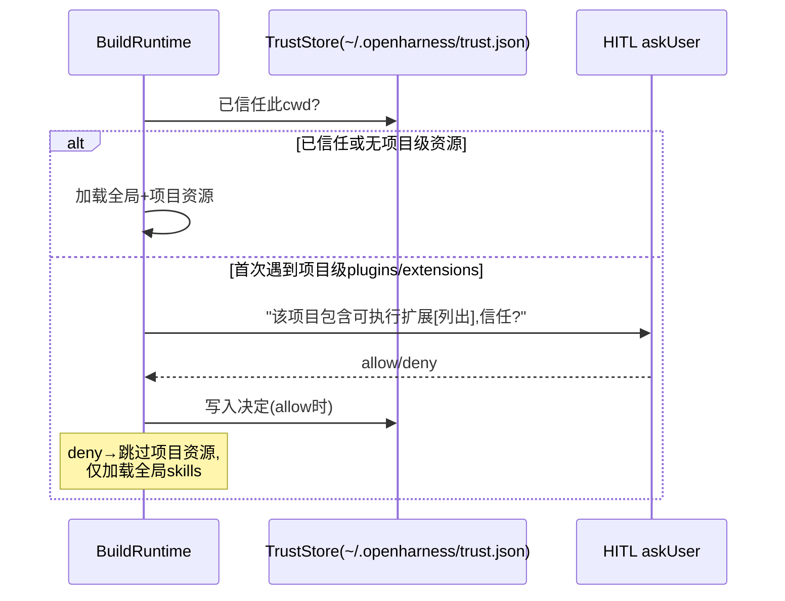
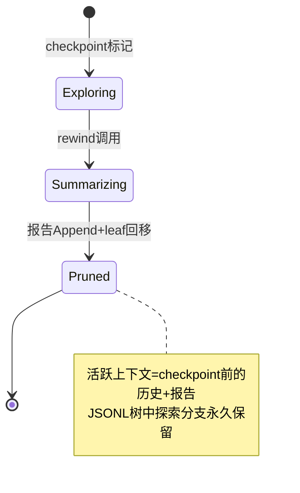

# 技术方案：pi/omp 黑科技落地设计（基于 openharness-go 现有代码）

> 配套文档：docs/p0-tech-debt.md（现状问题）、docs/pi-omp-research.md（调研结论）。
> 本文将调研报告的 10 条 P0 细化为可执行方案：接口定义、关键代码、时序图、状态机。
> 所有「现状」引用均标注真实文件与行号。

## 总览：模块依赖与实施批次



| 条目 | 主要触及文件 | 新增包 |
|---|---|---|
| #1 | tools/builtin/file_read.go, file_edit.go | pkg/hashline |
| #2 | pkg/engine, pkg/ui, cmd | pkg/session |
| #3 | pkg/engine/query_engine.go, pkg/ui/app.go | 无 |
| #4 | pkg/engine/query.go, pkg/hooks | 无 |
| #5 | pkg/engine/query.go | pkg/advisor |
| #6 | pkg/tasks/executor.go, task_tools.go | 无 |
| #7 | pkg/memory, tools/builtin | 无 |
| #8 | pkg/api/client.go, openai_client.go, tools/base.go | 无 |
| #9 | pkg/hooks → 全局, pkg/ui/runtime.go | 无 |
| #10 | pkg/services/compact.go, pkg/session | 无 |

---

## 0. 前置重构：engine 提交串行化（所有后续工作的地基）

**现状**：`SubmitMessage`（pkg/engine/query_engine.go:125）无并发防护——mu 只保护快照复制，agent loop 在锁外跑各自的 `msgs` 副本，结束时无条件写回 `qe.Messages = msgs`（:200）。JSONLines 模式下每行一个 goroutine 并发调用（pkg/ui/app.go:227），历史互相覆盖。

**目标形态**：单飞（single-flight）+ 队列。同一时刻最多一个 query loop 在跑；新提交进入队列，在既定投递点被消费。

```go
// pkg/engine/query_engine.go 新增
type Submission struct {
    Prompt string
    Kind   SubmissionKind // SteeringKind | FollowUpKind | NewTurnKind
}

// QueryEngine 增加：
type QueryEngine struct {
    // ...现有字段...
    runMu    chan struct{}   // 容量为1的令牌，保证单飞
    pending  []Submission    // 已入队待投递
}

// Submit 不再直接跑 loop，而是入队并触发 pump
func (qe *QueryEngine) Submit(kind SubmissionKind, prompt string) error {
    qe.mu.Lock()
    qe.pending = append(qe.pending, Submission{prompt, kind})
    qe.mu.Unlock()
    return qe.pump()
}
```

状态机（会话级）：



REPL 侧配套（修 P0-4b）：`signal.NotifyContext` 只用于进程退出信号通道，不再作为 sessionCtx 来源；Ctrl-C 第一次 → cancel 当前 queryCtx，第二次 → cancel sessionCtx 退出。

---

## 1. Hashline 编辑协议

**现状**：file_edit.go:82-88 用 `strings.Count` 做 str_replace 唯一性校验，失败即报错让模型重试——这正是 omp 数据里重试循环的来源。file_read.go:96 返回裸文本行，模型无从引用精确位置。

### 1.1 锚点编码

```go
// pkg/hashline/hash.go
package hashline

// 62 字符集 × 3 位 ≈ 238k 空间。对单文件几百行的场景，
// 冲突概率足够低；冲突时通过「位置消歧」兜底（见 1.3）。
const charset = "0123456789ABCDEFGHIJKLMNOPQRSTUVWXYZabcdefghijklmnopqrstuvwxyz"

// LineHash 对单行内容计算稳定 3 字符哈希。
// 关键：先 TrimRight 空白再哈希，行尾空白变化不使锚点失效。
func LineHash(line string) string {
    h := fnv.New32a()
    h.Write([]byte(strings.TrimRight(line, " \t\r")))
    v := h.Sum32() % (62 * 62 * 62)
    var b [3]byte
    for i := 2; i >= 0; i-- {
        b[i] = charset[v%62]
        v /= 62
    }
    return string(b[:])
}
```

### 1.2 Read 输出格式

file_read.go 的输出改为：

```
data, _ := os.ReadFile(path)
for i, line := range lines {
    fmt.Fprintf(&sb, "%s|%s\n", hashline.LineHash(line), strings.TrimRight(line, "\r"))
}
// 示例输出：
// aB9|func (t *FileEditTool) Execute(_ context.Context,
// xK2|    input json.RawMessage, execCtx *tools.ToolExecutionContext)
```

工具描述同步改为：「每行前缀为内容锚点。编辑时用锚点引用目标行，不要重抄整行」。默认 limit 收紧到 250 行并在末尾提示续读（omp 的 ideal defaults 思路）。

### 1.3 Edit 工具重做

```go
type FileEditInput struct {
    FilePath string `json:"file_path"`
    Anchors  []struct {          // 支持一次多行替换
        Anchor     string `json:"anchor"`      // 3字符哈希
        LineHint   int    `json:"line,omitempty"` // 可选行号消歧
        Occurrence int    `json:"occurrence,omitempty"` // 同锚点第n处,默认1
        NewLines   string `json:"new_lines"`    // 替换后的完整行内容(可多行)
    } `json:"anchors"`
}

// 校验流程（写盘前的硬闸门）：
func validateAnchors(lines []string, in FileEditInput) error {
    // 为当前文件建 index: hash -> []lineNo
    idx := buildIndex(lines)
    for _, a := range in.Anchors {
        candidates, ok := idx[a.Anchor]
        switch {
        case !ok:
            return staleAnchorError(a.Anchor) // 明确告知:文件已变化,请重新Read
        case len(candidates) > 1 && a.LineHint == 0 && a.Occurrence == 0:
            return ambiguousAnchorError(a.Anchor, candidates) // 附候选行号
        }
    }
    return nil
}
```

校验状态机：



要点：拒绝时错误信息必须包含「下一步该怎么做」（重新 Read / 补充消歧），把修复路径喂回给模型。

---

## 2. Session 树持久化

**现状**：sessionID 只是 `fmt.Sprintf("session_%d", time.Now().UnixMilli())`（runtime.go:180），无任何落盘；`qe.Messages` 是内存切片。

### 2.1 数据模型

```go
// pkg/session/store.go
package session

type EntryKind string

const (
    KindMessage      EntryKind = "message"       // user/assistant/tool结果消息
    KindCompaction   EntryKind = "compaction"    // 见 §10
    KindBranchSummary EntryKind = "branch_summary"
    KindStreamRule   EntryKind = "stream_rule"   // §4 注入记录,压缩时存活
)

type Entry struct {
    ID       string                     `json:"id"`        // uid.NewHex()
    ParentID string                     `json:"parentId"`  // 树结构的关键
    Ts       int64                      `json:"ts"`
    Kind     EntryKind                  `json:"kind"`
    Msg      *types.ConversationMessage `json:"msg,omitempty"`
    Meta     map[string]any             `json:"meta,omitempty"` // 各kind私有数据
}

type Store struct {
    mu     sync.Mutex
    f      *os.File            // append-only JSONL
    byID   map[string]*Entry
    leafID string              // 当前活跃分支叶子
}
```

### 2.2 核心操作

```go
// Append 追加到当前活跃分支
func (s *Store) Append(e Entry) error {
    e.ParentID = s.leafID
    // 写盘(fsync可选) → byID[e.ID]=&e → s.leafID=e.ID
}

// ActivePath 从叶子回溯到根,返回线性消息序列(LLM实际看到的历史)
func (s *Store) ActivePath() []*Entry

// ForkTo 把 activePath 复制进新 Store(独立文件),支持 --fork
// NavigateTo(id) 切换 leafID 即完成 /tree 分支跳转,O(1)
```

### 2.3 与引擎的接线

SubmitMessage 时序（改造后）：



CLI 接线：`--resume <id>` 打开对应 JSONL 设 leafID；`--continue` 取 cwd 下最近 mtime 文件；`/fork`、`/tree` 是 Store 上纯函数操作。

---

## 3. Steering / Follow-up 投递语义

§0 给出了队列骨架，这里定义 pi 语义的精确投递点。RunQuery 的 turn 循环（query.go:154）改造为：

```go
for turn := 0; turn < maxTurns; turn++ {
    // === 投递点A: steering ===
    // pi语义: "当前 assistant turn 的工具执行完后立刻投递"
    // 即: 工具结果消息 Append 之后、下一次 LLM 调用之前
    for _, sub := range qe.drainPending(SteeringKind) {
        *messages = append(*messages, types.FromUserText(sub.Prompt))
        qe.store.Append(...) // 同步进session树
    }

    params := buildParams(qctx, messages) // 见 §8 cache稳定性
    // ... LLM调用、工具执行（现有逻辑）...
}

// === 投递点B: follow-up ===
// loop 结束(无 tool_use 的最终 assistant 消息)后:
if more := qe.drainAll(); len(more) > 0 {
    // 作为新一轮 SubmitMessage 继续 pump
}
```

中断与恢复：Escape/Ctrl-C 触发 `cancel queryCtx` → RunQuery 收到 ctx.Done 时把已产生的部分消息标记 `meta.aborted=true` 后正常落盘 → 队列中未投递的 submission 退回给前端（REPL 打印提示，JSONLines 发 BE 事件）。这与 pi「abort 后队列退回编辑器」一致。

JSONLines 前端协议补充：FrontendRequest 增加 `FRQueueMessage { kind: "steering"|"follow_up" }`；BackendEvent 增加 `BEQueued` / `BEDelivered` 回执，TUI 才能正确渲染排队状态。

---

## 4. Time-traveling Stream Rules

**现状**：hooks 包有 PreToolUse/PostToolUse 但从未接线（P0-3），且缺少流文本维度的钩子。

### 4.1 规则模型与拦截点

```go
// pkg/hooks/streamrule.go
package hooks

type StreamRule struct {
    Name      string         `json:"name"`
    Pattern   string         `json:"pattern"`    // 正则
    Injection string         `json:"injection"`  // 违规时注入的system reminder
    compiled  *regexp.Regexp
}

type StreamRuleEngine struct {
    mu     sync.RWMutex
    rules  []*StreamRule
    fired  map[string]bool // 本会话已触发过的规则,注入内容压缩时存活(存session树)
}

// Match 在每个 TextDelta 上滑动检查。
// 实现: 维护每条规则的尾部缓冲(最长pattern长度-1)以处理跨delta命中
func (e *StreamRuleEngine) Feed(delta string) (hit *StreamRule, ok bool)
```

### 4.2 引擎内拦截与重试

RunQuery 流消费循环（query.go:182-198）改造：

```go
var textBuf strings.Builder
for ev := range streamCh {
    if hit := ruleEngine.Feed(ev.TextDelta); hit != nil {
        cancelStream()                       // abort 上游provider调用
        return retryWithInjection(hit)       // 见下
    }
    // ...原有转发逻辑...
}

// 重试 = 从本turn起点重新发起LLM调用,messages追加一条system reminder:
//   <system-reminder>Rule "no-box-leak" triggered. {rule.Injection}</system-reminder>
// 同时把该规则写入 session 树(KindStreamRule),保证 compaction 后仍生效;
// fired 过的规则默认不再二次触发(可配置 maxHitsPerRule)
```

状态机（单次 LLM 调用粒度）：



规则来源：项目 `.openharness/rules/*.json` + 全局目录，加载进现有 HookRegistry（loader 复用 pkg/hooks/loader.go 的模式）。这一步同时完成 P0-3 的修复——HookExecutor 通过 engine.WithHookExecutor 真正传入 NewQueryEngine。

---

## 5. Advisor 第二模型旁听

**现状**：无任何多模型概念；apiClientAdapter 只包一个 client（ui/adapter.go:12）。

### 5.1 接口设计

```go
// pkg/advisor/advisor.go
package advisor

type NoteLevel string // "aside" | "concern" | "blocker"

type Note struct {
    Level NoteLevel
    Text  string
}

type Advisor struct {
    Client  engine.StreamingLLMClient
    Model   string
    MaxTurn int               // 每会话最多插note数,防刷屏
    fired   int
}

// Observe 异步旁听:输入是本轮的紧凑摘要而非全量上下文,
// advisor 有自己的累积上下文(内部维护自己的messages切片)
func (a *Advisor) Observe(ctx context.Context, turn TurnSummary) <-chan Note
```

### 5.2 注入路径

在 RunQuery turn 循环的投递点 A（steering 同一位置）非阻塞收割 note channel：

```go
select {
case n := <-advisorCh:
    if n.Level == NoteBlocker || a.shouldInject(n) {
        *messages = append(*messages, types.FromUserText(fmt.Sprintf(
            "<advisor-note level=%q>\n%s\n</advisor-note>", n.Level, n.Text)))
    }
default:
}
```

时序：

```mermaid
sequenceDiagram
    participant Main as 主loop(RunQuery)
    participant Adv as Advisor goroutine
    participant L2 as reviewer模型

    Main->>Adv: Observe(turn摘要) [每轮fire-and-forget]
    par 主循环继续干活
        Main->>Main: 下一个turn的工具执行
    and advisor独立评审
        Adv->>L2: StreamMessage(advisor自有上下文)
        L2-->>Adv: note(aside/concern/blocker)
    end
    Main->>Main: 下个投递点A select收割note
    Note over Main: blocker强制注入;concern按预算注入;<br/>aside仅记录到session树供/tree查看
```

关键约束：Observe 绝不阻塞主循环；advisor 自身出错静默降级（记日志）。settings 增加 `advisor: {model: "...", enabled: true}`。

---

## 6. Subagent 结构化输出 + worktree 隔离

**现状**：SubAgentExecutor.runAgent（tasks/executor.go:78-137）把最终输出当纯文本累积（resultBuilder 只拼 TextDelta，:126-128）；无工作区隔离；PermissionChecker 写死 AllowAll（:108，P0-1 修复时需一并改为继承父级）。

### 6.1 结构化输出契约

```go
// SubAgentConfig 增加:
type SubAgentConfig struct {
    // ...现有字段...
    OutputSchema map[string]any `json:"output_schema,omitempty"` // 简化JSON Schema
}

// runAgent 尾部改造:
finalOutput := resultBuilder.String()
if cfg.OutputSchema != nil {
    for attempt := 0; attempt < 2; attempt++ {
        if obj, err := validateLooseSchema(finalOutput, cfg.OutputSchema); err == nil {
            e.Registry.SetStructuredResult(taskID, obj)   // 新增:typed结果
            break
        }
        // 校验失败→追加一条修复请求继续loop(复用RunQuery,限1轮):
        // "你的最终回复必须是符合以下schema的单一JSON对象,错误:{err},请只输出修正后的JSON"
    }
}
```

validateLooseSchema 先做最小实现：required 字段存在性 + type 检查 + 嵌套一层对象/数组，避免引入完整 JSON Schema 库；后续可换 santhosh-tekuri/jsonschema。

task_tools.go 的 TaskGet 返回体增加 `result` 字段（typed JSON）；AgentTool 描述同步更新「子任务可用 output_schema 约束返回格式」。

### 6.2 Worktree 隔离生命周期

```go
// pkg/tasks/worktree.go
func CreateIsolated(cwd, taskID string) (wtPath string, cleanup func(), err error) {
    wt := filepath.Join(cwd, ".oh-worktrees", taskID)
    // git worktree add -b oh/task/<taskID> <wt>
    // cleanup: git worktree remove --force(仅当分支未修改) / 否则保留并提示
}
```

状态机：



注意：worktree 内的子代理工具 Cwd 已由 QueryContext.Cwd 天然隔离（executeToolCall 用 qctx.Cwd 构造 execCtx，query.go:308），无需改工具层。

---

## 7. Agent 自主记忆

**现状**：pkg/memory 只有 LoadMemoryPrompt 静态读 MEMORY.md。

### 7.1 存储与工具

```go
// pkg/memory/store.go —— 最小实现用单文件SQLite(现代cgo-free驱动)或bolt
type MemoryStore interface {
    Retain(ctx context.Context, kind string, content string, tags []string) (id string, err error)
    Recall(ctx context.Context, query string, k int) ([]Memory, error) // FTS5全文检索起步
    Edit(ctx context.Context, id string, op MemOp) error               // update/forget/invalidate
}

// 三个新builtin工具(注册进CreateDefaultToolRegistry):
// Retain {content, tags[]} → 确认id
// Recall {query, top_k}    → 格式化列表(带id与时间)
// Learn {lesson}           → 写入 lessons.md 并提示可晋升skill
```

### 7.2 会话压缩为 mental model

会话结束钩子（REPL 退出 / session 切换）触发：



项目作用域：以 cwd 绝对路径的哈希作为 partition key，避免跨项目记忆污染。后端可插拔（interface 已留），默认 local 文件实现零配置可用。

---

## 8. Provider 韧性三件套

**现状**：client.go/openai_client.go 单次调用零重试；usage 解析只有 output_tokens（client.go:323-334）；ToolRegistry.ToAPISchema 遍历 map（tools/base.go:123-130）——**Go map 迭代随机顺序，每轮 tools 数组顺序都不同，直接打碎 provider 端 prompt cache 前缀**，这是当前代码里隐藏最深的一个成本 bug。

### 8.1 Cache 稳定性（先修，收益立现）

```go
// tools/base.go ToAPISchema 排序修复:
func (r *ToolRegistry) ToAPISchema() []map[string]any {
    // ...收集后:
    sort.Slice(result, func(i, j int) bool { return result[i]["name"].(string) < result[j]["name"].(string) })
}
```

同时审计：system prompt 组装（runtime.go:137）中 skills 列表、memory 内容必须确定性排序；usage 解析补 `input_tokens`、`cache_read_input_tokens`、`cache_creation_input_tokens`（Anthropic）与 `prompt_tokens_details`（OpenAI），透传到 CostTracker——一并修 P0-5b。

### 8.2 Fallback Chain 与凭证轮换

```go
// pkg/api/resilient.go
type ModelRef struct{ Provider, Model, APIKeyEnv string }

type ResilientClient struct {
    chains map[string][]ModelRef      // role -> chain, 来自 settings
    creds  *CredentialPool            // 同provider多key轮换
    state  sync.Map                   // key: chainIdx → cooldownUntil
}

func (c *ResilientClient) StreamMessage(ctx context.Context, p engine.LLMRequestParams) (<-chan engine.LLMStreamEvent, error) {
    chain := c.chains[roleFromContext(ctx)]
    for i, ref := range chain {
        if inCooldown(c.state, i) { continue }
        ch, err := c.tryStream(ctx, ref, p)
        if isRetryable(err) {           // 429/5xx/network
            setCooldown(c.state, i, backoff(err))
            continue                    // 下一个接手整个turn
        }
        return ch, nil                  // 流已建立后的中途断流不切换,交给上层
    }
    return nil, fmt.Errorf("all fallbacks exhausted")
}

type CredentialPool struct { ... } // round-robin + session affinity:
                                    // 同一session粘住同key保cache;429才切key
```

凭证状态机：



settings 结构：`modelRoles: {default, smol, slow, plan}` + `retry.fallbackChains`。engine 的 LLMRequestParams 增加 role 字段（advisor/smol 子代理天然复用 §5/§6 的便宜模型路由）。

---

## 9. Extension API + Project Trust

**现状**：hooks 包是独立死代码；BuildRuntime 无条件加载 cwd 下 plugins/、skills/（runtime.go:90-93）——任意仓库可自带会被自动执行的插件，本身就是供应链风险。

### 9.1 统一事件总线（把 hooks 泛化）

```go
// pkg/hooks/bus.go —— hooks 包升级为事件总线
type EventKind string
const (
    EvToolCall        EventKind = "tool_call"         // 可拦截
    EvToolResult      EventKind = "tool_result"
    EvBeforeCompact   EventKind = "session_before_compact" // §10自定义压缩入口
    EvSessionEnd      EventKind = "session_end"            // §7记忆压缩触发点
    EvStreamDelta     EventKind = "stream_delta"           // §4流规则挂载点
)

// Decision 允许扩展拦截工具调用(权限系统的正式出口,修P0-1)
type ToolCallDecision struct {
    Deny    bool
    Reason  string
    Confirm bool // 触发askPermission回调
}

type Extension interface {
    Name() string
    OnEvent(kind EventKind, h func(ev any) (any, error))
}
```

现有 HookExecutor 接口（PreToolUse/PostToolUse）作为 bus 上两个事件的语法糖保留，旧代码不破坏。engine.executeToolCall（query.go:291-306）改为先过 bus：

```go
if d := bus.Fire(EvToolCall, ev).(*ToolCallDecision); d.Deny {
    return fail("denied by extension: " + d.Reason)
}
if d.Confirm {
    allowed, _ := execCtx.AskPermission(ctx, toolName, d.Reason)  // AskPermission终于有调用方
    if !allowed { return fail("user denied") }
}
```

permissions.PermissionChecker.Evaluate 实现为一个内置 Extension（内置权限扩展），在 BuildRuntime 按 settings.Permission.Mode 注册——P0-1 至此闭环。

### 9.2 Project Trust 门控



范围：只对「会执行代码」的资源门控（plugins/、extensions/、未来脚本类 skills）；纯 markdown skills 不需要。

---

## 10. 压缩管线升级：Cut point / 结构化摘要 / CompactionEntry / Checkpoint-Rewind

**现状**：compact.go 的 L1-L4 是字符级截断（无消息边界概念），L5 有结构化 prompt 但结果不落盘；query.go:160 mid-loop 调用丢弃返回值（P0-5a）。

### 10.1 Cut Point 算法（对齐 pi 语义）

```go
// pkg/services/cutpoint.go
// 输入改为 Entry 序列而非裸消息——树结构让切点可被 firstKeptEntryId 精确引用
func FindCutPoint(entries []*session.Entry, keepRecentTokens int) (cut int, splitTurn bool) {
    budget := 0
    for i := len(entries) - 1; i >= 0; i-- {
        e := entries[i]
        if isToolResult(e) { continue }   // tool result 不独立计为切点候选
        budget += EstimateEntryTokens(e)
        if budget >= keepRecentTokens {
            // 只允许切在 user/assistant/custom 边界:
            if !isCuttable(e) { return i + 1, false }
            // 单turn超预算 → split turn: 切在本turn中间的assistant处,
            // turn前缀单独生成第二份摘要再合并(pi语义)
            return i, inSameTurn(entries, i)
        }
    }
    return 0, false
}
```

### 10.2 CompactionEntry 与增量语义

```go
type CompactionMeta struct {
    Summary          string `json:"summary"`
    FirstKeptEntryID string `json:"firstKeptEntryId"` // 幸存区起点
    TokensBefore     int    `json:"tokensBefore"`
    ReadFiles        []string `json:"readFiles"`      // 从tool_use提取
    ModifiedFiles    []string `json:"modifiedFiles"`
    PrevSummaryID    string   `json:"prevSummaryId,omitempty"` // 增量链
}
// 存入 session 树 Kind=compaction。
// 增量: 下次汇总区间 = [上次FirstKeptEntryID的上一边界, 新cutPoint),
// 即"上次幸存的这次也要进摘要"(pi语义);文件清单与PrevSummary合并累积。
```

结构化 prompt 在现有 autoCompact（compact.go:264-279）基础上补三段：`<constraints>`、`<next_steps>`、以及把 read/modified files 以 `<read-files>` 标签附在末尾。序列化时 tool result 截断从 50k 字符降到 2k（compact.go:27 的 MaxToolResultChars 是给 L1 用的，摘要输入应另设小值）。

### 10.3 修复 P0-5a 并接入 session 树

```go
// query.go turn循环内:
if services.ShouldCompact(pathEntries, config) {
    newEntries, summaryMeta, err := services.Compact(ctx, pathEntries, config, summarizeFn)
    if err == nil {
        qe.store.AppendCompaction(summaryMeta)     // 落盘
        *messages = services.RebuildFrom(newEntries, summaryMeta.FirstKeptEntryID)
    }
}
```

### 10.4 Checkpoint / Rewind 工具

```go
// checkpoint: 记录当前 leafID 为命名锚点(session树天然支持,O(1))
// rewind: 请求参数 {report_instruction} → 对 [checkpointLeaf, now] 区间生成报告 →
//         leafID 直接移回 checkpoint 锚点 → Append(report作为assistant消息)
// 效果: 探索性上下文从活跃路径消失,但完整历史仍在树中可/tree回看
```

状态机：



---

## 测试策略要点

| 层 | 关键测试 |
|---|---|
| hashline | 冲突率压测（10k 行文件全行哈希碰撞数）、TrimRight 稳定性、stale anchor 拒绝 |
| session 树 | append/fork/navigate 往返一致性；崩溃恢复（JSONL 尾部截断容忍） |
| 单飞队列 | `-race` 下并发 Submit 断言串行投递顺序；steering 在 turn 边界注入位置 |
| cut point | 构造 tool_use/tool_result 相邻序列断言永不分离；split turn 双摘要 |
| fallback | httptest mock 429 → 断言 chain 切换与 cooldown 生效 |
| 权限总线 | 内置权限扩展 × 三种 mode × deny/confirm 路径 |

## 实施风险提示

1. **§0+§2+§3 是强耦合重构**，建议同一 PR 序列完成并补 e2e（REPL 脚本驱动），否则 engine 处于半新半旧态不可发布。
2. **§8.1 的 map 迭代修复务必最先合入**——一行 sort，立刻改善所有用户的 cache 命中与费用。
3. §4 流规则的重试会放大 token 消耗（同 turn 重发），maxRetries 默认 2 且规则命中要计入 usage 统计。
4. §6 worktree 依赖 git 存在与工作树干净度，降级路径（共享目录+警告）必须实现，不能 hard fail。


