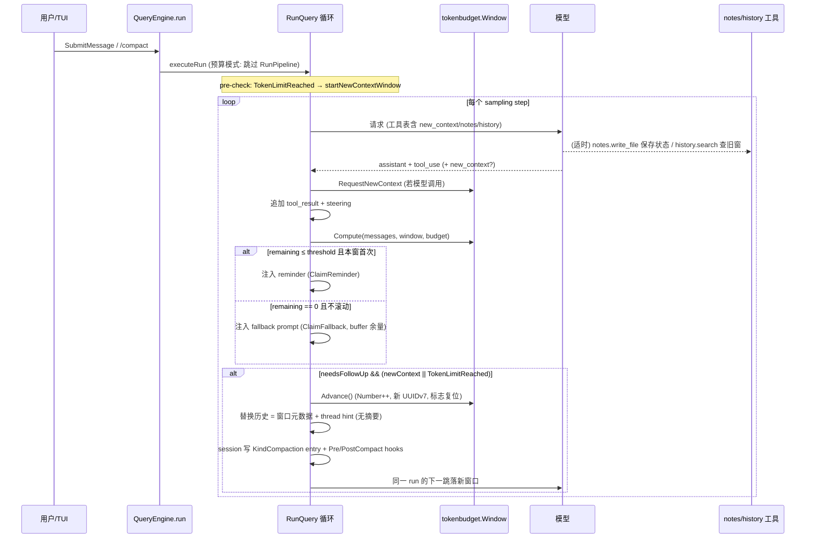

# 技术方案：Token Budget 上下文管理（对齐 Codex experimental_mode）

> 设计日期：2026-09-08
> 依据：[codex-context-management-research.md](codex-context-management-research.md)（Codex 源码 + PR 考古）、[codex-context-management.md](codex-context-management.md)（方法论）
> 配套决策记录：[Agent Note: Token Budget context management](../.agents/notes/proposed/feature/2026-09-08-token-budget-context-management.md)
> 定位：新增一条与现有五级压缩流水线并存的「换窗口保记忆」路径，配置开关切换，不覆盖 compression。

## 目录

- [Part 0：总览——一句话方案与不做的事](#part-0总览一句话方案与不做的事)
- [Part 1：现状盘点与前置修复](#part-1现状盘点与前置修复)
- [Part 2：配置面（对齐 Codex 三层开关）](#part-2配置面对齐-codex-三层开关)
- [Part 3：预算服务——记账与窗口状态机](#part-3预算服务记账与窗口状态机)
- [Part 4：感知层——提醒与上下文元数据注入](#part-4感知层提醒与上下文元数据注入)
- [Part 5：管理层——new_context 工具与滚动执行](#part-5管理层new_context-工具与滚动执行)
- [Part 6：记忆层——history/notes 工具（本地实现）](#part-6记忆层historynotes-工具本地实现)
- [Part 7：引擎接线——run 循环改造的精确位置](#part-7引擎接线run-循环改造的精确位置)
- [Part 8：端到端时序](#part-8端到端时序)
- [Part 9：分阶段实施与接线测试](#part-9分阶段实施与接线测试)
- [Part 10：与 Codex 的差异清单（有意为之）](#part-10与-codex-的差异清单有意为之)

---

## Part 0：总览——一句话方案与不做的事

**方案**：在 `pkg/engine` 的 run 循环与 `pkg/services` 之间新增一个 `pkg/services/tokenbudget` 包（窗口状态机 + 记账），向 `ToolRegistry` 注册 `new_context` / `get_context_remaining` / `notes_*` / `history_*` 四组工具，把换窗（rollover）实现为「历史替换为全新初始上下文 + 事件流上等价于一次 compaction」；总开关 `features.context_management`，机制开关 `features.token_budget`，二者都关时现有压缩流水线原样运行。

**明确不做**（对照 Codex 有意裁剪）：

- 不做服务端 history/notes 后端——notes 落本地文件（会话 scratchpad），history 直接读内存历史 + session JSONL；
- 不做 model-owned defaults 自动激活——`pkg/services/model_limits.go` 已有静态模型表，先做「模型已知 + 用户开关」两层资格；model 差异化阈值/文案留作 `knownLimits` 表的扩展字段后置；
- 不做订阅资格门（无 ChatGPT plan 概念）；
- 不做 remote compaction 路由（我们没有 remote V2）。

## Part 1：现状盘点与前置修复

### 1.1 可复用的既有资产

| 既有组件 | 位置 | 在本方案中的角色 |
|---|---|---|
| 五级压缩流水线 | `pkg/services/compact.go` | 关闭 token_budget 时原路径；`RunPipeline` 签名不动 |
| 模型上下文窗口表 | `pkg/services/model_limits.go` | 记账上限来源（`ContextWindowForModel` / `ThresholdForModel`） |
| 会话树存储 | `pkg/session/store.go` | `KindCompaction` Entry 已定义（当前无写入方），rollover 检查点直接用它；`Append` 天然支持窗口元数据进 `Meta` |
| token 估算 | `services.EstimateTokens / EstimateMessageTokens` | `BodyAfterPrefix` 基线兜底（server-observed 优先） |
| compaction 阈值解析 | `services.ResolveCompactionConfig` | token_budget 的 `scope_limit` 解析复用同一模型表 |
| 手动 /compact 命令 | `pkg/ui/tui.go:553`（`Engine.CompactNow`） | token_budget 开启时改走 rollover |
| TUI Brain Capacity 展示 | `pkg/ui/app.go:54`、`runtime.go:427` | 感知层 UI 复用：读 `get_context_remaining` 同一数据源 |

### 1.2 前置修复（不属于本特性但必须先做）

**P0-usage-input**：`pkg/api/client.go:293` 把 `message_start` 事件整体丢弃，`handleMessageDelta`（client.go:324）只取 `output_tokens`——当前 `UsageSnapshot.InputTokens` 对 Anthropic 恒为 0。而 `BodyAfterPrefix` 记账的基线正是「本窗口首次响应的 server-observed input_tokens」（Codex：`ensure_server_observed_prefill_from_usage`）。修复：新增 `handleMessageStart`，解析 `message.usage.input_tokens`（含 `cache_read_input_tokens` + `cache_creation_input_tokens`，与 Codex 的 `usage.input_tokens.max(0)` 同语义），经 stream 事件透出。

**P1-cost-tracker-double-count**：`CostTracker`（query_engine.go:20）按事件累加 input+output，rollover 之后它不再是「活跃上下文」的度量——本方案不动它（账单口径），活跃上下文改由预算服务自己维护（Part 3.3）。

## Part 2：配置面（对齐 Codex 三层开关）

`pkg/config/settings.go` 的 `Settings` 增加：

```go
// Context / token budget (Codex experimental_mode 对齐)
ContextManagement bool             `json:"context_management,omitempty"` // 总开关: experimental_mode
TokenBudget       *TokenBudgetCfg  `json:"token_budget,omitempty"`       // 机制配置, nil = 全默认
```

```go
// TokenBudgetCfg 对齐 codex-rs/core/src/config/mod.rs 的 TokenBudgetConfig。
type TokenBudgetCfg struct {
    Enabled                     bool `json:"enabled,omitempty"`
    UseHistoryNotesExtension    bool `json:"use_history_notes_extension,omitempty"`
    ReminderThresholdTokens     int  `json:"reminder_threshold_tokens,omitempty"`      // 0 = 模型表默认
    ReminderMessageTemplate     string `json:"reminder_message_template,omitempty"`    // 空 = 内置默认
    GuidanceMessage             string `json:"guidance_message,omitempty"`
    AutoCompactFallbackPrompt   string `json:"auto_compact_fallback_prompt,omitempty"`
    AutoCompactFallbackBufferTokens int `json:"auto_compact_fallback_buffer_tokens,omitempty"`
}
```

语义对齐（与 Codex 逐条对应）：

1. **激活**：`ContextManagement && TokenBudget.Enabled` 才进入预算模式；二者是「资格门 + 机制门」的乘积，与 Codex 的 `apply_experimental_context` 布尔结构一致；
2. **buffer 成对校验**：`AutoCompactFallbackPrompt != ""` 时 `AutoCompactFallbackBufferTokens <= 0` 视为配置错误（`LoadSettings` 返回 error，对齐 Codex `TokenBudgetConfig.validate`）；
3. **文案上限**：template / guidance / fallback prompt 各 2000 字节上限，超限 `LoadSettings` 报错（默认模板用 Codex 原文的中文等价物，`{n_remaining}` 占位符同名）；
4. **`ContextWindow`/`CompactionThreshold` 不变**：预算模式下 `CompactionThreshold` 充当 `scope_limit`（`BodyAfterPrefix` 口径），`ContextWindow` 充当全窗口硬限——与 Codex `model_auto_compact_token_limit` / `model_auto_compact_token_limit_scope` 的二字段一一对应，只是我们把口径固定为 BodyAfterPrefix。

默认阈值派生：`ReminderThresholdTokens` 为 0 时取 `scope_limit - fallback_buffer - 20%*window`（Codex 的模型默认值如 25%/50%/75% 分档，我们先用单一档位 80% 窗口占用，即 remaining ≤ 20% 窗口时提醒；后置到模型表扩展）。

## Part 3：预算服务——记账与窗口状态机

新包 `pkg/services/tokenbudget`（纯逻辑、无 IO，全部可单测）。

### 3.1 窗口状态机（对齐 `AutoCompactWindow`）

```go
// pkg/services/tokenbudget/window.go
type WindowIDs struct {
    FirstWindowID    string // UUIDv7 (pkg/internal/uid 扩展 v7 生成)
    PreviousWindowID string // "" = 首窗
    WindowID         string
}

type Window struct {
    Number    int
    IDs       WindowIDs
    newContextRequested bool
    reminderDelivered   bool
    fallbackDelivered   bool
    prefillTokens *Prefill // ServerObserved 优先, Estimated 兜底, 落定后估算不覆盖
}

func (w *Window) Advance()                       // Number++, previous←window, 新 UUIDv7, 三标志复位, prefill 清空
func (w *Window) ClaimReminder() bool            // one-shot
func (w *Window) ClaimFallback() bool            // one-shot
func (w *Window) RequestNewContext()             // new_context 工具置位
func (w *Window) TakeNewContextRequest() bool    // turn 循环消费
func (w *Window) ObservePrefill(inputTokens int) // ServerObserved, 仅首次
func (w *Window) SetEstimatedPrefill(n int)      // 无 ServerObserved 时兜底
```

并发约束：`Window` 只在 `QueryEngine.mu` 保护下读写（单 runner goroutine + 工具执行 goroutine 通过 `engine` 回调置位），状态机自身不加锁——与 `QueryEngine` 现有锁纪律一致，避免第二把锁。

### 3.2 记账（对齐 `ContextWindowTokenStatus`）

```go
// pkg/services/tokenbudget/accounting.go
type Status struct {
    ActiveContextTokens   int   // 窗口内全部消息估算 (活跃历史, 非累计账单)
    ScopeTokens           int   // BodyAfterPrefix: Active - Prefill
    ScopeLimit            int   // CompactionThreshold (或模型表派生)
    FullWindowLimit       int   // ContextWindowForModel (settings.ContextWindow 优先)
    BaseWindowRemaining   int   // min(ScopeLimit-Scope, Full-Active), 下限 0
    TokenLimitReached     bool  // Scope >= ScopeLimit+Buffer || Active >= Full
}

func Compute(messages []types.ConversationMessage, w *Window, cfg ResolvedBudget) Status
```

`ResolvedBudget` 是 `TokenBudgetCfg` + 模型表派生值的合并结果，由 `engine` 在 run 开始时解析一次并随 run 传递（对应 Codex 的 per-turn `resolve_token_budget`；模型热切换时 `SetModel` 触发重解析）。

### 3.3 活跃上下文的度量口径

Codex 用服务端 usage；我们取**两层合成**：优先用最近一次响应的 `input_tokens + output_tokens`（P0-usage-input 修复后可用，即 Codex 的 ServerObserved 路线），窗口首响应未到达时退回 `EstimateMessageTokens(窗口内消息)`。窗口切换后重置——这正是 `BodyAfterPrefix` 的语义，初始上下文（系统提示 + 环境注入）不消耗预算。`CostTracker` 保持账单口径不受影响。

## Part 4：感知层——提醒与上下文元数据注入

### 4.1 注入点

`QueryEngine` 已有两条消息进历史的通道：`deliverNewTurn`（用户消息）与 `RunQuery` 内的 tool-result/steering 追加。新增第三类：**系统合成的 developer 角色 user 消息**（Anthropic 无 developer 角色；Codex 的 developer message 在我们线协议中映射为 `role: user` 系统合成文本，与现有 `[Conversation auto-compacted...]` 摘要消息同构）。

消息体带显式标记以便测试与去重定位：

- 窗口元数据（新窗口首条注入）：`<context_window>` … `</context_window>`，内容为 agent 名、first/current/previous window id、（可选）thread hint——逐字对齐 Codex `TokenBudgetContext.body()`；
- guidance：`<context_window_guidance>` …，仅内容变化时注入（对齐 world-state diff 语义：我们快照 guidance 字符串，变更才发）；
- 提醒：`ClaimReminder()` 成功时注入模板渲染结果（`{n_remaining}` 替换）；
- fallback：`ClaimFallback()` 成功且 `BaseWindowRemaining == 0` 且不滚动时注入。

**确定性**：注入消息的拼接顺序固定（元数据 → guidance → 提醒 → fallback），不依赖 map 迭代——遵守 AGENTS.md 的 provider-facing determinism 规则。

### 4.2 注入时机

对齐 Codex post-sampling：每次 `EventAssistantTurnComplete` 后、工具结果消息已追加、下一轮 sampling 之前，在 run 循环内计算 `Status` 并按 4.1 注入（见 Part 7 的精确插入点）。

## Part 5：管理层——new_context 工具与滚动执行

### 5.1 工具定义（对齐 spec 原文）

```go
// pkg/tools/builtin/new_context.go
// Name: new_context
// Description: "Start a new context window. Does not clear, reset, or otherwise
//               affect environment state."
// Schema: 空对象 properties, required: []
// Execute: execCtx.Metadata["tokenbudget"].(*tokenbudget.Bridge).RequestNewContext()
//          返回 "A new context window will start without summarizing conversation history."
```

工具不直接改状态机——通过注入 `ToolExecutionContext.Metadata` 的桥接对象置位（`Window.RequestNewContext` 由 run 循环单线程消费），避免工具 goroutine 与 run 循环的数据竞争。注册门控：`CreateDefaultToolRegistry` 不注册；`BuildRuntime` 在激活预算模式时追加注册（对齐 `spec_plan.rs:1206` 的条件注册）。

`get_context_remaining` 同理：schema `{"tokens_left": int}` 语义，输出 `"You have {N} tokens left in this context window."`，数据源即 `Status.BaseWindowRemaining`。

### 5.2 滚动执行（对齐 `start_new_context_window`）

```go
// pkg/engine/rollover.go
func (qe *QueryEngine) startNewContextWindow() error {
    // 1. pre-compact hook (复用 HookExecutor.Execute + 新事件 PreCompact)
    // 2. w.Number++, IDs advance, prefill 清空 (Window.Advance)
    // 3. 构造新历史:
    //    - 保留: 系统提示不动 (qe.systemPrompt)
    //    - 重建: 窗口元数据消息 (Part 4.1) + thread hint
    //    - 丢弃: 其余全部消息 (无摘要)
    // 4. session.Store.Append(Entry{Kind: KindCompaction, Meta: {
    //        "window_number": n, "window_ids": ids, "kind_detail": "token_budget_rollover",
    //    }}) —— KindCompaction 的首个写入方
    // 5. 重算 Status (prefill 从下轮响应恢复, 短期用估算)
    // 6. post-compact hook
}
```

**事件流等价性**：新增 `engine.EventContextWindowReset`（`"context_window_reset"`）事件，TUI/print 模式渲染为一行 dim 提示；hook 层新增 `PreCompact`/`PostCompact` 事件名进 `pkg/hooks/events.go`（现有执行器 `Execute(event, payload)` 结构直接支持）。这样手动 /compact、new_context、token 超限三条触发路径在 hook 与 UI 观察上是同一条流——对齐 Codex "still modeled as compaction"。

**历史保留裁剪**：Codex 有 `RetainClientDeveloperMessages` 特性保留 client-authored developer 消息；我们没有该角色区分，**第一版不保留任何历史消息**（等价于 Codex 该特性关闭的默认行为），later 再议。

### 5.3 三个触发路径归一

```go
// run 循环每个 sampling step 之后 (Part 7 精确位置):
status := tokenbudget.Compute(...)
needsFollowUp := len(toolUses) > 0 || hasSteeringOrQueue   // 引擎已有信息
shouldRollOver := needsFollowUp && (w.TakeNewContextRequest() || status.TokenLimitReached)
allowFallback := !shouldRollOver && !status.TokenLimitReached
injectReminders(status, allowFallback)   // Part 4.2, one-shot claim
if shouldRollOver { qe.startNewContextWindow(); continue }
```

前置检查（对齐 pre-sampling compact）：`executeRun` 在调 `RunQuery` 前若 `TokenLimitReached`（上一 run 收尾时超限），先 `startNewContextWindow()` 再进循环。手动 `/compact`（`CompactNow`）在预算模式下直接调 `startNewContextWindow()` 并返回 `(before, after, nil)`——TUI 无需改语义。

## Part 6：记忆层——history/notes 工具（本地实现）

### 6.1 存储

- **notes**：`<cwd>/.openharness/sessions/<session_id>/notes/` 目录下的纯文本文件（虚拟路径 = 相对该目录），随 session JSONL 一起天然可 resume；
- **history**：不新增存储——直接读 `QueryEngine.Messages` 内存切片 + `session.Store.ActivePath()`（含已被 rollover 丢弃窗口的完整 JSONL 记录，这正是「换窗不失忆」的存储基础）。每个 entry 的窗口归属在 `KindCompaction` Meta 里，向前遍历即可切分窗口。

### 6.2 工具面（对齐 Codex 九工具，DirectModelOnly 语义）

注册名沿用 Codex 命名空间风格（`history.list_windows` 等，`ToolRegistry` 名字字段直接带点号即可）。九个工具的输出契约全部**有界**（AGENTS.md Bounded output 规则，对应 PR #39827 review 第 1/2 条）：

| 工具 | 输入（关键字段） | 输出上限 |
|---|---|---|
| history.list_windows | limit(默认 20) | 每窗一行: window_id + 起止时间 + 条目数 |
| history.list_items | window_id?, role?, limit | 每条目: 短 id + role + 前 200 字符预览 |
| history.read_item | item_id + window_id, offset/limit_chars | 单次 ≤ 20,000 字符（截断带提示） |
| history.search_contents | query, window_id?, limit | 每匹配: 定位 + 前 200 字符，≤ 50 条 |
| notes.list_files_by_prefix | prefix?, max_results | 文件名 + 大小 + mtime，≤ 100 |
| notes.read_file | path, start/stop_line | 单次 ≤ 20,000 字符 |
| notes.search_contents | query, path_prefix? | ≤ 50 行匹配 |
| notes.append_to_file | path, text | text ≤ 100,000 字节（超出整笔拒绝，报错含建议） |
| notes.write_file | path, text | 同上；单文件 ≤ 1,000,000 字节（对齐 Codex） |

短 id：对每个 entry 的 `Entry.ID` 取后 8 位 hex 作为模型可见 id（`read_item` 接受短 id 并在歧义时报错列出候选——对齐 Codex "short item ID is the suffix" 语义）。

并行安全：append/write 串行化（包内 mutex），读操作无锁（文件读 + 只读切片快照）。子代理隔离：notes 的 context 注入 `agent_name`（从 `ToolExecutionContext` 传入当前 agent path），子代理工具执行上下文带自己的 agent 名，notes 路径按 `<agent>/notes` 前缀隔离（对齐 PR #39827 review 第 8 条，`pkg/tasks` 执行时传入的 execCtx 需补 agent 标识字段）。

### 6.3 thread hint

新窗口元数据里的 thread hint 第一版从 notes 读取约定文件 `notes/_thread_hint.md`（模型可用 notes.write_file 维护，系统在窗口元数据中回读注入，≤ 4000 字节截断）——用最小机制复刻 `alpha/notes/v2/thread_hint` 的「续接提示」体验，不做独立后端调用。

## Part 7：引擎接线——run 循环改造的精确位置

`pkg/engine/query.go` `RunQuery` 的循环体改造点（按现有代码顺序标注）：

1. **循环顶部**（现 L1/L2 inline compaction 处，query.go:190）：预算模式下跳过 `services.ShouldCompact/RunPipeline`—— rollover 是唯一的窗口管理手段，L1 截断等无损步骤仍保留（它们不改变「窗口」语义，只压 tool result，对齐 Codex 的 truncation policy 独立于压缩存在）；
2. **`EventAssistantTurnComplete` 之后、toolUses 收集之后、工具执行之前**：计算 `Status`。之所以放在这里而不是工具执行后：`needsFollowUp` 判定与 `new_context` 置位都需要本步信息，且提醒注入要在工具结果消息之后（消息序：assistant → tool_result → 系统注入）；
3. **工具结果消息追加 + steering 注入之后**（query.go:333 附近）：`shouldRollOver` 判定 + `startNewContextWindow()` + `continue`。放在 steering 之后保证 steering 消息随本轮一起被 roll 进新窗口前的最后一个请求——与 Codex「同 turn 下一跳落新窗口」一致；
4. **`QueryContext` 扩展**：新增 `TokenBudget *tokenbudget.Bridge`（nil = 关闭）。`Bridge` 持有 `*Window`、`ResolvedBudget`、注入回调与 `RequestNewContext` 通道——`RunQuery` 通过它读写状态机，`executeToolCall` 通过 `execCtx.Metadata` 把 `RequestNewContext` 递给 `new_context` 工具；
5. **`executeRun`（query_engine.go:309）**：预算模式下跳过 pre-run `RunPipeline`，改为「`TokenLimitReached` 则先 rollover」；`Submit` 生命周期不动（单 flight 语义天然满足 Codex 的 "one agent loop at a time"）。

`pkg/ui/runtime.go` `BuildRuntime`：解析 settings → 激活时构造 `tokenbudget.Bridge`（注入 `engine.WithTokenBudget(...)` option）+ 注册四组工具（`toolReg.Register`，顺序在现有注册块之后，`ListTools` 已按名排序保证 schema 确定性）→ `SwitchModel` 里重解析 budget（对齐现有 `SetCompactionConfig` 调用点 runtime.go:315）。

## Part 8：端到端时序



## Part 9：分阶段实施与接线测试

按 PR #27438 → #27488 → #39827 的顺序，每阶段独立可合、带接线测试（AGENTS.md wiring 纪律）：

**阶段一：地基 + 感知层**

- P0-usage-input 修复（`pkg/api`，message_start 解析）；
- `pkg/services/tokenbudget`：Window 状态机 + Compute 记账 + ResolvedBudget 解析；
- 感知注入（窗口元数据 + reminder + guidance）进 run 循环；
- 配置面 + `BuildRuntime` 接线；
- 测试：Window 状态机单测（advance 复位/one-shot/prefill 优先级——对齐 Codex `auto_compact_window.rs` 内嵌测试逐条移植）；Compute 单测（BodyAfterPrefix/双上限/buffer）；**接线测试**：构造激活配置跑 `BuildRuntime`，断言引擎 `QueryContext.TokenBudget != nil` 且注入消息出现在请求参数中（拆除注入即失败）；假 LLM 客户端驱动的 run 集成测试断言 reminder 恰好注入一次。

**阶段二：管理层**

- `new_context` / `get_context_remaining` 工具 + Bridge 置位链；
- `startNewContextWindow`（历史替换 + KindCompaction 写入 + hooks + 事件）；
- 三触发路径归一（工具置位 / 超限 / 手动 /compact）；
- 测试：假 LLM 返回 new_context 调用，断言下一请求的历史被替换为「元数据 + 无旧消息」、KindCompaction entry 落盘、事件流含 `context_window_reset`；并行 new_context+其他工具的用例断言兄弟工具结果已先落历史（我们修掉 Codex 接受的缺陷 ①：置位消费发生在结果追加之后）；流失败（ctx 取消）后 pending 请求清零（缺陷 ②）；
- **-race**：Bridge 跨 goroutine 读写必须过 `go test -race ./pkg/engine/... ./pkg/services/tokenbudget/...`。

**阶段三：记忆层**

- notes 文件工具 ×5 + history 查询工具 ×4（输出上限硬编码 + 表驱动测试每条上限）；
- thread hint 回读注入；
- 子代理 agent_path 隔离（`pkg/tasks` execCtx 扩展）；
- 测试：上限拒绝/截断逐条；resume 会话后 history.list_windows 能看到前窗口（「换窗不失忆」的核心回归）；notes 跨窗口存活；子代理写 notes 不落 root 前缀。

## Part 10：与 Codex 的差异清单（有意为之）

| 维度 | Codex | 本方案 | 理由 |
|---|---|---|---|
| 记忆存储 | 服务端 `alpha/history|notes/v2` + 加密参数头 | 本地文件 + session JSONL | 无自建后端；加密头随服务端形态一并裁剪 |
| 激活资格 | 模型能力位 × provider 路由 × ChatGPT plan × TokenBudget | settings 两层开关 × 模型表已知 | 无订阅体系；模型表后置扩展 |
| model-owned defaults | models manager 下发模板/阈值/自动激活 | 静态表 + 固定默认 | 先跑通，差异化后置 |
| developer message | 原生 developer 角色 | `role: user` 系统合成文本 | Anthropic 线协议无 developer 角色 |
| 并行工具调用丢结果 | 接受（"this is ok"） | 修掉（置位消费在结果追加后） | 我们有串行收集点，修复成本低 |
| 流失败不回滚 | 接受（实现简单） | 修掉（ctx 取消清 pending） | 同上 |
| prefill 基线 | ServerObserved 优先，估算兜底 | 相同（依赖 P0-usage-input） | 记账准确性关键路径 |
| 窗口状态机 | AutoCompactWindow (tokio Mutex) | tokenbudget.Window (engine 锁纪律) | 避免第二把锁 |
